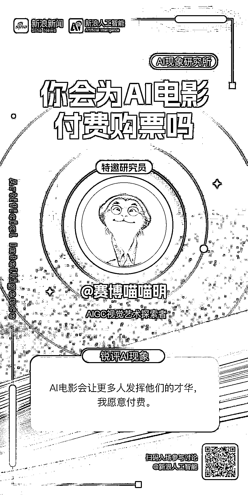
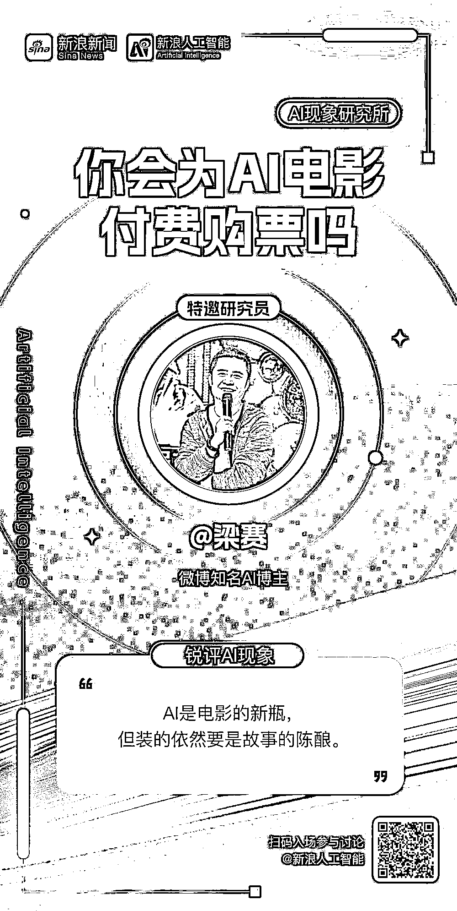
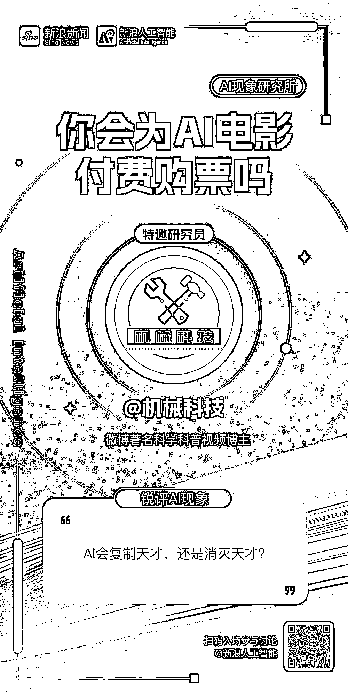
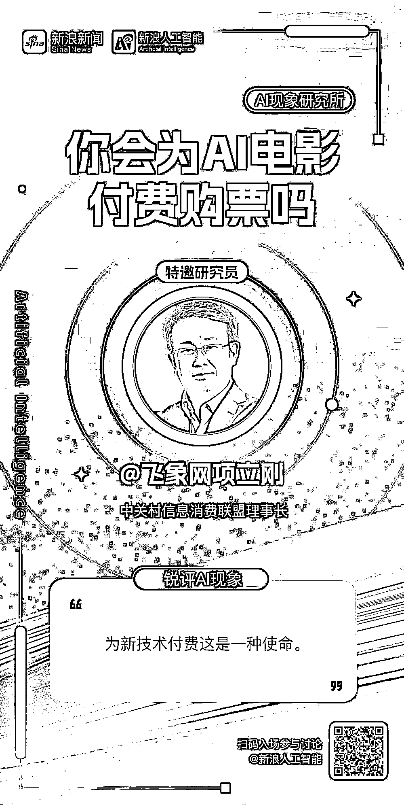
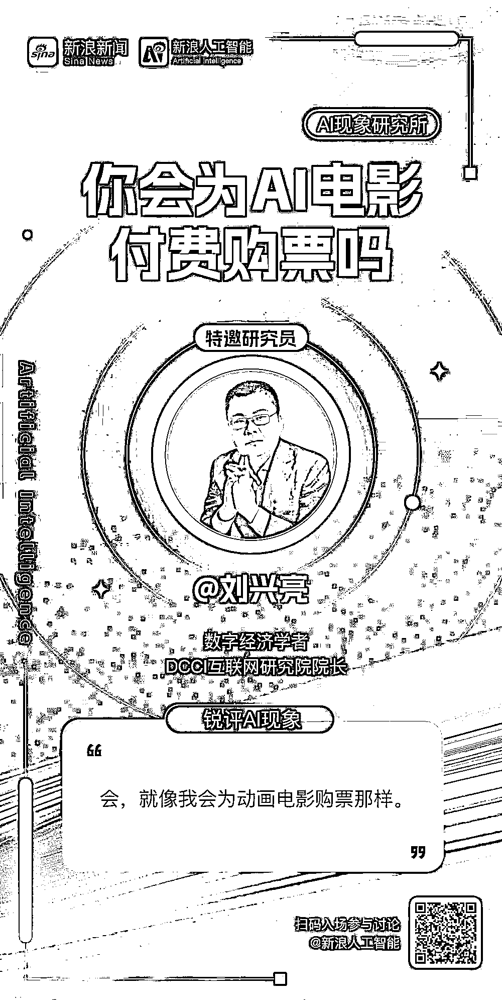
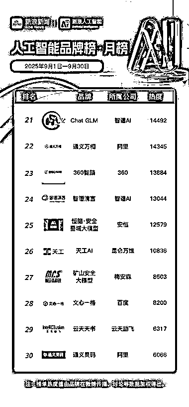
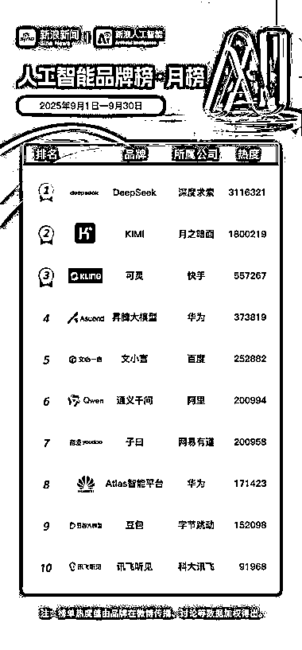
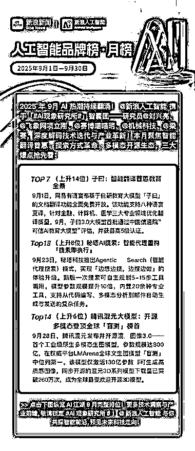

# AI 内容创作获微博扶持 入选人工智能现象研究所智囊团研究员

> 原文：[`www.yuque.com/for_lazy/wind/egtzha0ctw0uiuzh`](https://www.yuque.com/for_lazy/wind/egtzha0ctw0uiuzh)

作者： 赛博喵喵明

日期：2025-10-13

点赞数：**28**

* * *

正文：

大家做的 AI 方面的，也可以把内容发在微博，微博在扶持 AI 相关的内容。 有幸和几位大佬一起被选为新浪人工智能 AI 现象研究所智囊团研究员

* * *

评论区：

亦仁 : 感谢分享，已中标

* * *

公众号懒人搜索，[懒人专属群分享](https://lazybook.fun/#/blog/group)