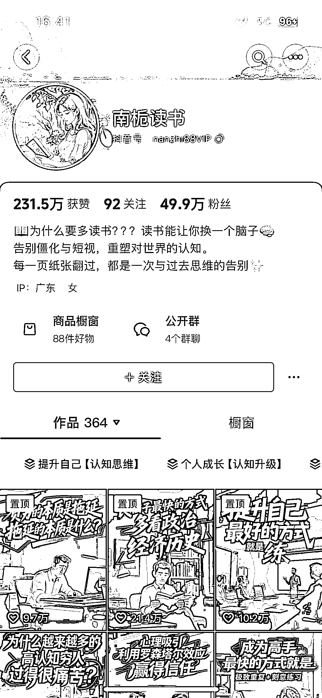

# 人性认知赛道 49.9W 粉丝：内容形式升级搭配 AI 图片生成视频

> 原文：[`www.yuque.com/for_lazy/wind/ornyz5dy1vky7fhg`](https://www.yuque.com/for_lazy/wind/ornyz5dy1vky7fhg)

作者： 漫鱼

日期：2025-10-14

点赞数：**24**

* * *

正文：

南栀爱读书，这个账号主要讲解人性和认知方面的内容，49.9W 粉丝。 其实就是换了一个形式把之前做认知思维的内容搭配 AI 生成的图片生成视频。

* * *

评论区：

老七 : 橱窗销售 261 单，这个账号靠什么赚钱呢？

亦仁 : 感谢分享，已中标

漫鱼 : 收徒等，导流私域可以做很多

* * *

公众号懒人搜索，[懒人专属群分享](https://lazybook.fun/#/blog/group)