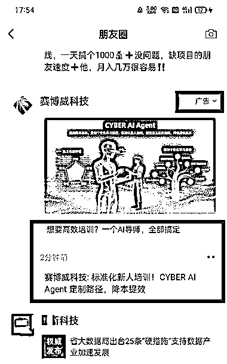
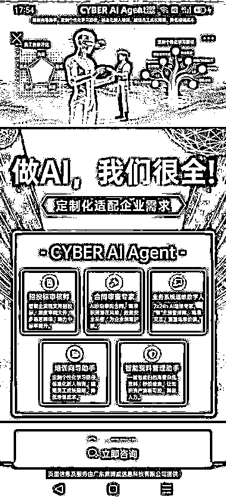
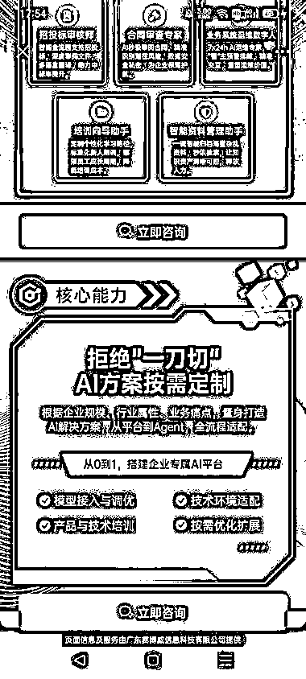
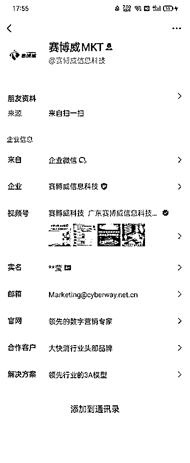

# 企业服务 AI 自动化

> 原文：[`www.yuque.com/for_lazy/wind/atagicp3gu0ynghq`](https://www.yuque.com/for_lazy/wind/atagicp3gu0ynghq)

作者： 锦拾年（同路人）

日期：2025-10-17

点赞数：**21**

* * *

正文：

企业服务 AI 自动化 朋友圈付费投流的【广告】。 企业服务玩 AI，这波风口藏着大机会！
企业现在最愁啥？培训新人慢、合同审核烦、资料管理乱，每一项都在烧钱。赛博威的 AI
Agent 就像个“全能打工人”，培训能定制、合同能 AI 审、资料能智能管，把企业那些“花钱又费力”的活儿全给自动化了。
现在企业都在喊【降本增效】，这种能实打实帮企业省钱提效的 AI 工具，可不就是香饽饽？不管是大公司优化流程，还是小企业想少雇人多办事，都得靠它。
做企业 AI 服务，现在入局，就是抢市场大蛋糕！B 端用户有钱，都是大单子。有能力的圈友和团队，值得搞！

* * *

评论区：

刘飞 : 最近我也看到挺多投定向推广告的

亦仁 : 感谢分享，已中标

锦拾年（同路人） : 感谢亦仁大大的看见 [害羞][抱拳]

* * *

公众号懒人搜索，[懒人专属群分享](https://lazybook.fun/#/blog/group)