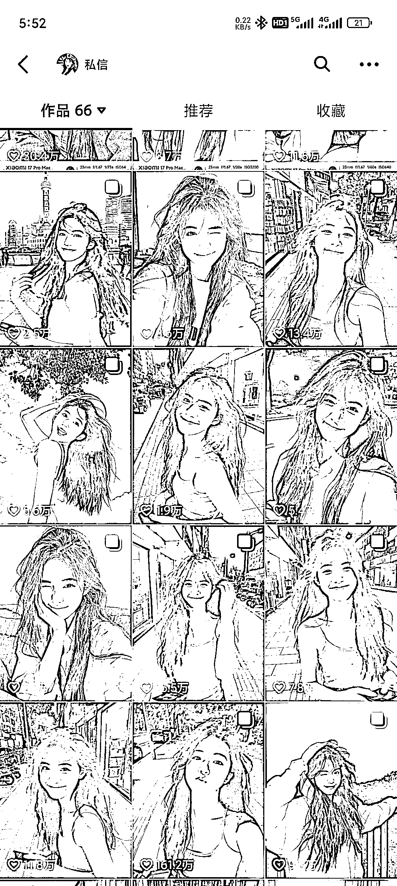
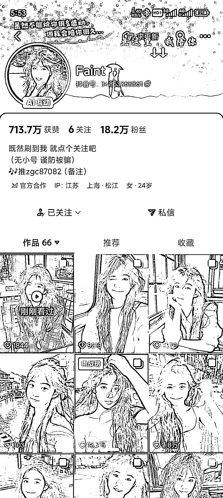

# 抖音 AI 美女图片账号流量运营拆解：提示词与文案 BGM 优化方向

> 原文：[`www.yuque.com/for_lazy/wind/erevniym35hvsmt8`](https://www.yuque.com/for_lazy/wind/erevniym35hvsmt8)

作者： R.Z

日期：2025-10-14

点赞数：**28**

* * *

正文：

刷到一个抖音美女号博主，都是分享 ai 做的图片，流量超级好，他这种是怎么写的提示词，文案和 bgm 感觉也很合适。有没有大佬拆解一下，我也想做这种。

* * *

评论区：

陶美丽 : 在星绘里可以大量生成美女图片和视频，选择喜欢的风格，稍稍修改提示词就可以生成图片或者视频了

R.Z : 星绘里面我感觉就是即梦灵感里面搬过去的

诗语 : 即梦、可灵在首页广场可以看到别人的提示词（官方功能） 国外类似的居合站都有，可能要付费 然后自己二创

亦仁 : 感谢分享，已中标

R.Z : 我现在就是在即梦灵感里面找几个好看的，用他们提示词为模板，让豆包给我换个场景、服饰、动作，批量出提示词，然后挨个测试，效果还可以

徐小媛 : 这样如何变现呢

R.Z : 收徒、接广、卖图片、卖账号都行，也可以用来涨粉，后面拿来做图文女装带货之类的

* * *

公众号懒人搜索，[懒人专属群分享](https://lazybook.fun/#/blog/group)