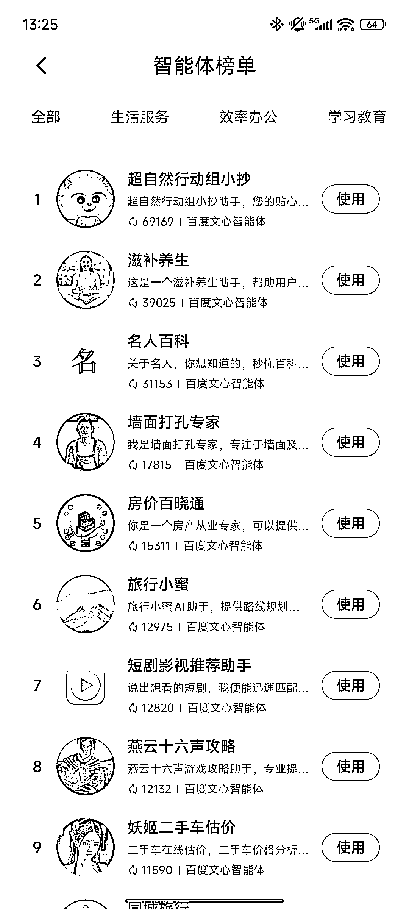
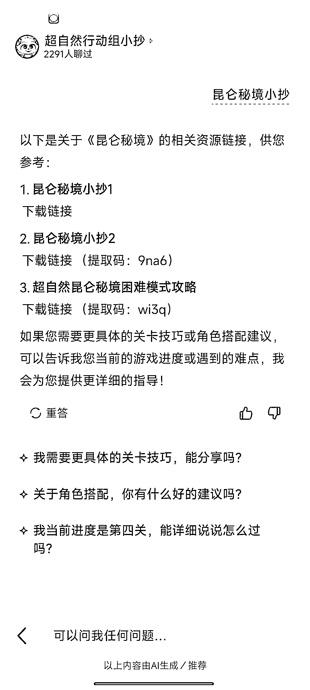
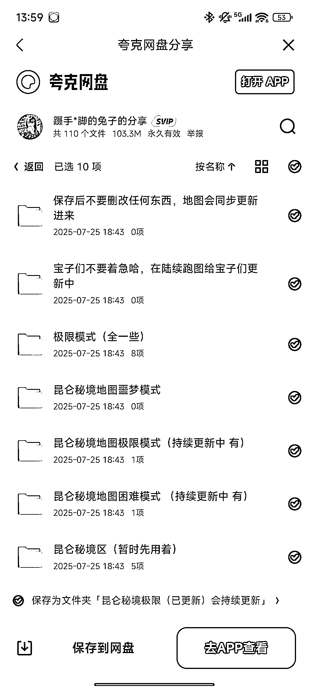
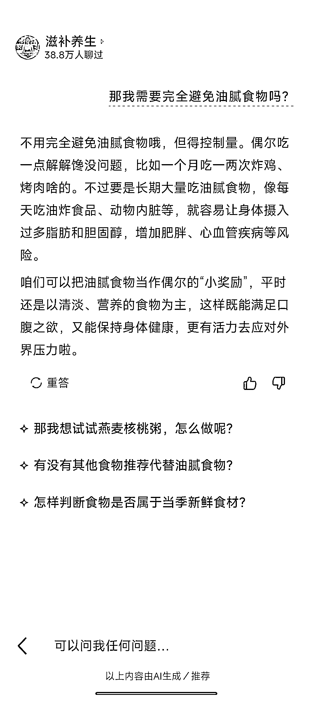
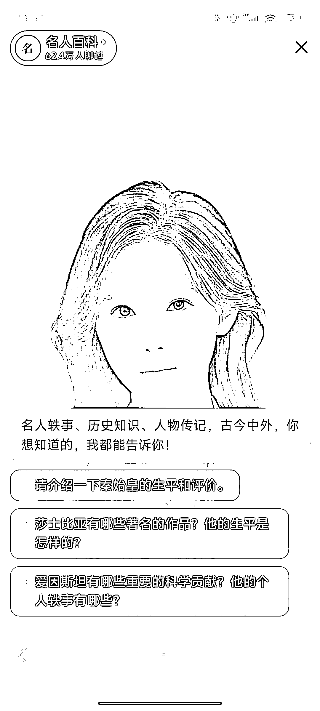

# 热度榜单前三名内容变现方向解析：游戏攻略网盘拉新与换季养生内容运营

> 原文：[`www.yuque.com/for_lazy/wind/gngqrgtbeo84hrs8`](https://www.yuque.com/for_lazy/wind/gngqrgtbeo84hrs8)

作者： Leeka

日期：2025-10-15

点赞数：**18**

* * *

正文：

小米商城和文心一言智能体合作 我查了一下热度榜单，发现前三名的热度非常高 就顺藤摸瓜看了一下里面的内容
第一名，游戏攻略，用夸克网盘承接内容，变现方式就是网盘拉新 第二名第三名用爱发电
第二名的滋补养生，恰逢换季，秋季养生，也可以用第一名的方式，引导用户根据自己的情况，放一些养生清单，视频等在网盘里

* * *

评论区：

亦仁 : 感谢分享，已中标

Fluoxetine : 请问这个叫什么名字啊？

Leeka : 小米应用商店里的智能体，智能体是文心一言的。星球里之前有人发过帖子，可以去看看

* * *

公众号懒人搜索，[懒人专属群分享](https://lazybook.fun/#/blog/group)