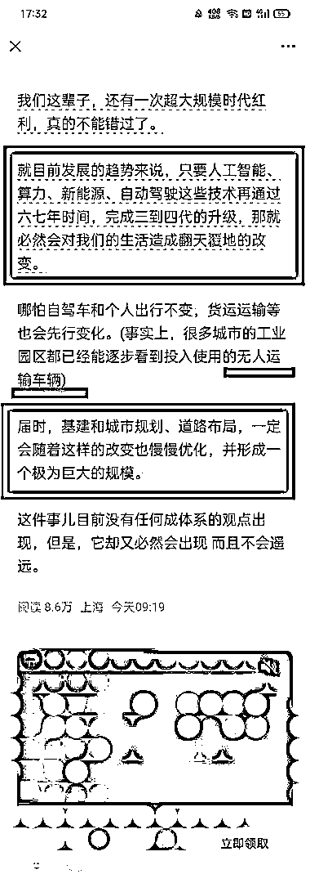
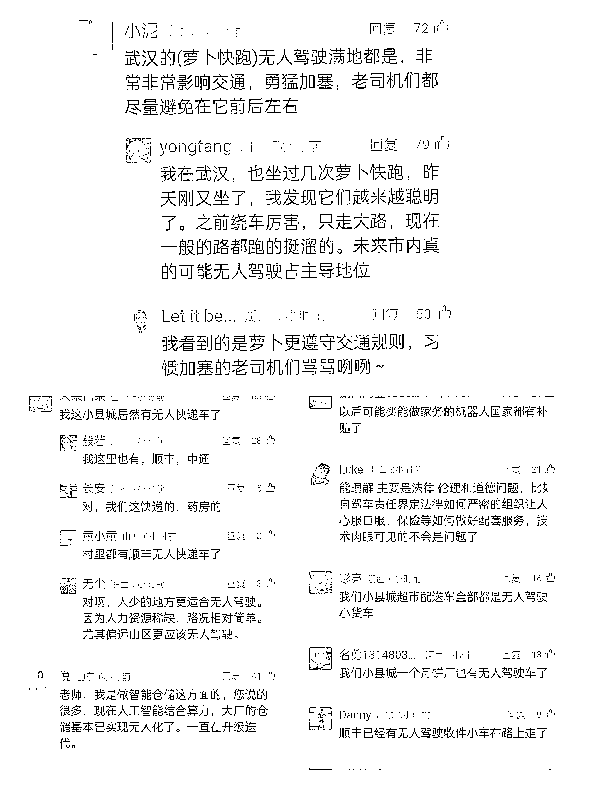
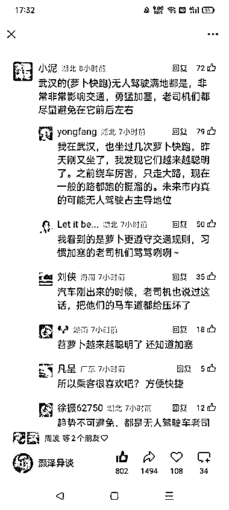

# 人工智能-算力-新能源-自动驾驶技术升级将带来生活变革

> 原文：[`www.yuque.com/for_lazy/wind/bk4ex1f9hi4506ca`](https://www.yuque.com/for_lazy/wind/bk4ex1f9hi4506ca)

作者： 锦拾年（同路人）

日期：2025-10-17

点赞数：**20**

* * *

正文：

超大规模时代红利，不能错过！
大佬预测，就目前发展的趋势来说，只要人工智能、算力、新能源、自动驾驶这些技术再通过六七年时间，完成三到四代的升级，那就必然会对我们的生活造成翻天覆地的改变。
评论区也有真实的现象和事实，值得关注时代变化！

* * *

评论区：

礼新 : 趋势改变不了，只能适应

亦仁 : 感谢分享，已中标

* * *

公众号懒人搜索，[懒人专属群分享](https://lazybook.fun/#/blog/group)