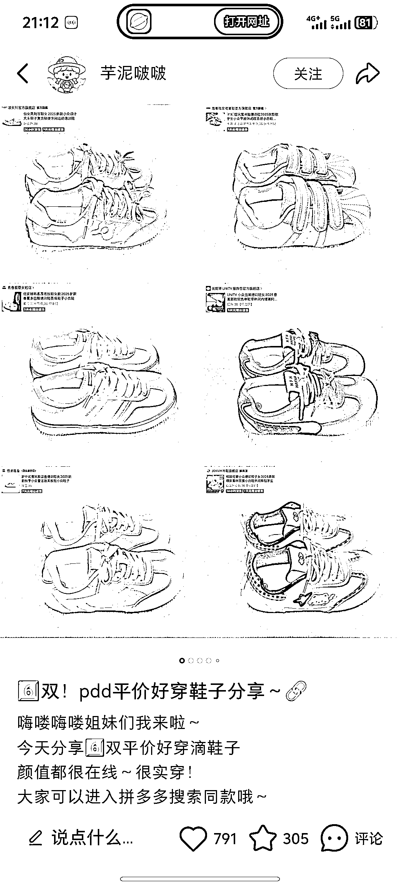
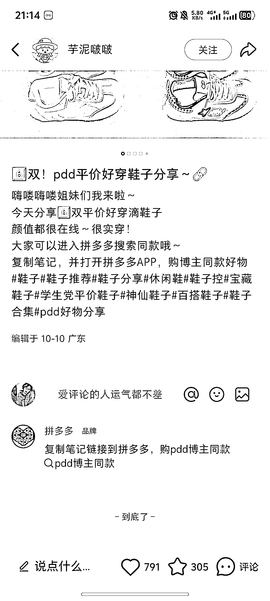
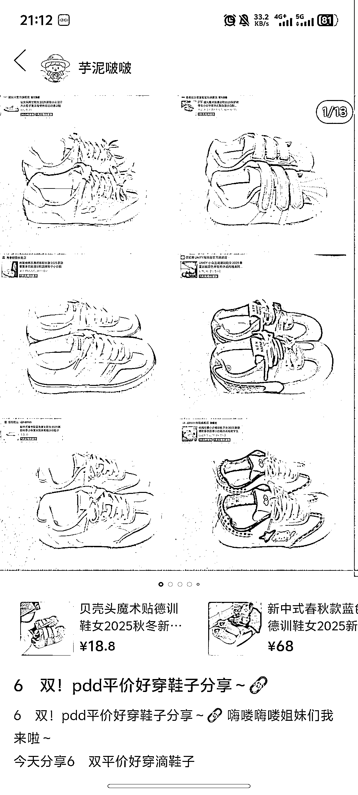
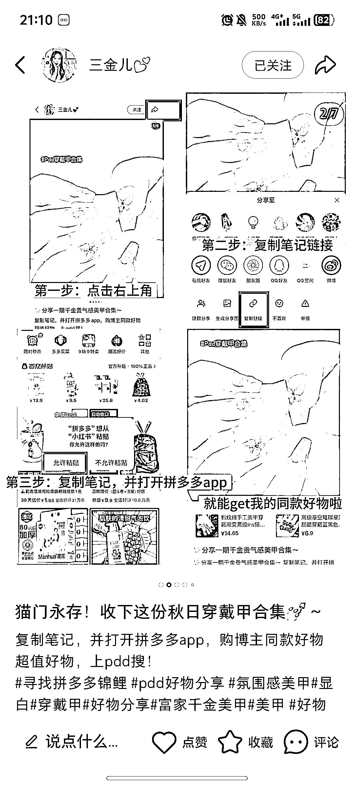

# 小红书链接可直接跳转至电商平台购买方法探讨

> 原文：[`www.yuque.com/for_lazy/wind/gs1i9c0d6wiywqo2`](https://www.yuque.com/for_lazy/wind/gs1i9c0d6wiywqo2)

作者： QQQ

日期：2025-10-20

点赞数：**42**

* * *

正文：

小红书链接复制到拼多多可以直接购买了
今天刷小红书突然发现的，看了几个博主的主页是经常分享拼多多商品的，突然说可以复制到拼多多直接购买，不知道是不是拼多多官方联系博主的，目前还不清楚具体方法，有没有圈友知道怎么弄呢？
（p1-2 为小红书页面） （p3 为拼多多页面） （p5 为拼多多官方发表的评论里的话题）

* * *

评论区：

亦仁 : 感谢分享，已中标

* * *

公众号懒人搜索，[懒人专属群分享](https://lazybook.fun/#/blog/group)