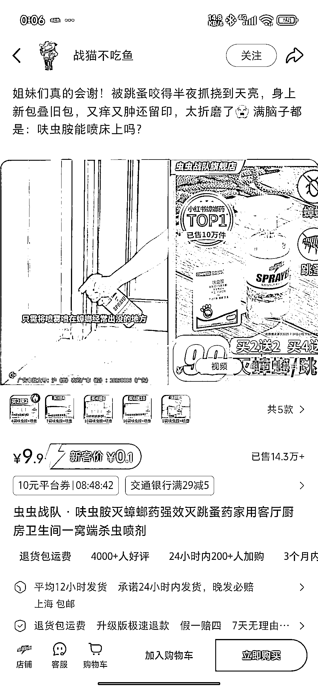
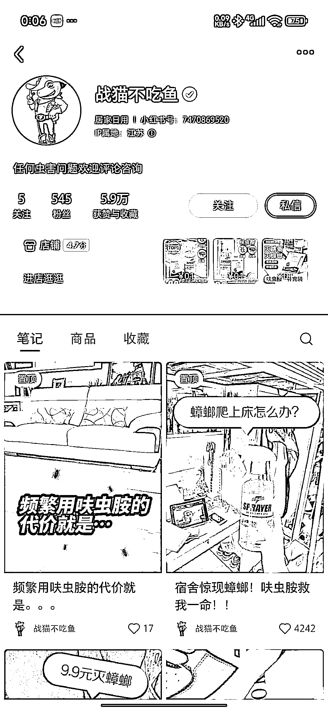

# 小红书跳蚤相关产品销量 14 万+ 单笔记点赞 4000+

> 原文：[`www.yuque.com/for_lazy/wind/bgn2gvqm9o91mxh1`](https://www.yuque.com/for_lazy/wind/bgn2gvqm9o91mxh1)

作者： 天气

日期：2025-10-19

点赞数：**32**

* * *

正文：

被跳蚤咬了，小红书搜一下，习惯性的看看销售数量，14 万+，大概算了下，不下 140 个。 重点是，笔记数据特别差，就一个笔记的点赞有 4000+
不得不说，小红书确实赚钱

* * *

评论区：

虚竹 : 全店 28w 销量 140 个少了。这个就是买化学原材料自己灌装的，暴利[坏笑]

天气 : 我草，我没想到可以自己封装，这个可以哈

张姝 : 不是吧，我去看了，这个是品牌旗舰店的货，淘宝上 10 年老店，店铺年销量 10 万+

虚竹 : 牛皮啊，办个他们农药证，直接开搞了。 这市场不小啊。

张姝 : 农药证是怎么搞的？好办吗？

虚竹 : 不好办 哈哈。投资大 没有仓库和经营地址估计得 1-2w，有的话就简单了。目前淘宝给我反馈没有地址只能注册山东的，费用 1.3w

张姝 : 哈哈，你去问过啦。肯定会有些门槛，不然都去干了。农药证是什么意思？办这个农药证所有的农药都能卖，还是可以单独办理这家公司的农药证只能卖他们家的？

虚竹 : 只能卖这个商品 你看下他们这个小红书店铺的农药证就知道了

* * *

公众号懒人搜索，[懒人专属群分享](https://lazybook.fun/#/blog/group)