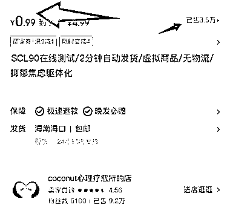
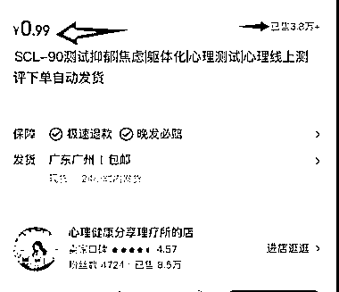

# 小红书虚拟产品：SCL90 症状自评量表在线测试销量表现亮眼

> 原文：[`www.yuque.com/for_lazy/wind/rxo2alwy87v24hyt`](https://www.yuque.com/for_lazy/wind/rxo2alwy87v24hyt)

作者： 林不林

日期：2025-10-14

点赞数：**33**

* * *

正文：

小红书虚拟产品-SCL90(症状自评量表)在线测试 最近的 SCL90(症状自评量表)在线测试，虚拟产品在小红书上销售数据很好，
关于当代心理健康的问题，可能是一个不错的项目 图片是 3 个店铺的数据，销量很好 生财朋友圈

* * *

评论区：

悦己社长 : 哪位大佬知道他们这种测评链接是怎么生成获取的呢

九局下半 : 都是公开免费的网址，能搜到，然后小红书后台直接发链接点进去就能用

亦仁 : 感谢分享，已中标

* * *

公众号懒人搜索，[懒人专属群分享](https://lazybook.fun/#/blog/group)