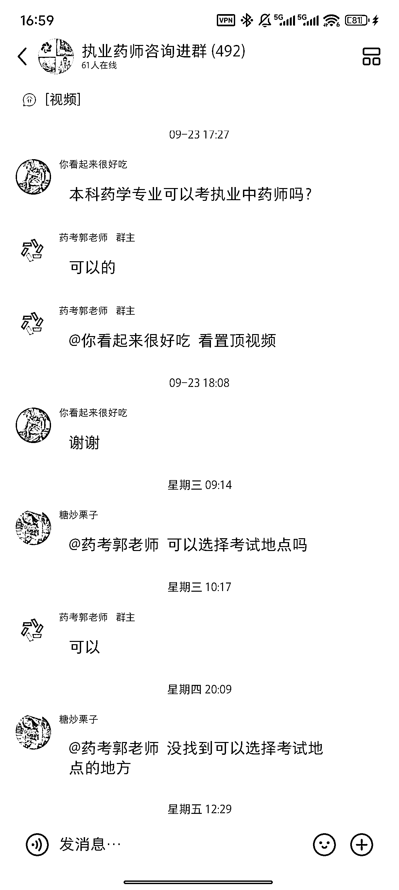
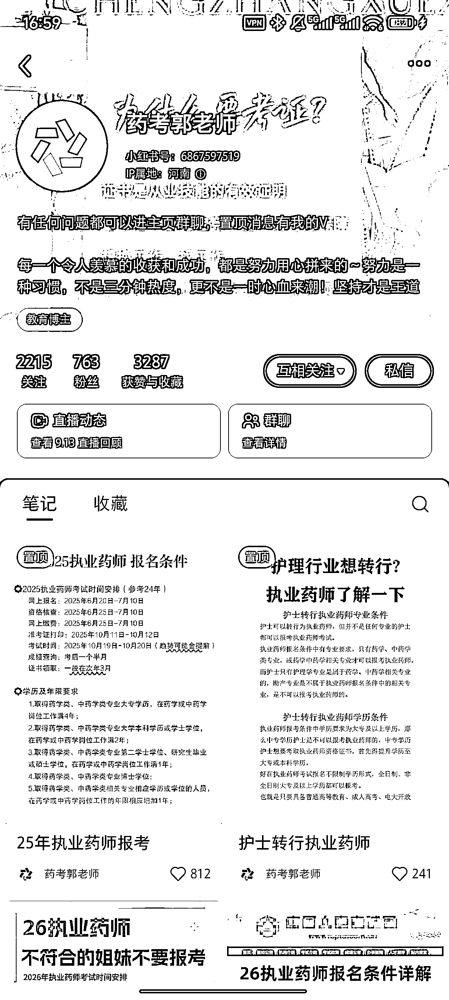
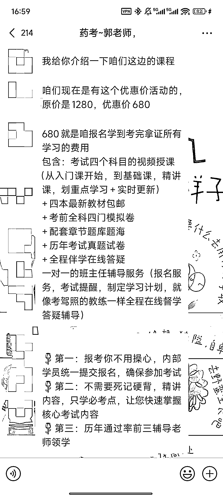

# 小红书药师考证细分赛道 763 粉丝转化率超 65%（496 人入群）

> 原文：[`www.yuque.com/for_lazy/wind/ormn0v6dad9osxcm`](https://www.yuque.com/for_lazy/wind/ormn0v6dad9osxcm)

作者： 小 Q

日期：2025-10-13

点赞数：**24**

* * *

正文：

小红书药师考证，超级细分的行业！普通人以为考个药师会很难，其实确实不简单，需要前置的药学专业，这个去报一个国开大学相关药学专业，大概 2 年拿证。
异常点：763 个粉丝但是群里面有 496 人，可见转化率还可以。 课程：录播+直播，680
，4 年内考过四科就可以拿证书，一年考几科都可以，考试机考：单选+多选 结论：没有想象中那么难，课程应该都是公开的，被他们收集整理做成了 app

* * *

评论区：

亦仁 : 感谢分享，已中标

* * *

公众号懒人搜索，[懒人专属群分享](https://lazybook.fun/#/blog/group)