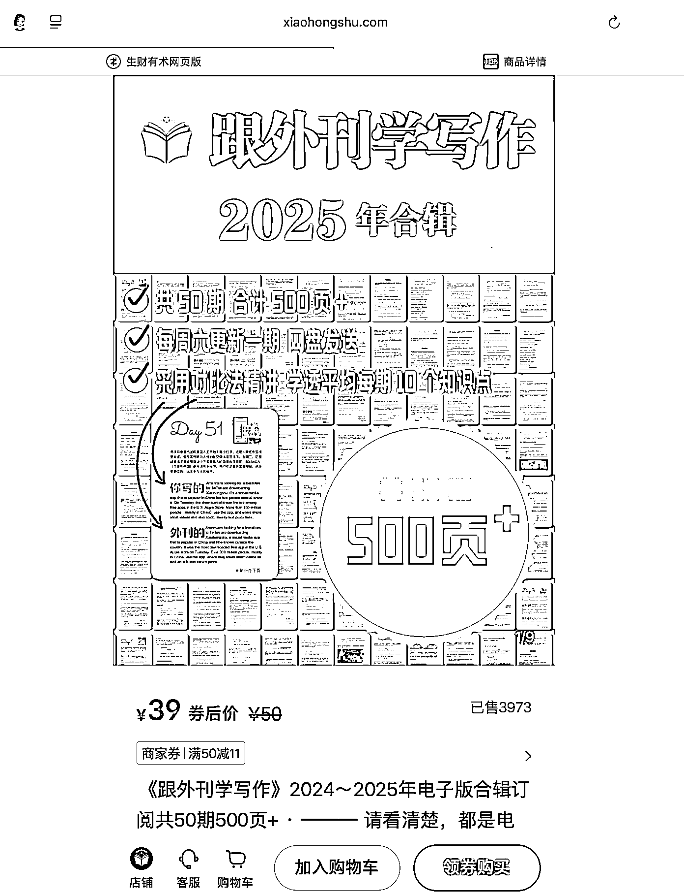
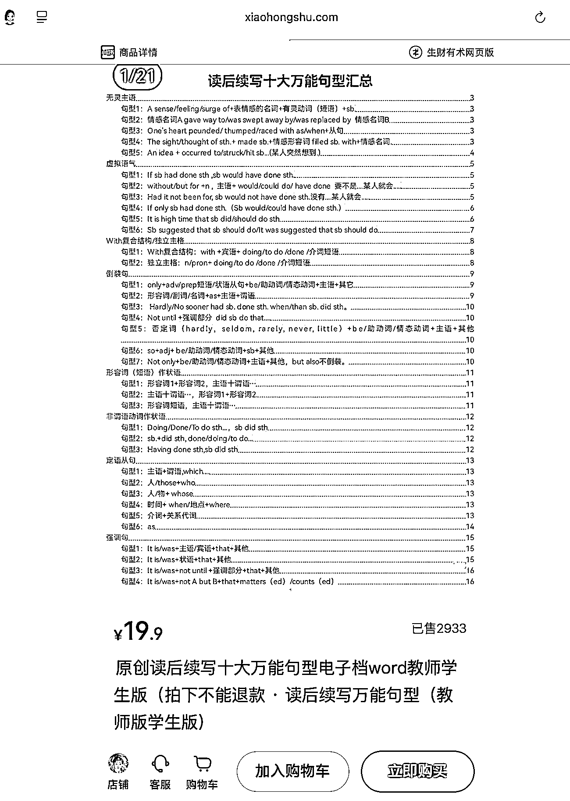
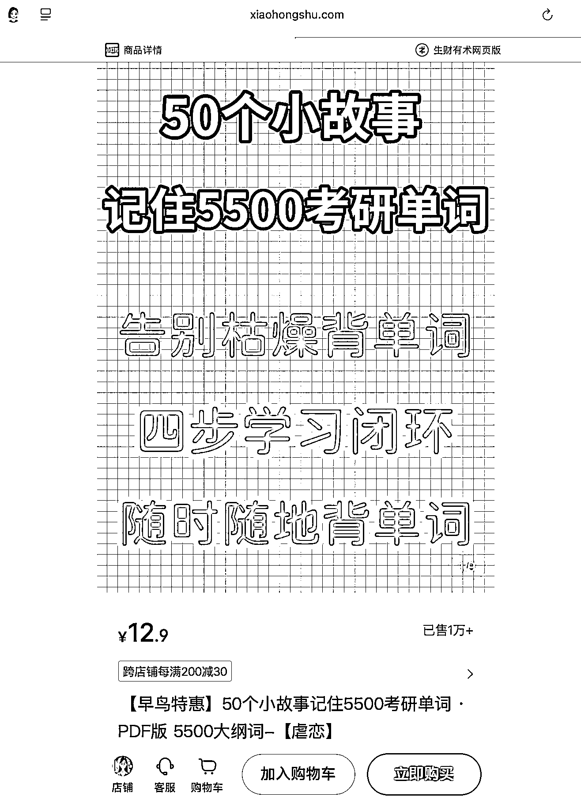
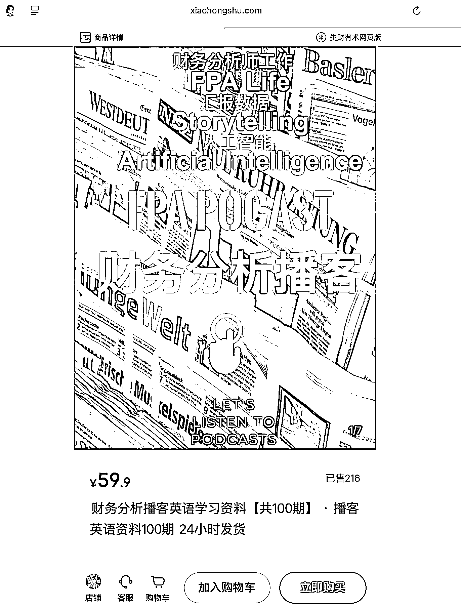
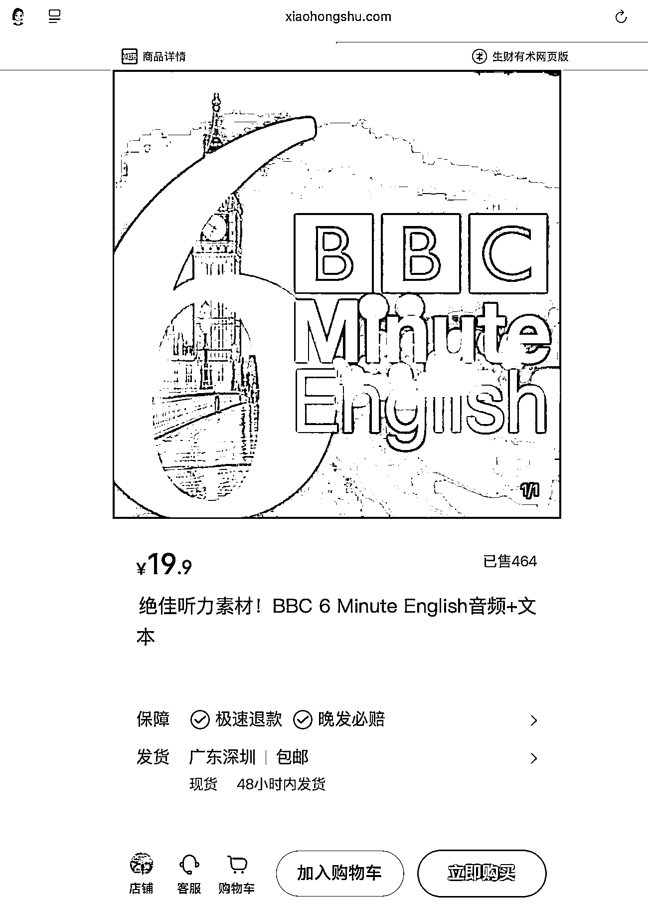

# 小红书英语虚拟产品细分赛道案例：变现最高 15 万的 5 个差异化方向

> 原文：[`www.yuque.com/for_lazy/wind/xenept54sscmf1f2`](https://www.yuque.com/for_lazy/wind/xenept54sscmf1f2)

作者： 馆主

日期：2025-10-17

点赞数：**22**

* * *

正文：

产品 ｜异常值 在小红书上挖掘出一批做【英语】虚拟产品的店铺，做小红书【英语】虚拟电商的圈友可以参考
图 1/这个虚拟产品的优势是换一个视角看外刊，很多人做外刊只是去做听力，而他是去做写作，并且加了很多自己的想法，值得学习。 --该产品变现：15w
图 2/英语在小红书是一个大赛道，我们要选一个细分赛道，切入具体的一个解决方案，而不是大而全的英语赛道。 --该产品变现：58366¥
图 3/考研邪修是一个很好的卖点，这个产品，24 小时加购 500+，这个产品能够通过 AI 去实现，考研/雅思/四六级都可以 --该产品变现：12.9w
图 4/对于想做英语赛道的圈友，可以思考怎么做垂直行业的英语训练，这个产品是聚焦在财务领域的英语播客垂类，避免了大而全的竞争，聚焦在小而美。 --该产品变现：12938¥ 图 5/细分垂直英语赛道：BBC 音频，非常聚焦和垂直，并且资源也很好找 该产品变现：9233¥

* * *

评论区：

亦仁 : 感谢分享，已中标

* * *

公众号懒人搜索，[懒人专属群分享](https://lazybook.fun/#/blog/group)