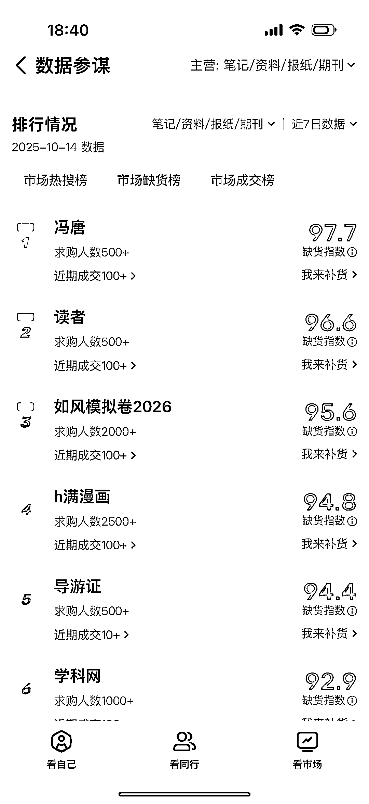
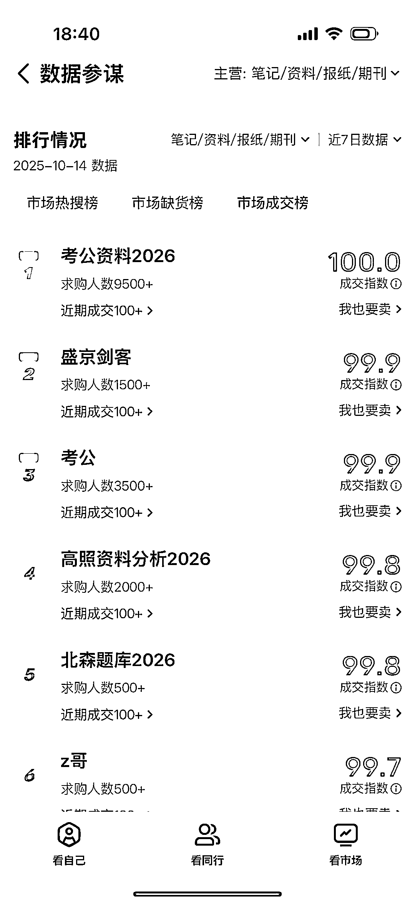
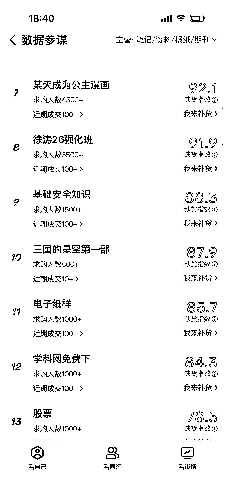
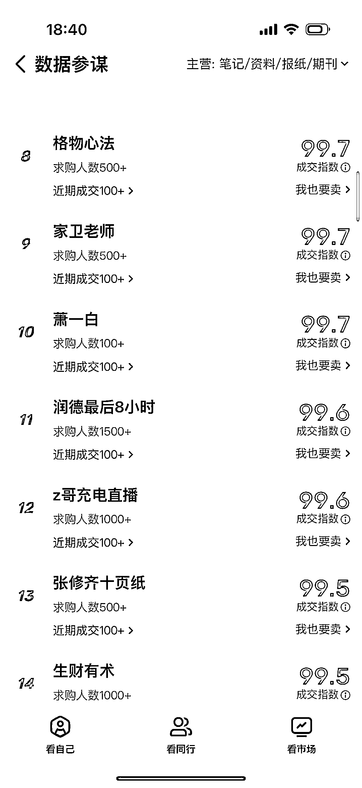
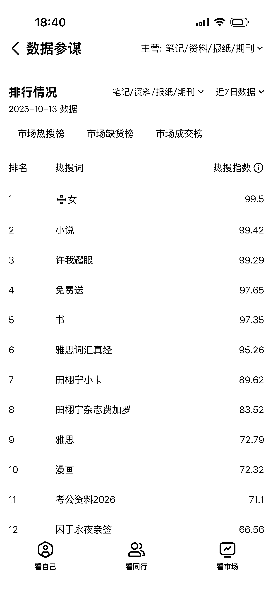
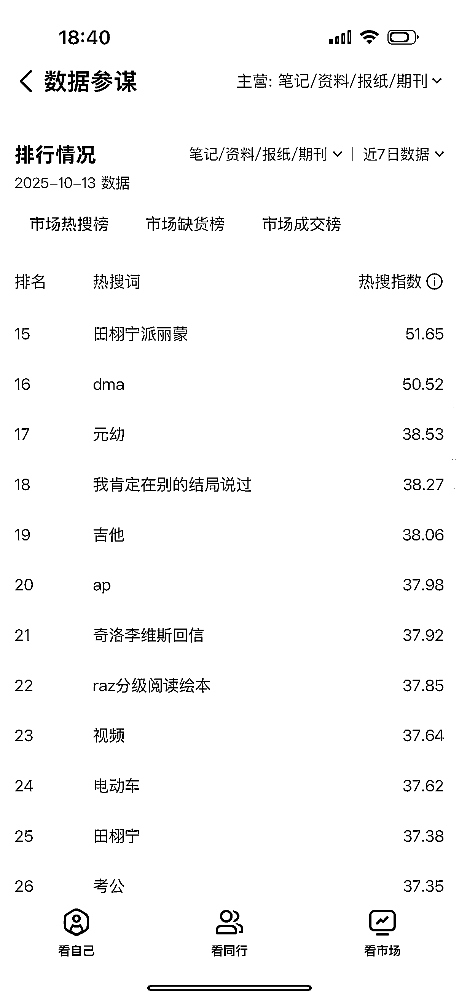

# 闲鱼 10 月热搜榜单：考公资料热度攀升

> 原文：[`www.yuque.com/for_lazy/wind/es0tf533tcovimrb`](https://www.yuque.com/for_lazy/wind/es0tf533tcovimrb)

作者： 音子带你做副业

日期：2025-10-14

点赞数：**23**

* * *

正文：

闲鱼这月热搜榜单➕热销榜单🔥 其中国家公务员考试笔试在 11 月 30 日，考公资料冲上热搜榜单！
不过要注意的是上传考公资料千万不要有机构或者很有名老师的名字，很容易被下架！

* * *

评论区：

亦仁 : 感谢分享，已中标

* * *

公众号懒人搜索，[懒人专属群分享](https://lazybook.fun/#/blog/group)