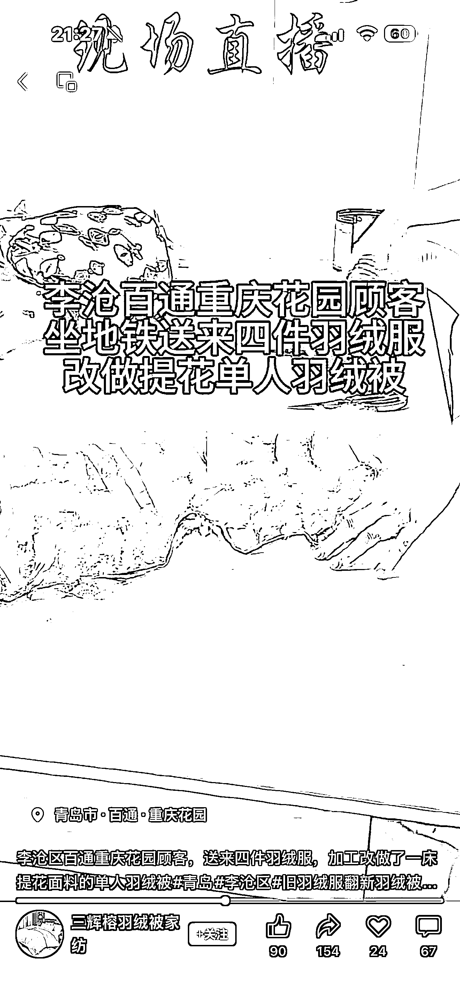
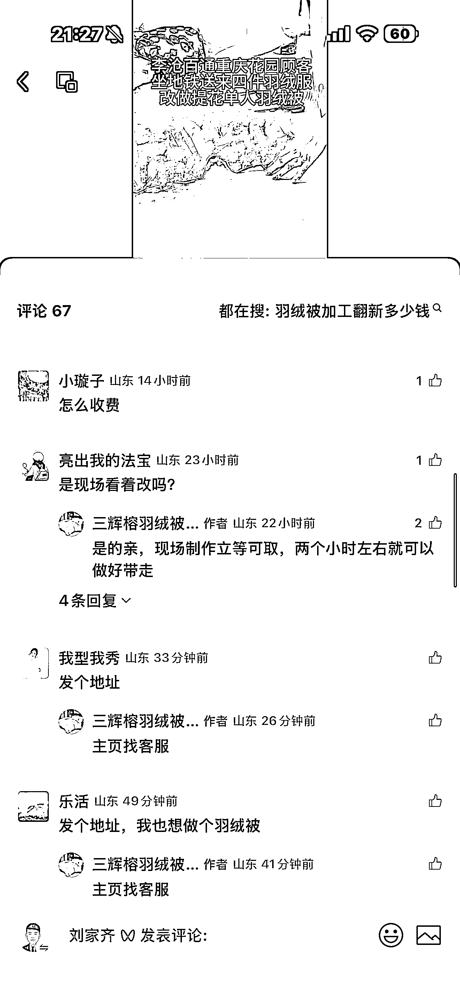
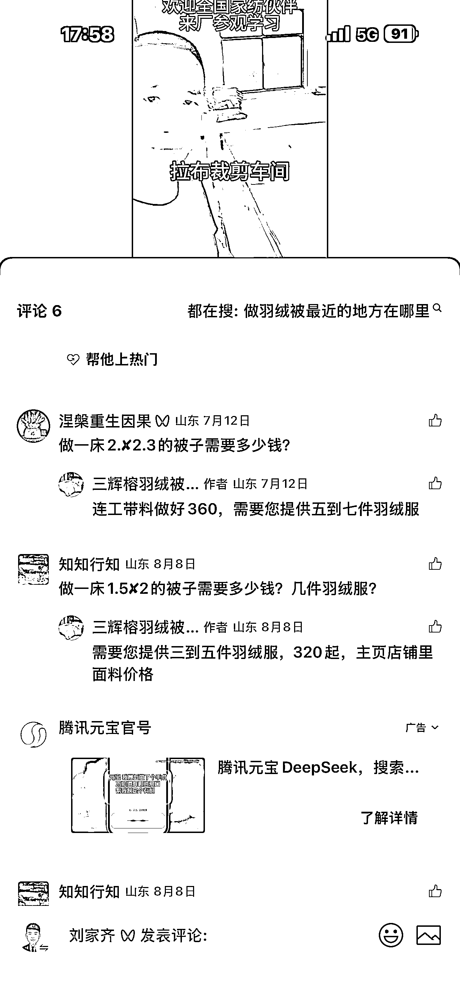

# 视频号羽绒服改羽绒被项目毛利润 70%以上

> 原文：[`www.yuque.com/for_lazy/wind/suxs9mu7dq50wut0`](https://www.yuque.com/for_lazy/wind/suxs9mu7dq50wut0)

作者： 刘家齐

日期：2025-10-17

点赞数：**29**

* * *

正文：

视频号：羽绒服改羽绒被 刷到一个账号，人群切的太准了，评论区清一色求价格。后续又连续刷到两个类似的账号，这个项目做好了目测轻松年入百万。
每个人的家里都有几件穿不到了，又占地方的羽绒服，扔了又不舍得。花钱改造成羽绒被，性价比那就太高了，视频号的人群又主要以家庭主妇为主，项目的人群切的很准。
其中评论区里面还有升单玩法，就是提供的羽绒服羽绒不够为理由，让消费者二次加价买一斤或者两斤的羽绒，销售话术也很简单就是羽绒太少不暖和。
单纯改造小 400 的客单价，再加一两斤羽绒，一单收个七八百不成问题，毛利润率至少 70%以上。

* * *

评论区：

亦仁 : 感谢分享，已中标

搞钱萌新 : 这个真的火

* * *

公众号懒人搜索，[懒人专属群分享](https://lazybook.fun/#/blog/group)