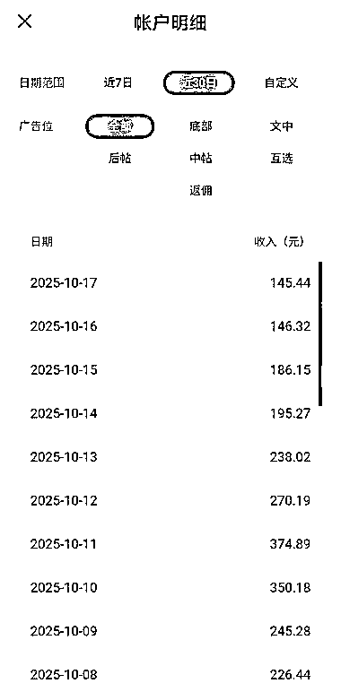
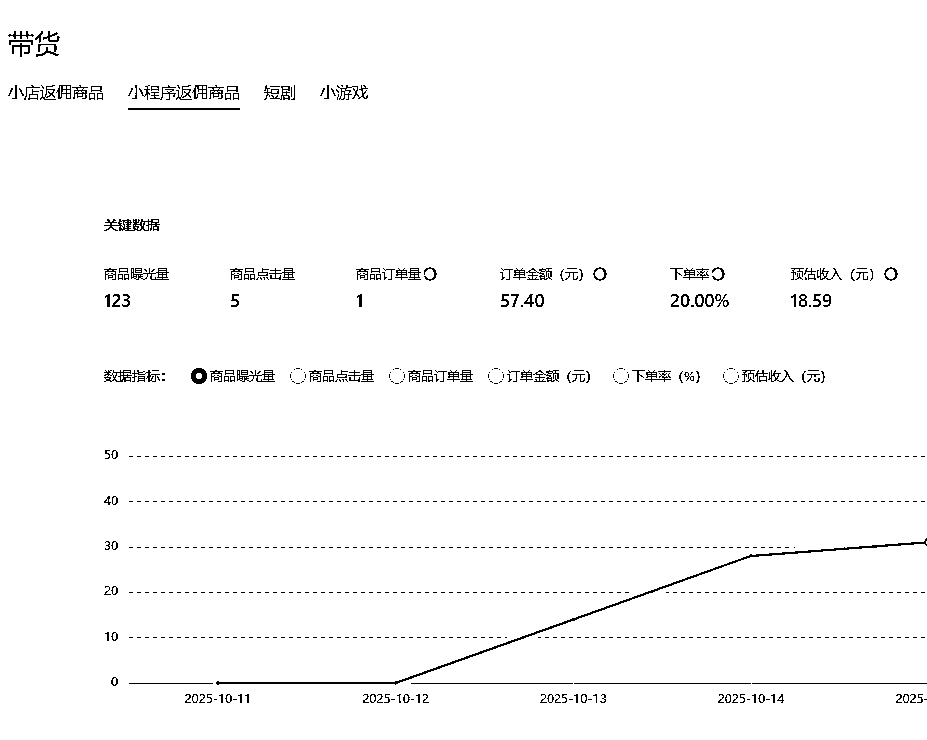

# 公众号垂直内容赛道文章带货出单案例分享

> 原文：[`www.yuque.com/for_lazy/wind/uymtyv0vt7cf89ez`](https://www.yuque.com/for_lazy/wind/uymtyv0vt7cf89ez)

作者： 黎明即起，曰法三章

日期：2025-10-18

点赞数：**30**

* * *

正文：

公众号垂直小号，个人觉得公众号在流量主收益降低的情况下，文章带货可以做一做，只要和公众号赛道内容强相关就行，这是本人的小号发布带货文章后本来不报希望，居然出单了，我觉得日更一篇主文章加一篇带货文章，佣金收入应该还可以！

* * *

评论区：

刘智行 : 很值得做，我一直在做，流量主和橱窗卖货都还可以。

亦仁 : 感谢分享，已中标

深元哥 : 怎么做能指导一下么

风益 : 这个"日更一篇主文章和一篇带货文章"，是指用主号专门发主文章，用小号专门发带货文章么？

幸福旺财 : 请问你公众号做的什么样的内容

* * *

公众号懒人搜索，[懒人专属群分享](https://lazybook.fun/#/blog/group)