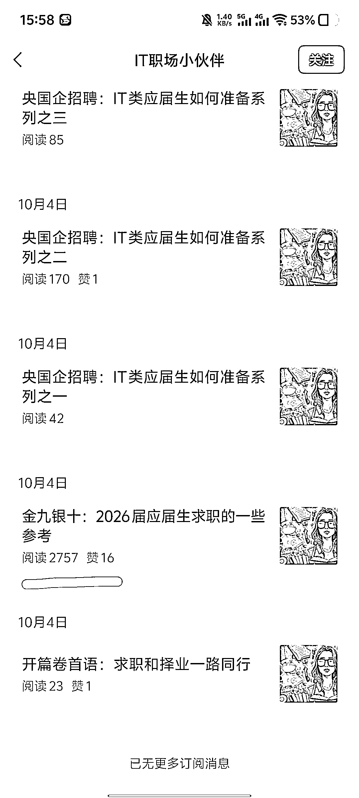

# 职场-秋招赛道：5 篇起号即爆千阅 后续稳定 4-5 位数阅读量

> 原文：[`www.yuque.com/for_lazy/wind/dsiznra9rc4slvlz`](https://www.yuque.com/for_lazy/wind/dsiznra9rc4slvlz)

作者： 嘻嘻姐

日期：2025-10-15

点赞数：**32**

* * *

正文：

一天 5 篇直接起号，这赛道值得尝试！ 赛道：职场/秋招 对标账号：IT 职场小伙伴
数据：10 月 4 号开始更新，当天发 5 篇爆了一篇千阅，接下来发 1-2 篇，数据也能跑到 4-5 位数。 为什么是机会？秋招火热进行时，抓住热点有机会上推荐。
变现：先垂直发涨粉挣流量主，再引流私域做求职陪跑等服务。

* * *

评论区：

亦仁 : 感谢分享，已中标

* * *

公众号懒人搜索，[懒人专属群分享](https://lazybook.fun/#/blog/group)