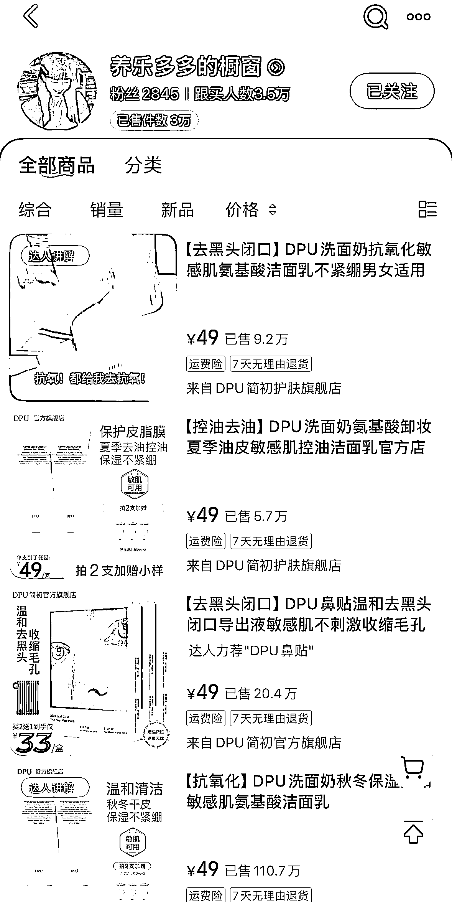
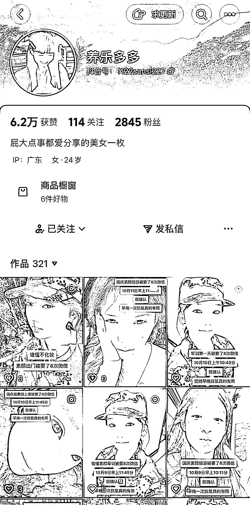
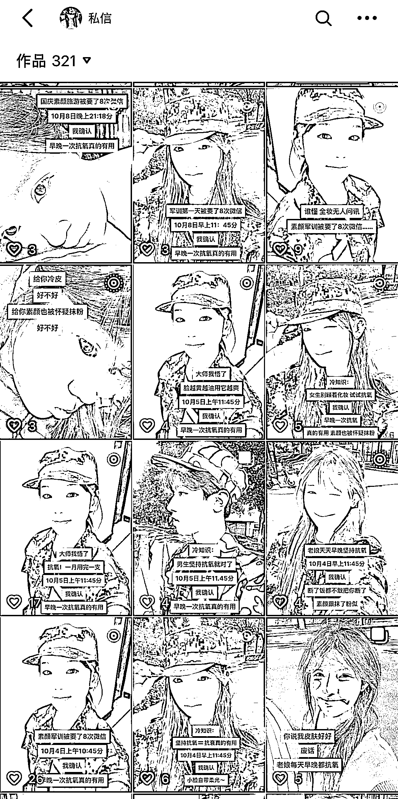
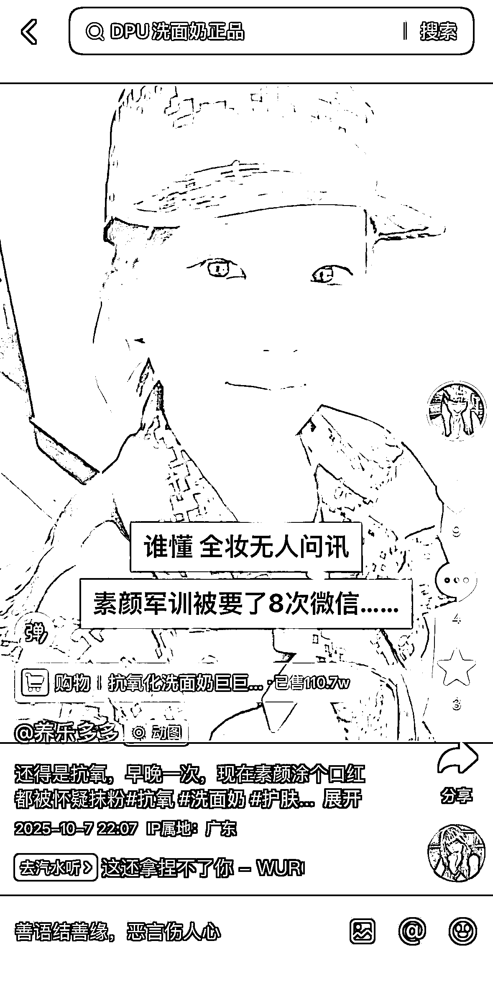

# 抖音护肤产品带货：粉丝 3000 变现 14 万，3 秒视频模板批量操作

> 原文：[`www.yuque.com/for_lazy/wind/ugl3ltshgg2qzifh`](https://www.yuque.com/for_lazy/wind/ugl3ltshgg2qzifh)

作者： 馆主

日期：2025-10-12

点赞数：**39**

* * *

正文：

变现｜异常值 在抖音上刷到一个账号【护肤产品｝，粉丝不到 3000，但是变现非常的异常，售卖 3w 件产品 按带货佣金 10%来算，赚了多少钱？
观察发现，商品定价都是 49 元 49*10%=4.9¥，4.9*30000=147000 元 赚了 14w，而且这种账号都是矩阵来玩
这个带货模版，制作过程非常的简单，不知道那偷来的自拍几个视频 3 秒，内容是大学军训自拍，然后配几行文案，作品挂上小黄车
ps：这个模版完全可以批量生产，也很适合小白上手

* * *

评论区：

亦仁 : 感谢分享，已中标

步凡 : 这种要投流吧

馆主 : 不需要，全靠自然流

* * *

公众号懒人搜索，[懒人专属群分享](https://lazybook.fun/#/blog/group)