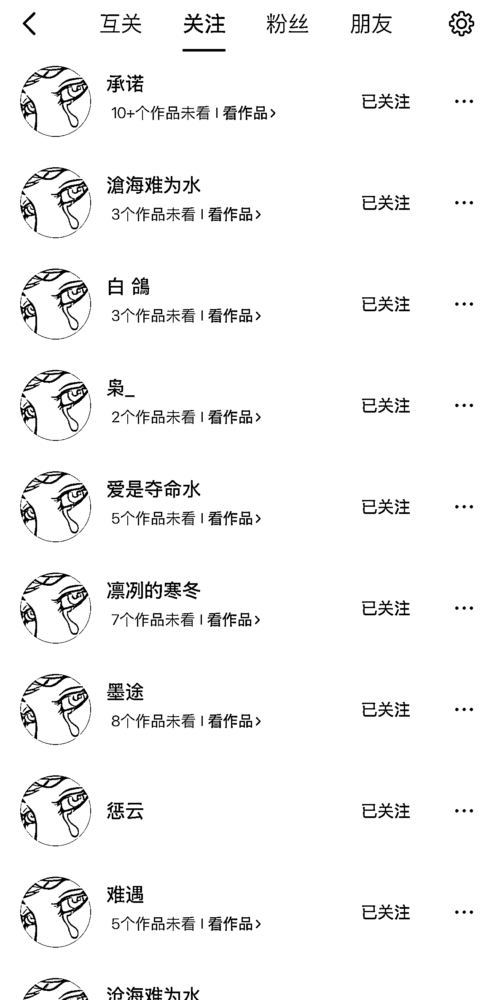
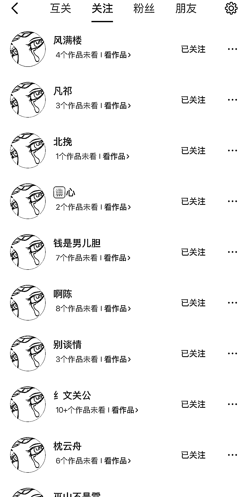
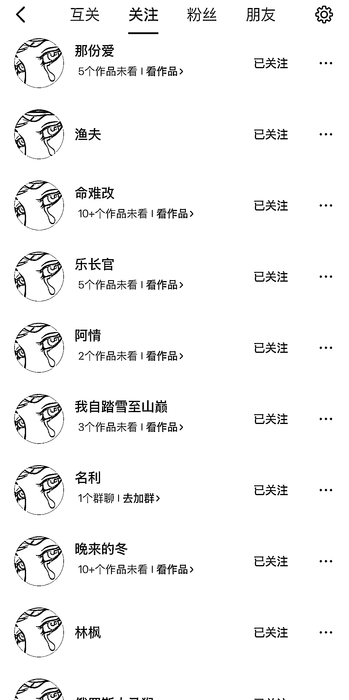
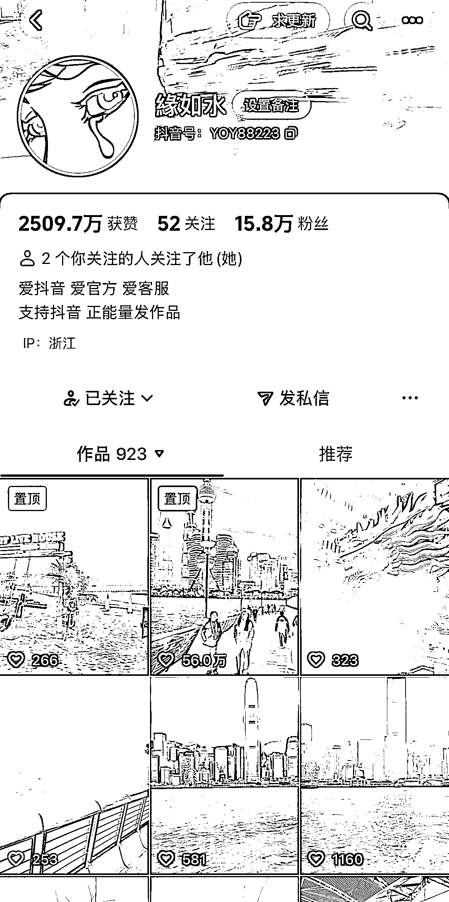
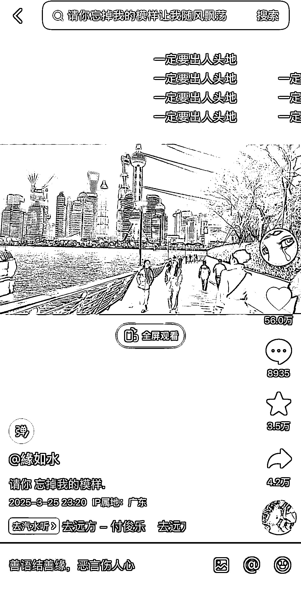
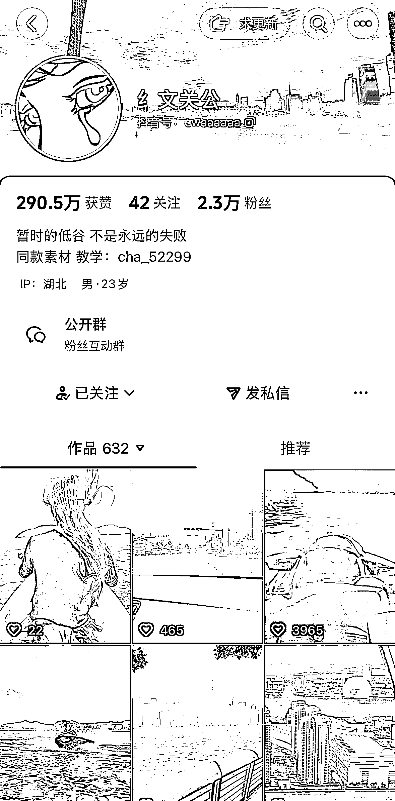
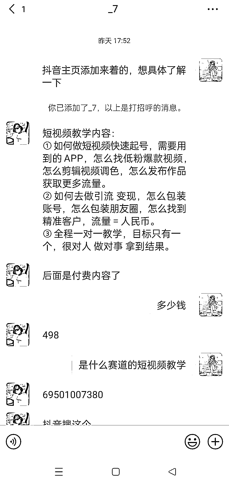
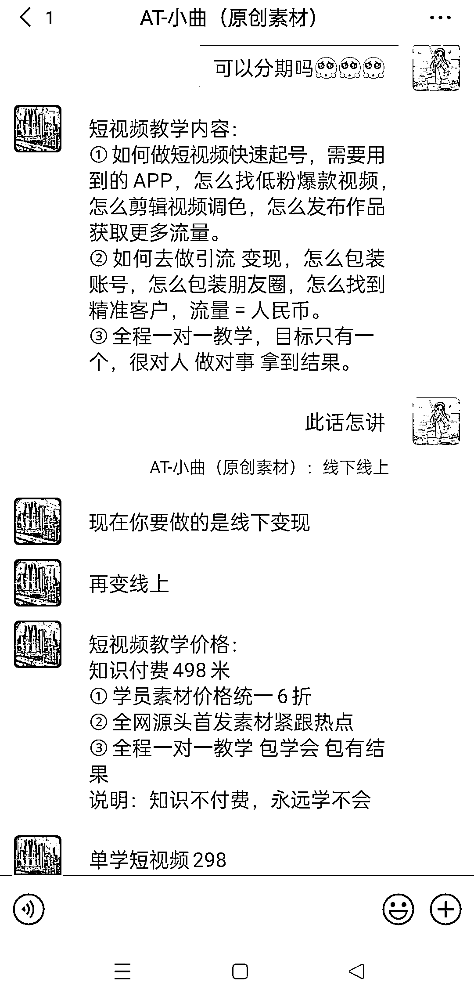
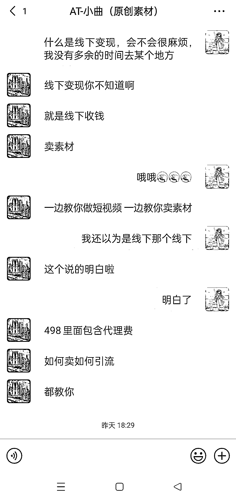

# 抖音风景素材赛道代理模式：关注 2000 账号的流量变现解析

> 原文：[`www.yuque.com/for_lazy/wind/prsci13fggzbxxf2`](https://www.yuque.com/for_lazy/wind/prsci13fggzbxxf2)

作者： 馆主

日期：2025-10-13

点赞数：**40**

* * *

正文：

流量/变现｜异常值 在抖音上挖掘到一个非常火爆的代理模式【风景素材赛道】短视频，目前已经关注了 2000 个账号（异常值） 1/账号人群：打工人
2/细分赛道：情感共鸣、风景、励志 3/视频作品：这个短视频非常的简单，只需要找一些好看的风景素材，然后配上一些励志背景音乐+励志文案
通过观察这些博主的主页发现都有留下教学联系方式，我加微信之后发现，是一个知识付费模式（代理）
看图 7、8、9 可以发现这类型短视频教学费用 498 元，就可以教你发和他一模一样的视频，素材他们提供，你只需要跟着发就行了
ps：有没有发现为什么头像都一样呢？因为设置一样可以更好的增大博主的热点流量 变现又分为两种：线上和线下 1/线上：流量主收益、接广告
2/线下：收代理、卖素材

* * *

评论区：

亦仁 : 感谢分享，已中标

拾悦说 : 哇，大开眼界

* * *

公众号懒人搜索，[懒人专属群分享](https://lazybook.fun/#/blog/group)