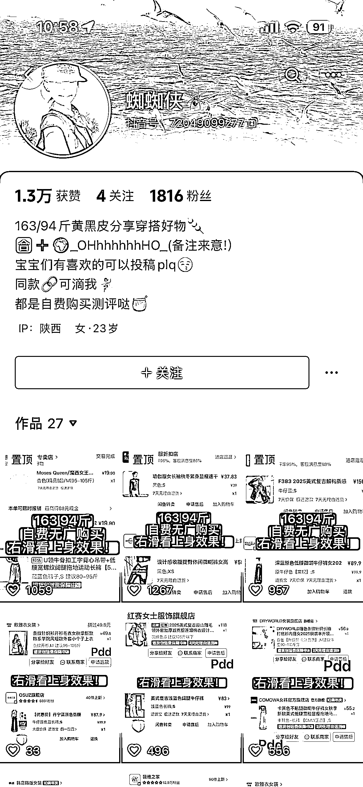
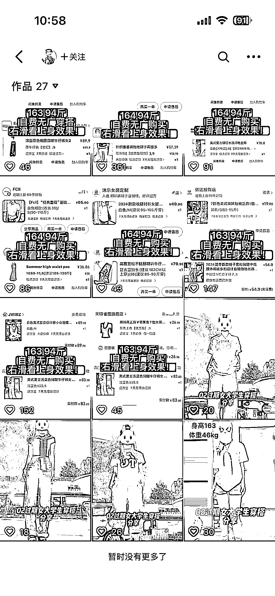
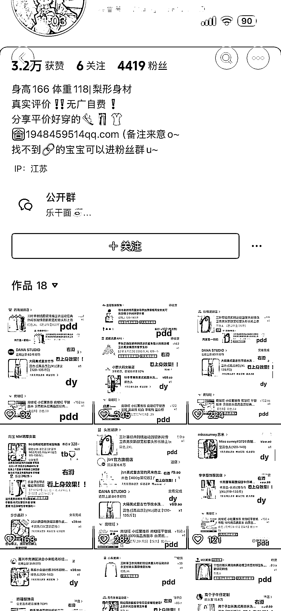
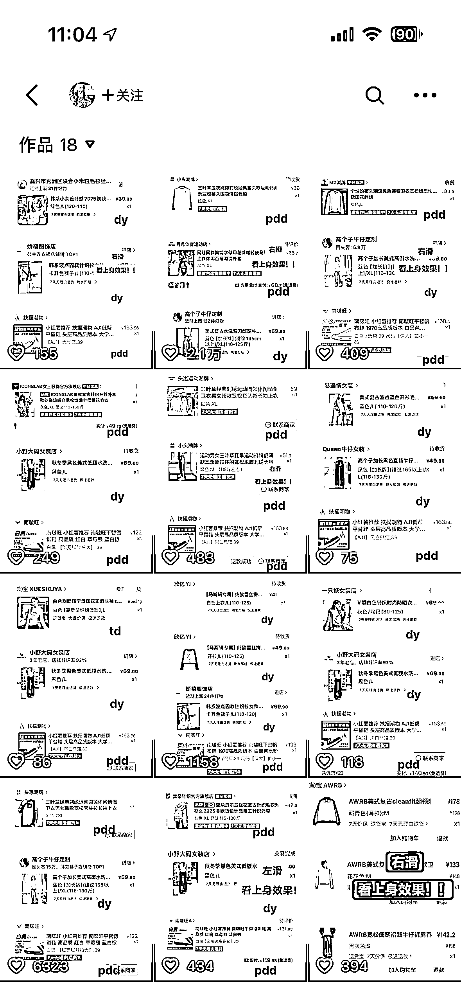
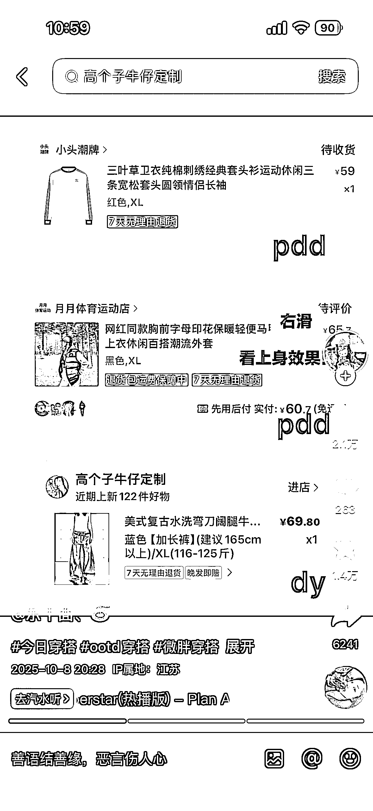
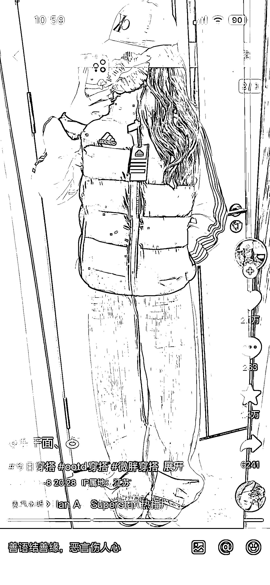
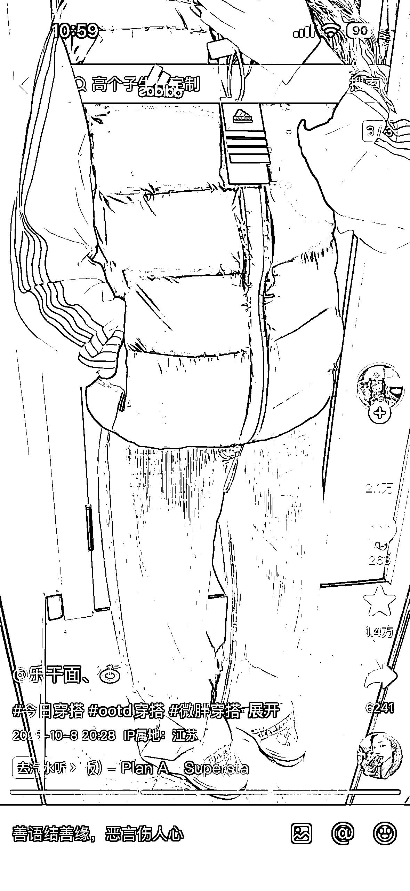
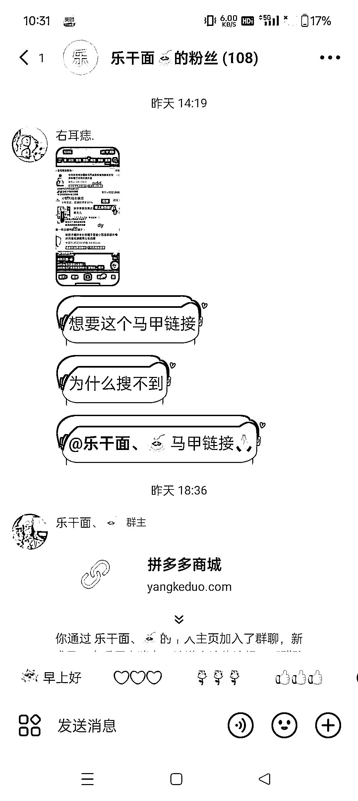
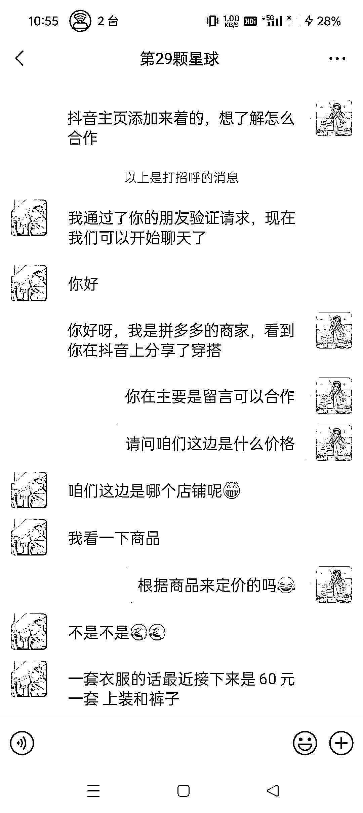

# 抖音穿搭带货低成本变现模板解析

> 原文：[`www.yuque.com/for_lazy/wind/ygy00podbruot530`](https://www.yuque.com/for_lazy/wind/ygy00podbruot530)

作者： 馆主

日期：2025-10-16

点赞数：**31**

* * *

正文：

流量/变现｜异常值 在抖音上挖掘到一个很火的穿搭【商单/带货】模版，带的是拼多多/淘宝/抖音平台的商品，这个思路值得借鉴 通过深度挖掘以知具体玩法：
1/账号前期需要自己在网上购买商品，然后穿搭拍视频，那这样成本会不会很高呢？不会！因为买回来穿拍个视频就退回去了，0 成本💰 2/开始有流量之后，就要包装主页，明确的告诉商家你在接单合作留下你的联系方式
3/这个带货视频模版非常的简单，把你购买商品的下单记录截图下来然后排版一下，一般是这个顺序：上衣-内搭-
鞋子，记下来就是把这套商品穿在自己身上，拍两张照片就可以制作成一个图文带货模版，然后在评论区留言，需要同款链接的姐妹们可以私我/进群领取链接
4/我以商家的身份咨询作者，发现报价不是很高，以知报价： 上衣 40 内搭 20 鞋子 20 裤子 40
ps：有没有发现他的单都是来着不同商家不同平台的，合并在一起组成的
总觉：这个模版非常适合大学生/宝妈等女性朋友玩。通过举一反三：男孩子也可以使用这个模版和变现思路，门槛很低只需要长的体面

* * *

评论区：

亦仁 : 感谢分享，已中标

flashs sta* : 圈友在做吗

馆主 : 没有在做，只是挖掘到了而已

flashs sta* : 有没在做的圈友，一起来

徐小媛 : 我发现自己抖音号空着 不如动手做起来，希望有姐妹可以一起做！

馆主 : 楼上有个圈友，你可以私她一下，一起玩

* * *

公众号懒人搜索，[懒人专属群分享](https://lazybook.fun/#/blog/group)