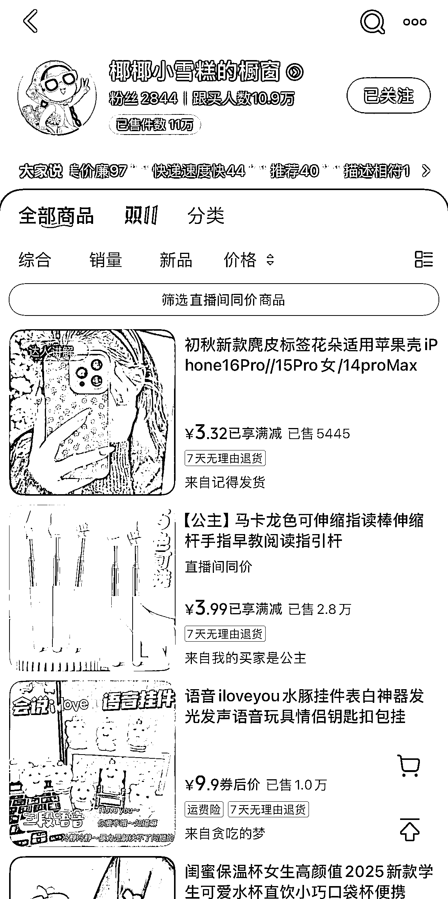
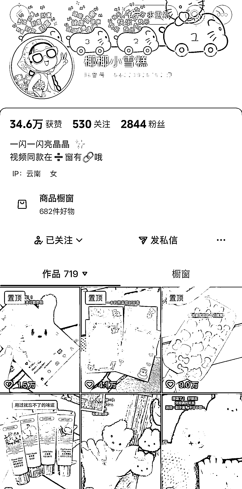

# 抖音带货 跟热点二次创作实现 11w 件商品销量

> 原文：[`www.yuque.com/for_lazy/wind/kpxm9kzl7c6fitn5`](https://www.yuque.com/for_lazy/wind/kpxm9kzl7c6fitn5)

作者： 馆主

日期：2025-10-14

点赞数：**39**

* * *

正文：

产品/变现｜异常值 在抖音上又挖掘到一个账号—低粉爆卖，跟热点卖商品，也能卖出 11w 件产品
这个账号已经更新了 719 个作品，但是没有一个是原创，而是看那个作品带货火了
她就去抓取原视频下来进行二次创作，跟着发布带同款商品，就这样一个不依靠粉丝就靠跟热点也能卖出这么多件商品，妥妥的带货思路，小白可直接上手呀！

* * *

评论区：

zwj : 哪里找热卖商品？

馆主 : 这个问题问的好，多关注这类型账号，然后一对一的模仿，你可以搜索我上图的账号，然后点赞他的作品，次数多了，平台会推荐原创视频给你

zwj : 谢谢

Ventus : 抓取原视频会不会被平台检测到呀

馆主 : 不会，复制原视频链接，打开微信搜索 xxx 去水印小程序，然后把视频下载下来，就可以进行二创了

Ventus : 好的，谢谢

逍遥子 : 恕我笨拙，请教一下，这个看不出来视频是如何二创的

馆主 : 因为她发的这些视频都是别人发过的呀

* * *

公众号懒人搜索，[懒人专属群分享](https://lazybook.fun/#/blog/group)