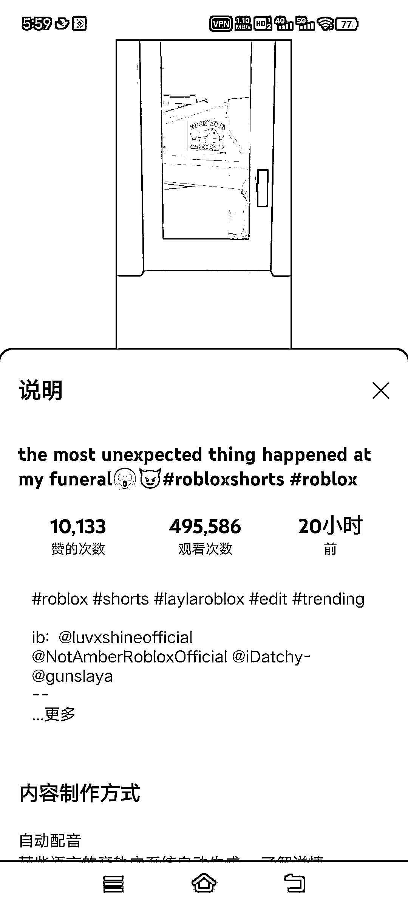
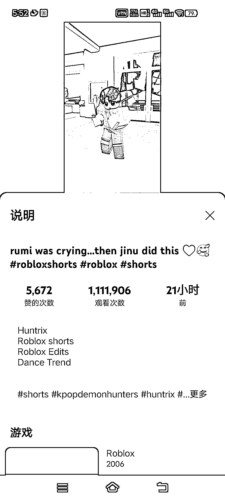
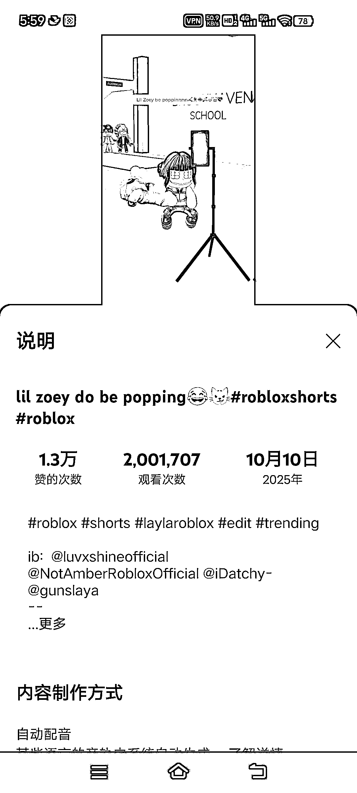

# Kpop 细分赛道创作者单频道千万订阅 80 个爆款视频流量分析

> 原文：[`www.yuque.com/for_lazy/wind/ezl0t3ngplmo5fxl`](https://www.yuque.com/for_lazy/wind/ezl0t3ngplmo5fxl)

作者： 澜桉

日期：2025-10-14

点赞数：**25**

* * *

正文：

kpop 真的是越来越有料了 有发现一个非常奇特的 Kpop 的赛道
他一个人的频道几乎把所以这个风格的 Kpop 的流量吃光了，开始他不是做这个的，但是是 kpop 火了之后他就开始用他的视频的那个风格做这个
看了一下，根本就没有人和他竞争，他的订阅直接暴涨到了千万，千万爆款将近 80 个，还有一个是几亿播放的 现在他这半个月的流量依旧保持在几百万和几十万
然后现在他的账号每天都发几个视频，应该是看到了大势所趋，所以最近在抓紧榨干流量了
另外一个账号也发掘了他的风格，一半真人，然后沿用了一下这个频道的风格，和真人演绎的 Kpop 拉开差异，而且根本不需要露脸
也跟着吃到了流量，搞到了 50 多万的订阅 因为根据他这个频道的数据可以断定这个风格的受众也是非常广的
迁移一下，如果，放到名人、山海经赛道等这些已经火过的赛道，但是还没有这种风格的，以及即将兴起的赛道里面的话，不知道会不会也大火一波
感兴趣的可以去看看其他赛道有没有这个风格的 如果没有，测试一下，便可知这种玩法的市场 有精力和能力的的朋友可以看看，然后去测试一下 如果真的是蓝海赛道
那就赚翻了 感兴趣的可以去研究一下这两个频道

* * *

评论区：

亦仁 : 感谢分享，已中标

* * *

公众号懒人搜索，[懒人专属群分享](https://lazybook.fun/#/blog/group)