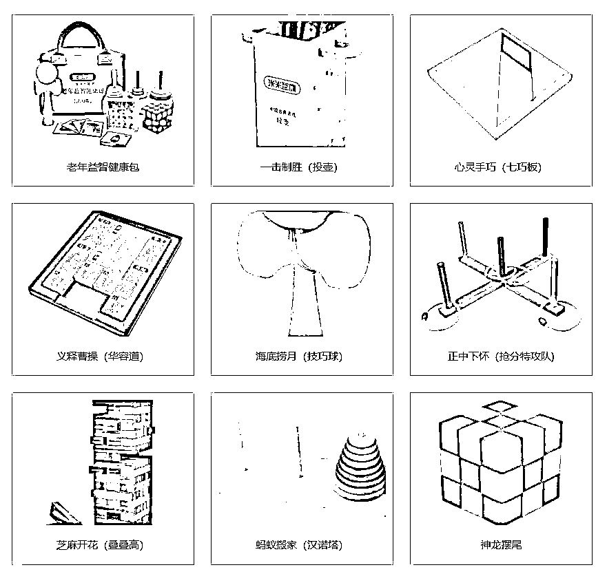
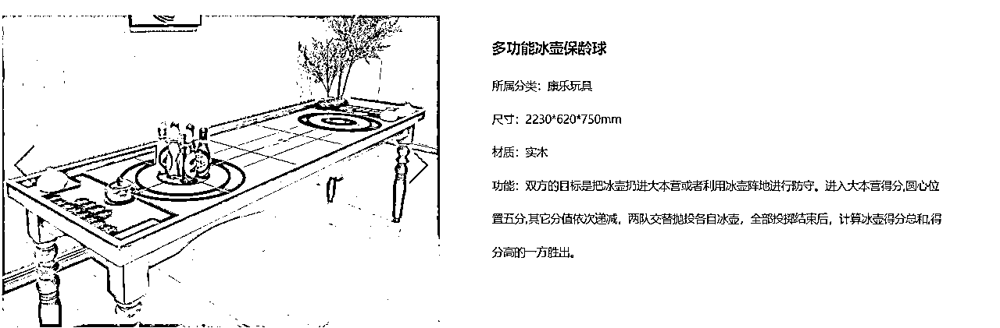
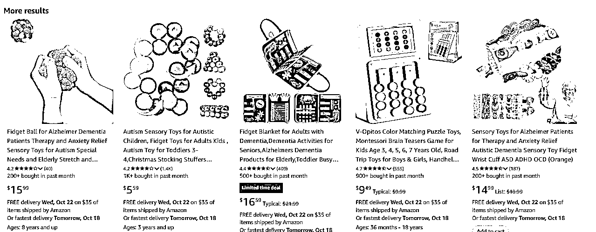

# 适老玩具正悄然成为银发经济的增长点

> 原文：[`www.yuque.com/for_lazy/wind/qfatkmquggbbq7yo`](https://www.yuque.com/for_lazy/wind/qfatkmquggbbq7yo)

作者： Miles

日期：2025-10-19

点赞数：**43**

* * *

正文：

老年人需求也在不断被放大，适老玩具，正悄然成为银发经济的增长点 老年玩具尚属于小众赛道，在传统认知中，玩具市场通常面向儿童，中老年群体的文娱活动往往被忽视。
研究机构 IMARC
Group 数据显示，2023 年全球玩具市场规模达 1830 亿美元，预计到 2032 年超 3260 亿美元。在所有年龄段群体中，中老年人群对于玩具的消费正呈现出上升趋势。
日本的老年玩具销量颇高。亚马逊上搜索“elderly toys”（老年玩具）等关键词，会出现很多相关产品，产品销量不高，但利润相对可观。
1688 平台数据显示，相关老年人玩具价格在 0.67-9.5 区间内，同样类型产品，亚马逊售卖价格在 10 美元以上。

* * *

评论区：

亦仁 : 感谢分享，已中标

搞钱萌新 : 好想法

* * *

公众号懒人搜索，[懒人专属群分享](https://lazybook.fun/#/blog/group)