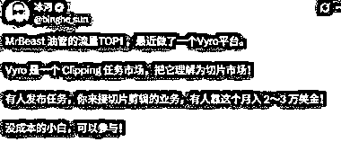
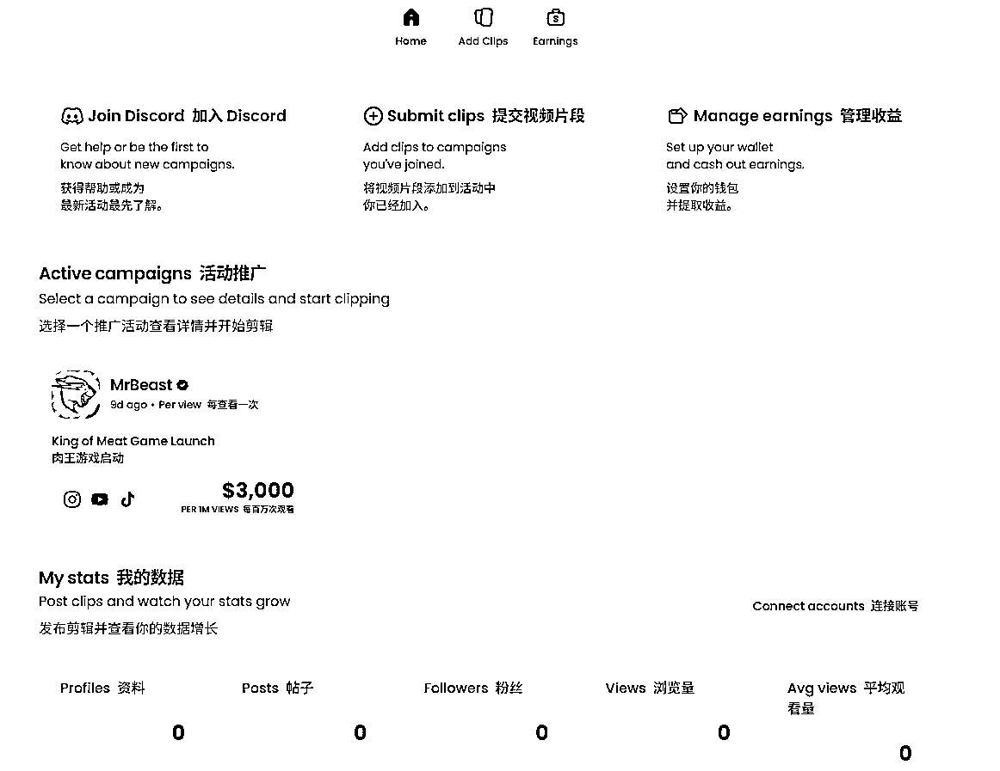
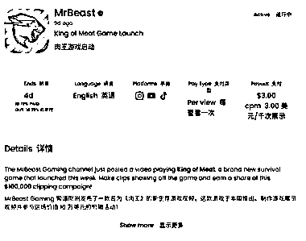
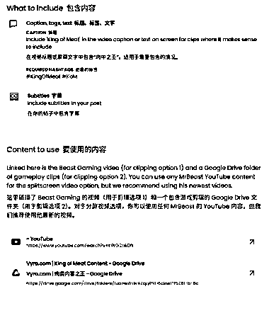
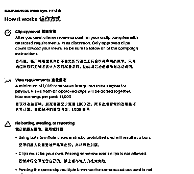

# MrBeast 的新剪辑平台 播放量 1000 次收益 3 美元

> 原文：[`www.yuque.com/for_lazy/wind/xlkh39zcqtkgkph6`](https://www.yuque.com/for_lazy/wind/xlkh39zcqtkgkph6)

作者： 怪兽宇

日期：2025-10-18

点赞数：**39**

* * *

正文：

MrBeast 的新平台， 靠剪视频就可以赚美刀。 模式主要是剪辑符合要求的视频，然后客户发布后，播放量达到最少 1000 次就有收益，1000 播放量 3
美元，以 MrBeast 的知名度应该很容易达到，收益还是挺高的。 [`www.vyro.com/`](https://www.vyro.com/)

* * *

评论区：

亦仁 : 感谢分享，已中标

* * *

公众号懒人搜索，[懒人专属群分享](https://lazybook.fun/#/blog/group)