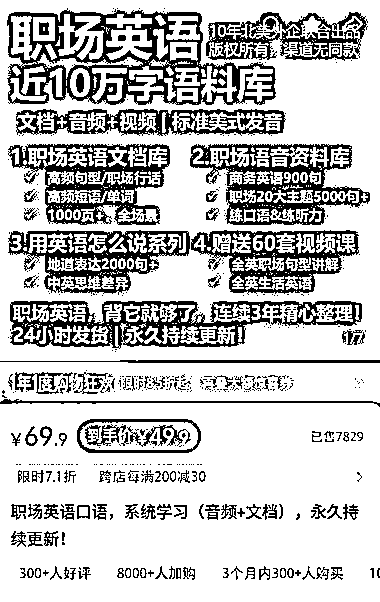
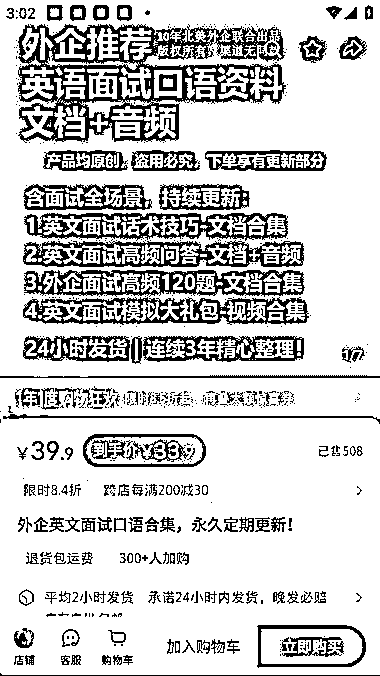
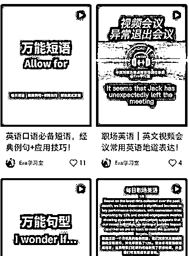

# 职场英语细分赛道：销量 1w+的外企实用英语内容变现模式解析

> 原文：[`www.yuque.com/for_lazy/wind/dh58phg8ff6fps2u`](https://www.yuque.com/for_lazy/wind/dh58phg8ff6fps2u)

作者： 地雷💣

日期：2025-10-20

点赞数：**33**

* * *

正文：

职场英语，外企实用英语，英语的细分赛道， 销量 1w+，客单价 30-50 之间； 笔记形式开始图文，目前主要是视频形式（ai 可做）
再留钩子，引入私域做其他服务； 借鉴：结合个人优势，行业经验总结打包成电子版

* * *

评论区：

亦仁 : 感谢分享，已中标

* * *

公众号懒人搜索，[懒人专属群分享](https://lazybook.fun/#/blog/group)