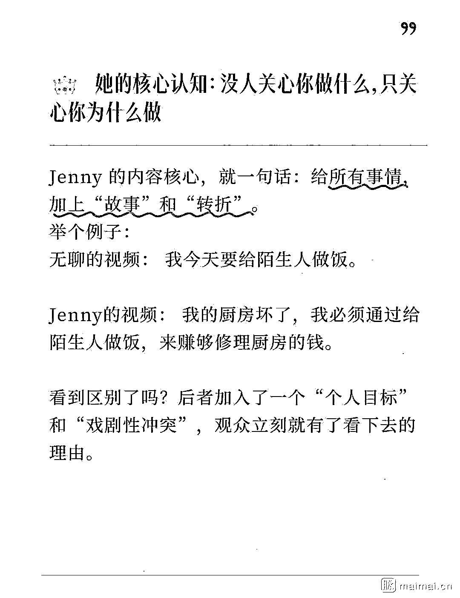

# 短视频爆款公式：6 亿播放量背后的科学总结

> 原文：[`www.yuque.com/for_lazy/wind/mz7gnbu5gx5zzve6`](https://www.yuque.com/for_lazy/wind/mz7gnbu5gx5zzve6)

作者： 小问

日期：2025-10-17

点赞数：**43**

* * *

正文：

6 亿播放，她把短视频的爆款公式扒干净了 一位 19 岁的女孩，Jenny Hoyos，在过去一年里，视频观看次数超过 6 亿，平均每个视频都有 1000 万播放。
她是怎么做到的？ 她没靠别的，就是把 MrBeast 等顶流的视频和自己的几千个视频翻来覆去地分析，总结出了一套堪称“科学”的爆款公式。

* * *

评论区：

亦仁 : 感谢分享，已中标

* * *

公众号懒人搜索，[懒人专属群分享](https://lazybook.fun/#/blog/group)