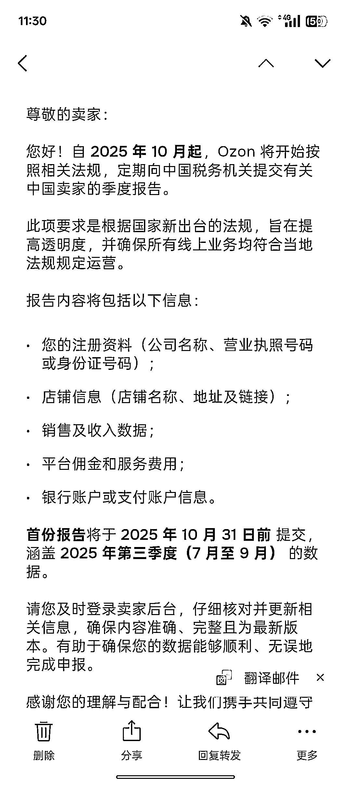

# 电商平台税务申报注意事项：10 月起 7-9 月数据推送及纳税要点解析

> 原文：[`www.yuque.com/for_lazy/wind/vsdsnvmvsri9fssq`](https://www.yuque.com/for_lazy/wind/vsdsnvmvsri9fssq)

作者： 倾听晚风

日期：2025-10-17

点赞数：**20**

* * *

正文：

生财朋友圈 现在包括 ozon 在内的各平台都开始进行报税了，各位可以参考下一个财税公司发的内容: 10 月份开始正式要推送 7-9 的电商平台数据
我们有做电商的话要看下电商平台后台的销售额 因为电商后台数据，我们看不到 ，要注意以下几点
1、一般纳税人要看进项是否够抵扣，不够的话要按 13 个点缴纳增值税（一月一申报） 2、小规模（季度申报）
A.我们连续 12 个月的电商平台数据不能超过 500 万，超过就要缴纳 13 个点的增值税税金和升级一般纳税人 B.如果单季度超过 30 万，也要缴纳一个点的增值税税金
C.如果没有成本企业有利润需要缴纳企业所得税（小微企业利润不超过 300 万按利润的 5%缴纳，超过 300 万按利润的 25%缴纳）

* * *

评论区：

亦仁 : 感谢分享，已中标

Josef : 店均营业额 5 万左右，没有进货发票怎么解决呢？可以做零申报？

小七 : 不可能

倾听晚风 : 0 申报不太行了圈友

* * *

公众号懒人搜索，[懒人专属群分享](https://lazybook.fun/#/blog/group)