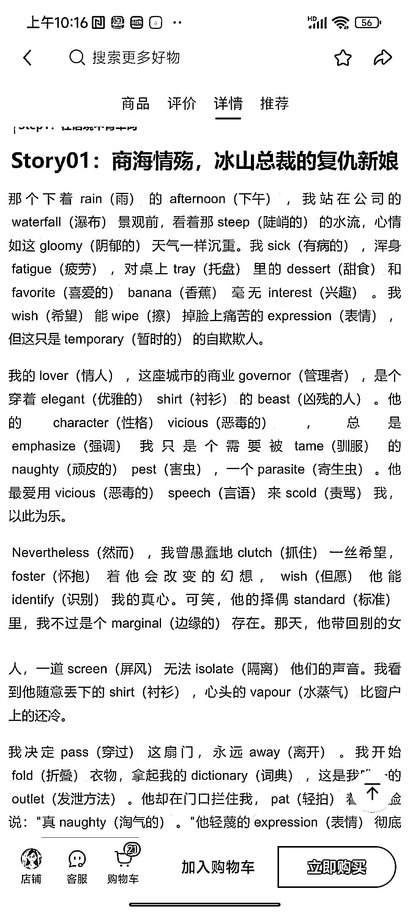
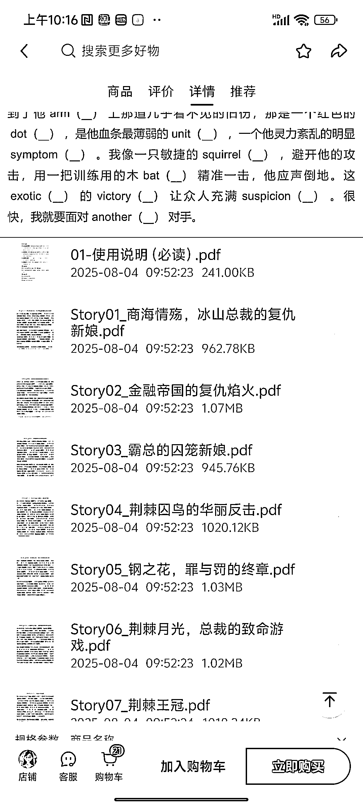
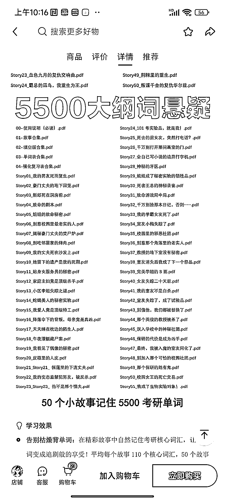

# 考研雅思词汇小说虚拟产品三个月销量十万加

> 原文：[`www.yuque.com/for_lazy/wind/bmykxpv1zkfcv4pu`](https://www.yuque.com/for_lazy/wind/bmykxpv1zkfcv4pu)

作者： 嗯

日期：2025-10-07

点赞数：**66**

* * *

正文：

这个创作者单品三个月都十万加了，他做的工作就是比如说考研 5500 词，或者说雅思核心词汇，它首先拿到这个词汇，然后用 AI 进行创作，创作出 50 篇小说，然后去卖，这样那些考研或者考雅思的人，他们可以一边看小说，一边背单词，相当于圈住了考研的群体中喜欢偷懒的那群人，特别是爱看小说的那群人，它这个东西也是可以长期复利的，花个几天时间把它整理出来，然后长期运营，长期一直卖，弄个版权什么的，这个品感觉很不错，适合做虚拟的大家看看。

* * *

评论区：

风益 : 开眼了！

Lucky 万 : 开眼

倪大胖 : 真人才

驼铃 : 学习界天才

亦仁 : 感谢分享，已中标

偶尔的时光 : 真牛掰，这个看着是不是可以延伸到其他领域？考公考研考编制等等？

搞钱萌新 : 有意思

* * *

公众号懒人搜索，[懒人专属群分享](https://lazybook.fun/#/blog/group)