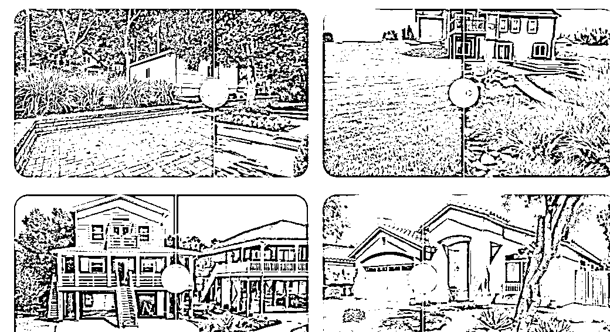
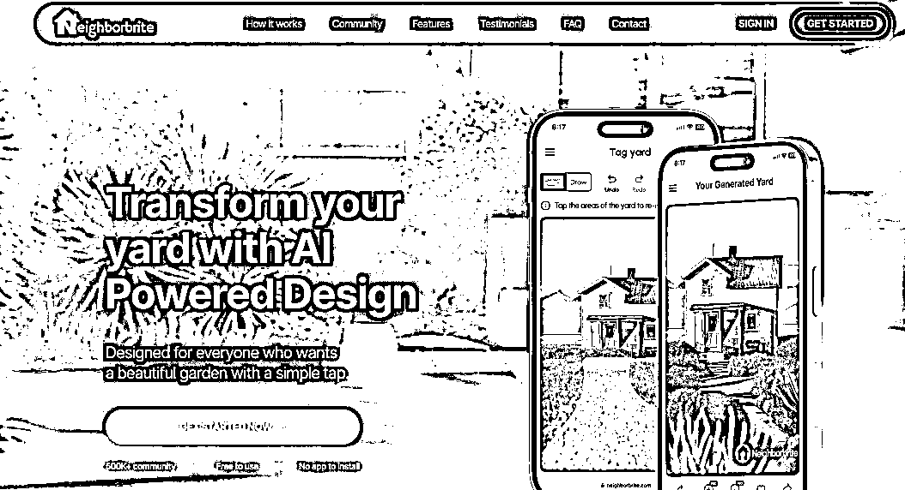
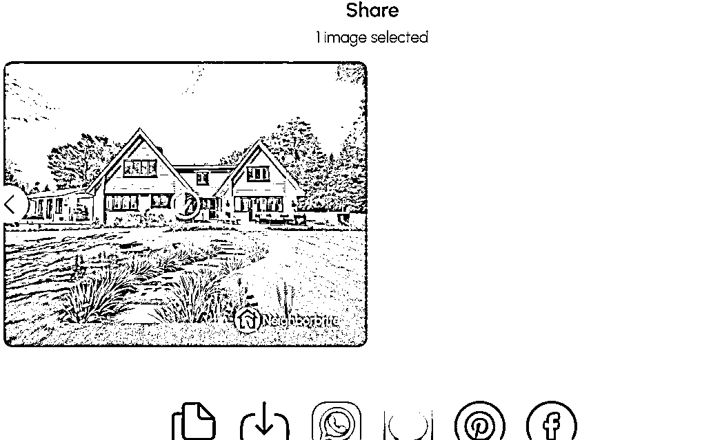
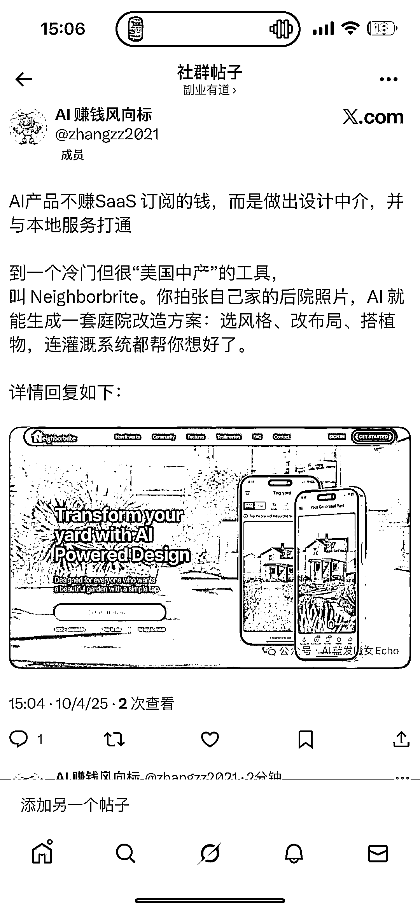

# AI 庭院设计工具：月访问 10 万+，靠“设计中介+本地施工”闭环盈利

> 原文：[`www.yuque.com/for_lazy/wind/il5r7fyi2s0lpf5m`](https://www.yuque.com/for_lazy/wind/il5r7fyi2s0lpf5m)

作者： Miles

日期：2025-10-04

点赞数：**42**

* * *

正文：

AI 产品不赚 SaaS 订阅的钱，而是做设计中介，并与本地服务打通 刷到分享，一个冷门但很“美国中产”的工具，叫
Neighborbrite。你拍张自己家的后院照片，AI
就能生成一套庭院改造方案：选风格、改布局、搭植物，连灌溉系统都帮你想好了。不只是“画个草图”那种体验，它还做到了： 月访问 10
万+（多数来自美国独立住宅用户）； 一次 AI 设计不花钱，但升级版收费 <card type="inline" name="math" value="data:%7B%22code%22%3A%22287%20%E8%B5%B7%EF%BC%9B%20%E5%90%8E%E7%AB%AF%E8%BF%98%E8%83%BD%E6%8E%A5%E5%85%A5%E4%B8%93%E4%B8%9A%E8%AE%BE%E8%AE%A1%E5%B8%88%20%2B%20%E6%9C%AC%E5%9C%B0%E6%96%BD%E5%B7%A5%E5%9B%A2%E9%98%9F%EF%BC%8C%E5%B9%B3%E5%8F%B0%E6%8A%BD%E4%BD%A3%E8%B5%9A%E9%92%B1%EF%BC%9B%5Cn%E7%9C%8B%E4%B8%8A%E5%8E%BB%E5%8F%AA%E6%98%AF%E4%B8%AA%E7%94%A8%20AI%20%E6%8B%BC%E6%8B%BC%E5%9B%BE%E7%9A%84%E5%B0%8F%E5%B7%A5%E5%85%B7%EF%BC%8C%E8%83%8C%E5%90%8E%E5%85%B6%E5%AE%9E%E6%98%AF%E4%B8%80%E4%B8%AA%20%E2%80%9CAI%20%2B%20%E8%AE%BE%E8%AE%A1%20%2B%20%E6%9C%AC%E5%9C%B0%E6%96%BD%E5%B7%A5%E2%80%9D%20%E7%9A%84%E5%B9%B3%E5%8F%B0%E9%97%AD%E7%8E%AF%E3%80%82%20%E8%BF%99%E4%B8%AA%20AI%20%E5%B7%A5%E5%85%B7%E7%9A%84%E5%95%86%E4%B8%9A%E6%A8%A1%E5%9E%8B%EF%BC%8C%E6%98%AF%E5%81%9A%E6%88%90%E2%80%9C%E8%AE%BE%E8%AE%A1%E7%95%8C%E7%9A%84%E5%A4%96%E5%8D%96%E5%B9%B3%E5%8F%B0%E2%80%9D%5Cn%E8%A1%A8%E9%9D%A2%E4%B8%8A%EF%BC%8CNeighborbrite%20%E6%98%AF%E4%B8%80%E4%B8%AA%E2%80%9CAI%20%E8%AE%BE%E8%AE%A1%E5%B7%A5%E5%85%B7%E2%80%9D%EF%BC%8C%E5%85%B6%E5%AE%9E%E5%AE%83%E8%B5%9A%E7%9A%84%E4%B8%8D%E6%98%AF%20SaaS%20%E7%9A%84%E9%92%B1%EF%BC%8C%E8%80%8C%E6%98%AF%E5%81%9A%E6%88%90%E4%BA%86%E4%B8%80%E4%B8%AA%E2%80%9C%E8%AE%BE%E8%AE%A1%E4%B8%AD%E4%BB%8B%E2%80%9D%E3%80%82%20%E5%AE%83%E6%8B%86%E6%88%90%E4%BA%86%E4%B8%89%E6%AD%A5%E8%B5%B0%EF%BC%9A%5Cn%E5%85%8D%E8%B4%B9%E8%8E%B7%E5%AE%A2%EF%BC%9A%E4%BD%A0%E4%B8%8A%E4%BC%A0%E7%85%A7%E7%89%87%E3%80%81%E9%80%89%E9%A3%8E%E6%A0%BC%E3%80%81%E5%85%8D%E8%B4%B9%E5%87%BA%20AI%20%E5%9B%BE%EF%BC%8C%E4%BD%8E%E9%97%A8%E6%A7%9B%E6%8B%89%E7%94%A8%E6%88%B7%20%E4%B8%AD%E7%AB%AF%E5%8F%98%E7%8E%B0%EF%BC%9A%E4%BD%A0%E8%A7%89%E5%BE%97%E4%B8%8D%E9%94%99%EF%BC%8C%E5%B0%B1%E8%83%BD%E8%8A%B1%E9%92%B1%E5%8D%87%E7%BA%A7%E4%BA%BA%E5%B7%A5%E8%AE%BE%E8%AE%A1%E5%B8%88%E5%B8%AE%E4%BD%A0%E7%BB%86%E5%8C%96%E5%9B%BE%E7%BA%B8%E3%80%81%E5%87%BA%E6%A4%8D%E7%89%A9%E6%B8%85%E5%8D%95%EF%BC%88%22%2C%22id%22%3A%22UzMQg%22%7D">287 起）
终端撮合：你要真想改造院子，它能把你推荐给附近的园艺团队，平台抽佣或收中介费这三个环节， 不管你是 DIY 党、设计师、还是施工方，每一步都能赚到钱。
这种模式最有意思的点在于：用户用完 AI 图之后，大概率不懂怎么落地，所以会付费升级落地又涉及线下人力，就有服务费用 &
抽佣空间整个链条不靠订阅，而是靠真实意图转化赚钱你很少看到哪款 AI 工具在落地端能做这么扎实的闭环。
这类工具赛道够窄、使用够简单、变现有路径、渠道有抓手而且一旦积累了落地服务商，平台就有护城河了。不是谁都能一键复制。</card>

* * *

评论区：

亦仁 : 感谢分享，已中标

* * *

公众号懒人搜索，[懒人专属群分享](https://lazybook.fun/#/blog/group)