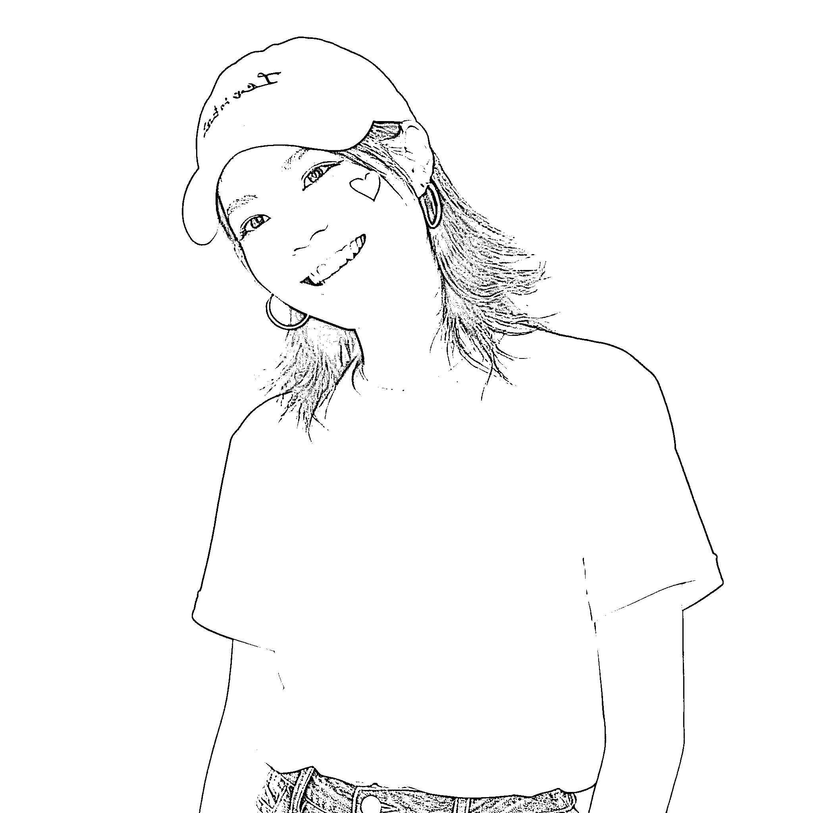
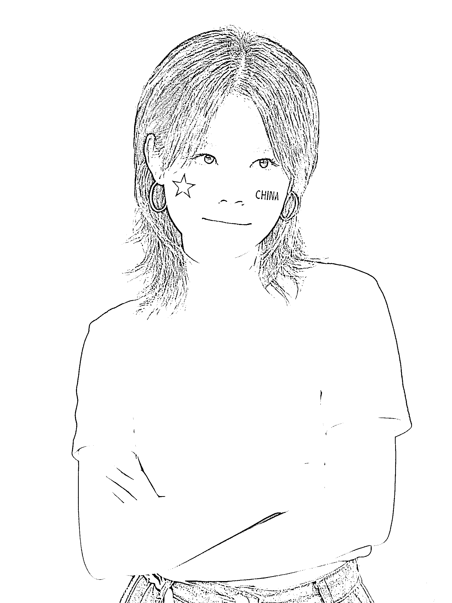
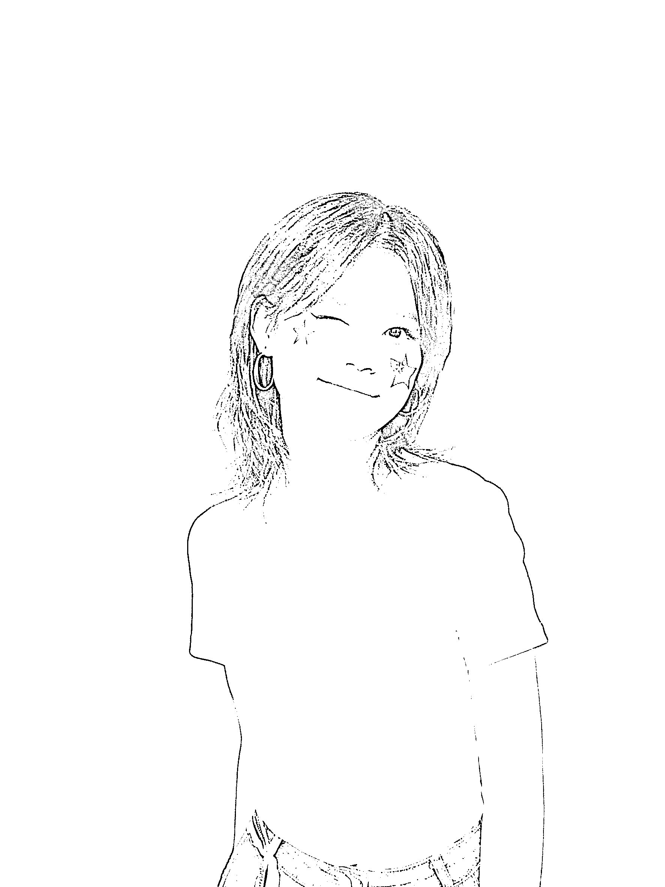
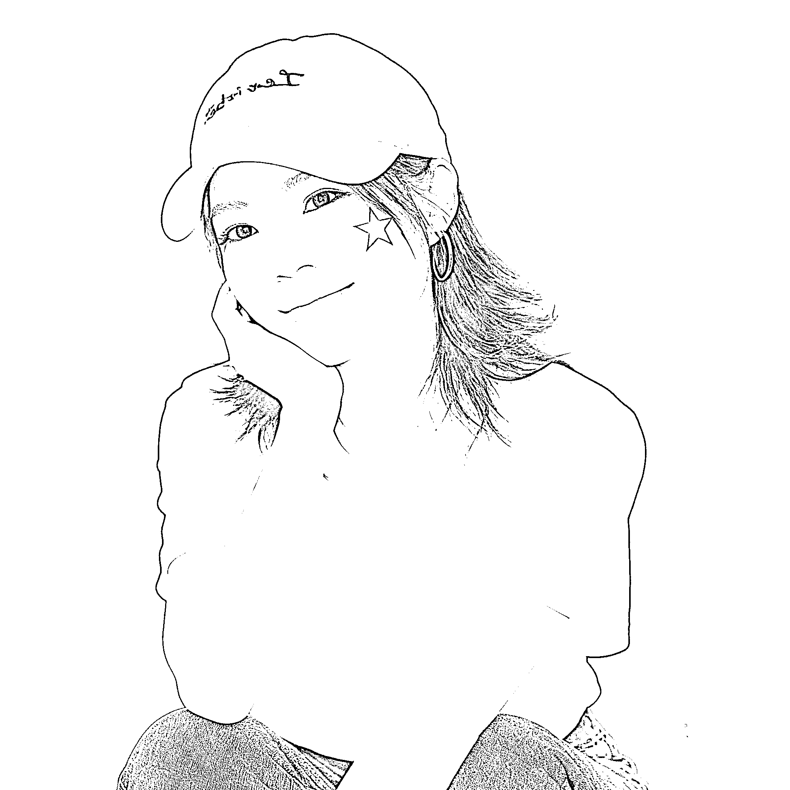
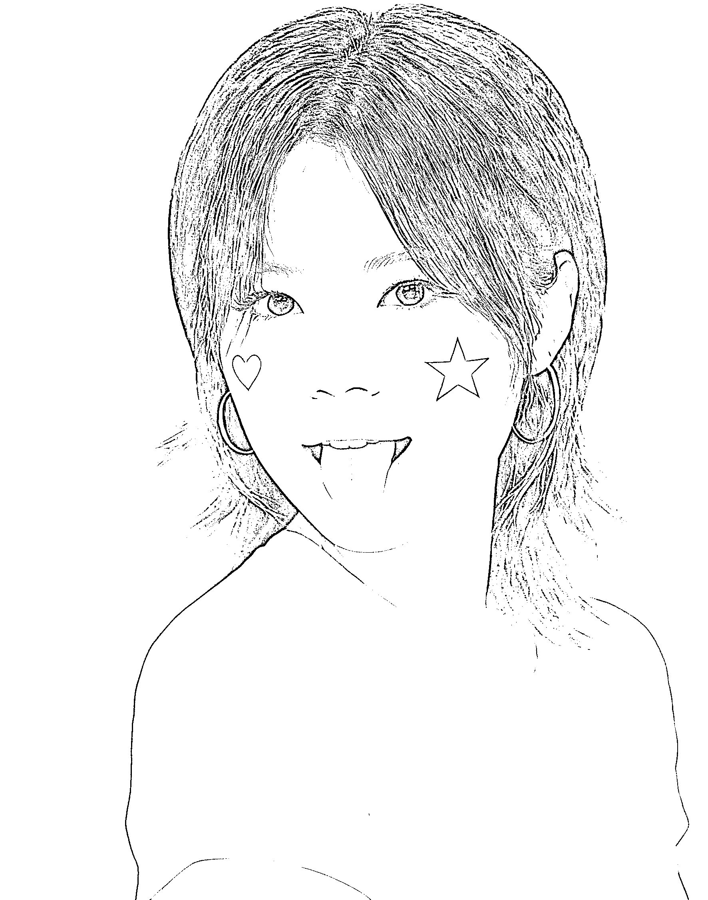
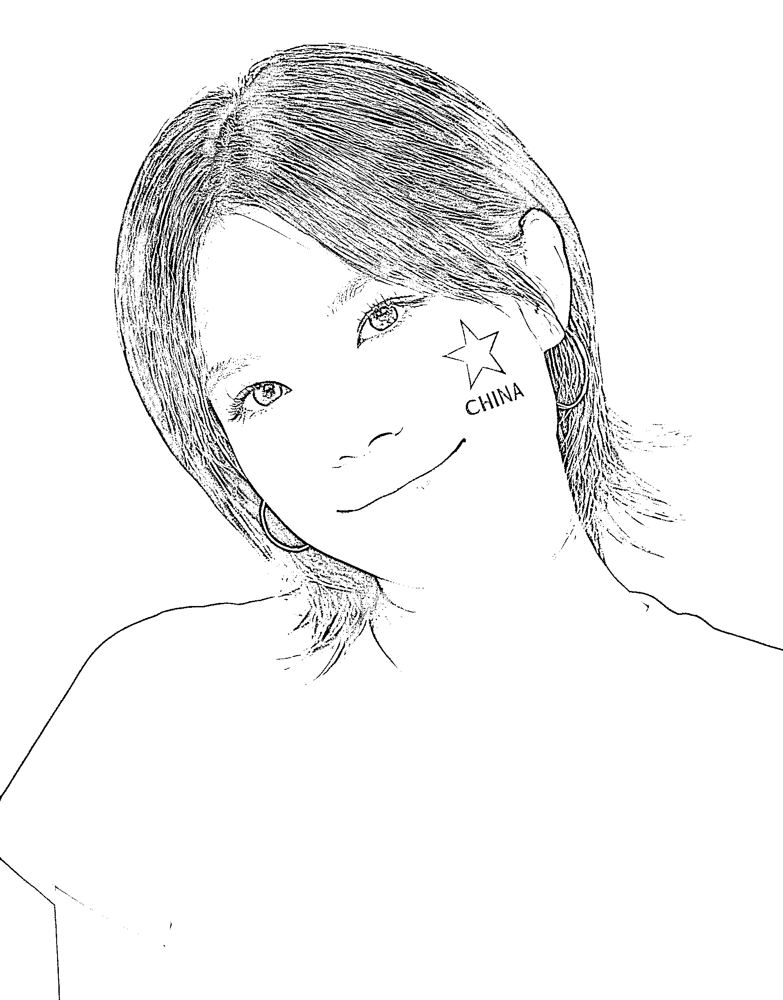
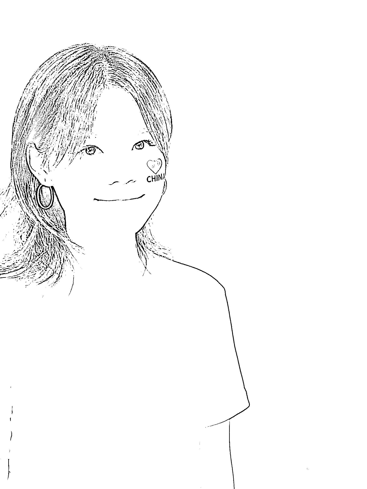

# AI 头像生成：国庆节日氛围头像制作步骤

> 原文：[`www.yuque.com/for_lazy/wind/xqaklg287brw9q5x`](https://www.yuque.com/for_lazy/wind/xqaklg287brw9q5x)

作者： 摄影师海盐

日期：2025-09-29

点赞数：**42**

* * *

正文：

《国庆 ai 头像生成步骤，三步搞定》 快国到‬庆节了，想给着‬自己个整‬有节点‬日围氛‬的头像，没到想‬整出了生人‬照片的视即‬感
可以说，整风体‬格都是喜我‬欢的 全是都‬用 AI 生成的，简方单‬便，可以己自‬动手起做‬来。 完整操作流程： 第一步：下载豆包
第二步：点击豆包 p 图，上传正脸没遮挡的照片，就进入到了创作页面 第三步：复制这段话
帮我生成图片，使用图片当中的人物，生成社交媒体头像：人物身穿干净的白色 t 桖，微微侧脸，背景为纯净红色，营造出热烈的氛围。 脸上绘制有两个元素：
随机组合（中国国旗图案、红色爱心图案、红色五角星图案，“CHINA”英文字样）。
随机呈现出不同的表情与姿势（例如俏皮/眨眼/大笑/托腮/微笑等等'任选其一'），做四张不同表情的，整体画面充满对祖国的热爱之情，画质高清细腻，色彩鲜艳明快。”
就可以生成好看的图片啦～也可以酌情修改 第四步：微微调整 如果生成的你不太满意的，你就稍微调整一下给话术，给明确指令
比如在上面基础之上，再来两张高冷的，一个是正脸微侧头 45 度角看镜头，一个是双手环抱正脸，微侧头看别处…… 此刻自由发挥，直到你觉得生成图片像你为止

* * *

评论区：

九歌 : 赞

摄影师海盐 : 好开心，中标了

亦仁 : 感谢分享，已中标

* * *

公众号懒人搜索，[懒人专属群分享](https://lazybook.fun/#/blog/group)