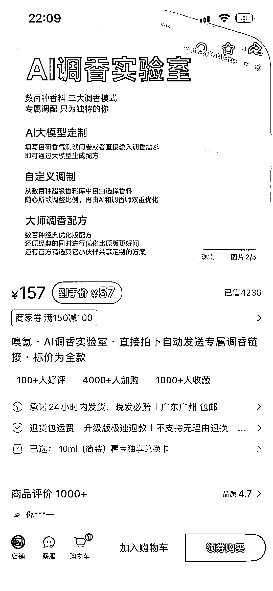
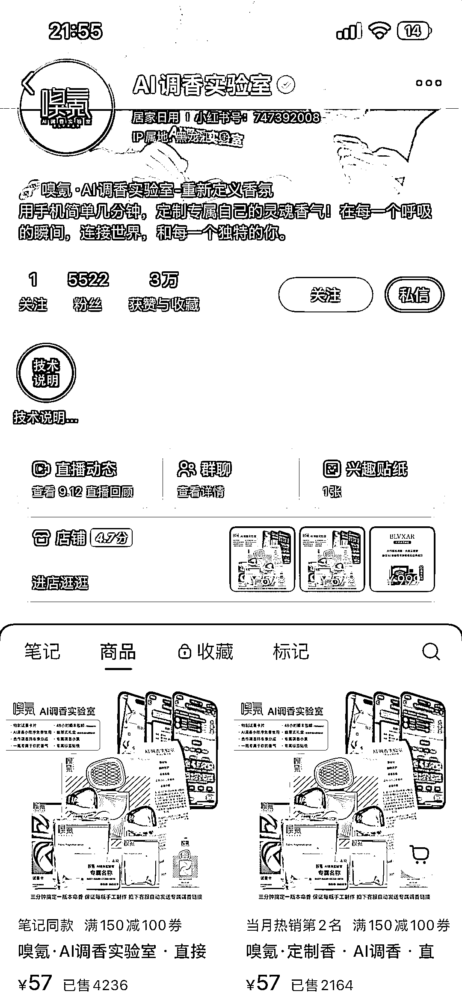
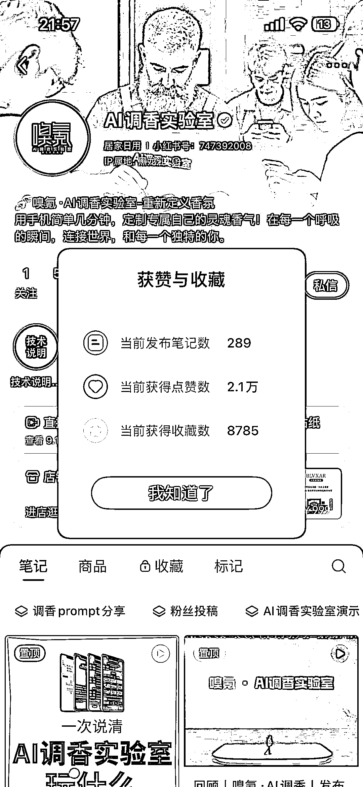
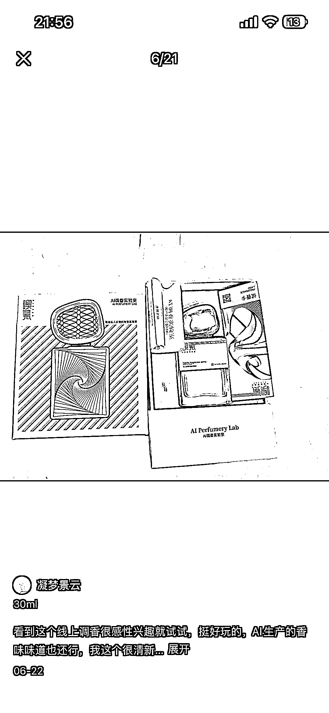
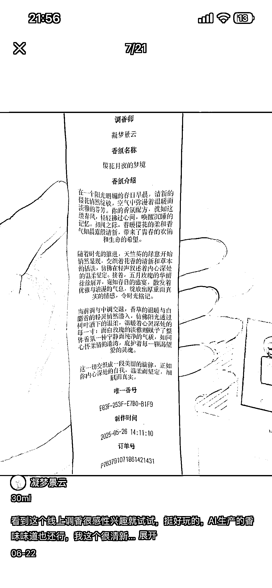

# AI 调香赛道：个性化配方生成模式实现 GMV24 万+

> 原文：[`www.yuque.com/for_lazy/wind/xc55ngyinxw2pzaa`](https://www.yuque.com/for_lazy/wind/xc55ngyinxw2pzaa)

作者： 阿牛

日期：2025-10-08

点赞数：**38**

* * *

正文：

赛道/细分方向 ai 调香赛道 案例描述： 用户下单后根据 MBIT 和一些其他的问卷内容，通过大模型生成个性化配方并调配香水 数据：
刷了下笔记今年 7 月笔记开始发布的，爆款链接销售 4236 件，客单价 57，GMV 大约 24w+ 为什么是机会：
我在一个线下摆摊看到过类似的项目，通过 coze 搭建的一个调香项目，今天在小红书看到这个已经商业化落地了，确实很强，毛利润估计很高，通过 AI 降低调香师的人工成本，而且可复制性比较强，配方数据库可以无限扩展，这个也比较符合 Z 世代个性化消费趋势

* * *

评论区：

李朵拉 dollna : 区块链香水哈哈

亦仁 : 感谢分享，已中标

* * *

公众号懒人搜索，[懒人专属群分享](https://lazybook.fun/#/blog/group)