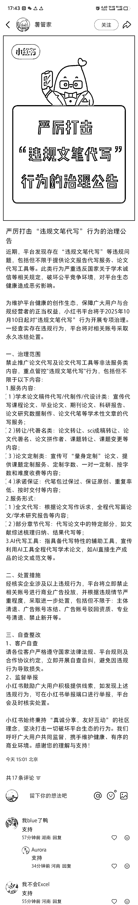

# 小红书 AI 代写项目风向：平台专项治理“违规文笔代写”需调整引流策略

> 原文：[`www.yuque.com/for_lazy/wind/klsxwh1vw6po30c2`](https://www.yuque.com/for_lazy/wind/klsxwh1vw6po30c2)

作者： 嗯

日期：2025-10-10

点赞数：**31**

* * *

正文：

这是一条对圈友非常重要的风向标，AI 代写是社群的一个重要的项目，很多人在上面拿到了几万，几十万，甚至上百万的成绩。主要依靠的就是咸鱼和小红书这些流量洼地。小红书官方今天发布通告，要严厉打击“违规文笔代写”，在小红书上引流的圈友注意一下，别账号废掉了，及时看到这个风向标，然后调整一下自己的策略。
严厉打击“违规文笔代写”行为的治理公告
近期，平台发现存在“违规文笔代写”等违规问题，包括但不限于提供论文报告代写服务、论文代写工具等。此类行为严重违反国家关于学术诚信等相关规定，破坏公平竞争环境，对平台生态健康造成恶劣影响。
为维护平台健康的创作生态，保障广大用户与合规经营者的正当权益，小红书平台将于 2025 年 10 月 10 日起对"违规文笔代写”行为开展专项治理。一经查实存在违规行为，平台将对相关账号采取永久冻结处置。
一、治理范围 禁止推广论文代写及论文代写工具等非法服务类内容，重点管控"违规文笔代写"行为，包括但不限于以下内容： 1.服务内容：
（1）学术论文稿件代写/代制作/代设计类：宣传代写课程论文、毕业论文、期刊论文、科研报告、论文研究数据制作、论文代笔等学术性文章的代写服务；
（2）转让/代署名类：论文转让、sci 成稿转让、论文代署名、论文拼作者、课题转让、课题变更等内容；
（3）论文定制类：宣传可“量身定制”论文、提供课题定制服务、定制字数、一对一定制、按字数和难度收费等内容；
（4）承诺保证：代笔包过保过、保证原创、重复率低、按时交付等内容； 2.服务形式： （1）全文代写：根据论文写作诉求，全程代写篇论文/学术研究报告等内容；
（2）部分章节代写：代写论文中的特定部分，如文献综述梳理归纳、结果代写等；
3.AI 代写工具：指具备代写特性的辅助工具，宣传利用 AI 工具全程代写学术论文，如 AI 直接生产成品的论文或范文等。 二、处置措施
经核实企业涉及以上违规行为，平台将立即禁止相关账号进行商业广告投放，并根据违规情节严重程度，采取进一步处置，包括但不限于：主体清退、广告账号冻结、广告账号驳回资质、专业号清退、禁止新开等。
三、自查整改 1、客户自查 请各位客户严格遵守国家法律法规、平台规则及合作协议约定，立即开展自查自纠，避免因违规行为导致损失。 2、监督举报
小红书鼓励广大用户积极提供线索，如发现上述违规行为，可在小红书举报端口进行举报，平台会及时核实处置。
小红书始终秉持“真诚分享，友好互动”的社区理念，坚决打击一切破坏平台生态的行为。我们呼吁广大用户共同监督，携手维护健康、有序的商业环境。感谢您的理解与支持！

* * *

评论区：

嗯 : [偷笑]多点点赞让更多圈友看到哈，避免账号损失

诗语 : 学术类本来就是灰产啊

亦仁 : 感谢分享，已中标

* * *

公众号懒人搜索，[懒人专属群分享](https://lazybook.fun/#/blog/group)