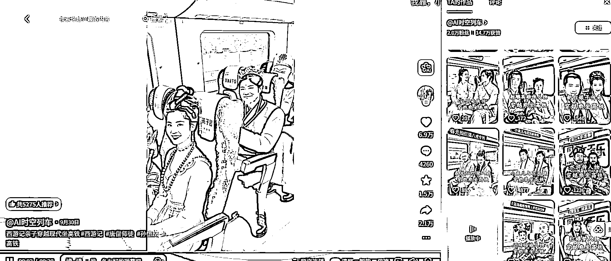
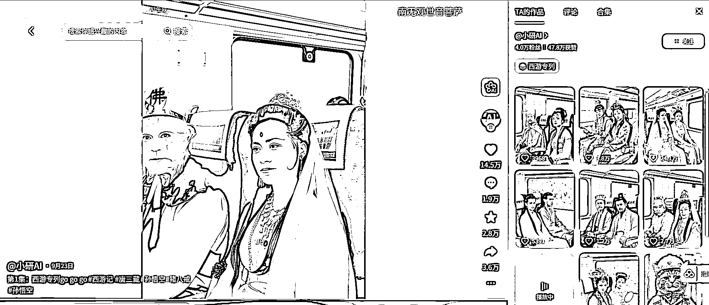

# AI 视频制作：经典影视人物高铁场景创作教程 怀旧情绪内容涨粉方案

> 原文：[`www.yuque.com/for_lazy/wind/hsls9o09liztxp4v`](https://www.yuque.com/for_lazy/wind/hsls9o09liztxp4v)

作者： 漫鱼

日期：2025-10-09

点赞数：**35**

* * *

正文：

AI 视频新玩法！涨粉点赞超好，经典影视人物坐高铁，怀旧情绪拉满 制作教程：
1.我习惯用百度网页，直接搜索“三国演义诸葛亮剧照全身照”，剧名+角色，尽量选择全身照，方便后边 AI 生图少抽卡
2.选择适合的图片点开大图，网页版有“变清晰” 3.变清晰后下载 即梦 AI 生图/视频 1.准备好需要生成的影视角色图
2.打开即梦 AI，图片生成（先生成一张高铁座位） 即梦： 🗨️ （提示词） 高铁一等双人座，棕色皮质座椅，无小桌板，窗外蓝天白云，全景
3.选择适合的高铁座椅下载，上传 2 张影视人物图和高铁座椅（即梦 APP 也支持上传多张图的） 🗨️ （提示词） 图一和图二的人物坐在图三的高铁座位上，看向镜头
4.选择满意的照片，挨个保存下来，选择视频生成，智能多帧（即梦网页版才有，手机用浏览器输入即梦网页操作） 5.视频生成，智能多帧，图片之间输入图提示词 🗨️ （提示词）
镜头从高铁前排座位自然平移到后排座位，车厢内人物和座位内部结构稳定不变，只有镜头在向车厢后慢速移动，座位上人物看向镜头微笑，窗外景色快速闪过，呈现高铁高速行驶中，一镜到底效果展示，转场不能使用叠化[`jimeng.jianying.com/ai-
tool/generate`](https://jimeng.jianying.com/ai-tool/generate)

* * *

评论区：

亦仁 : 感谢分享，已中标

搞钱萌新 : 变现靠收徒吗

漫鱼 : 收徒，商单都有

* * *

公众号懒人搜索，[懒人专属群分享](https://lazybook.fun/#/blog/group)