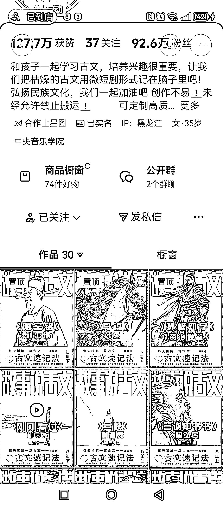
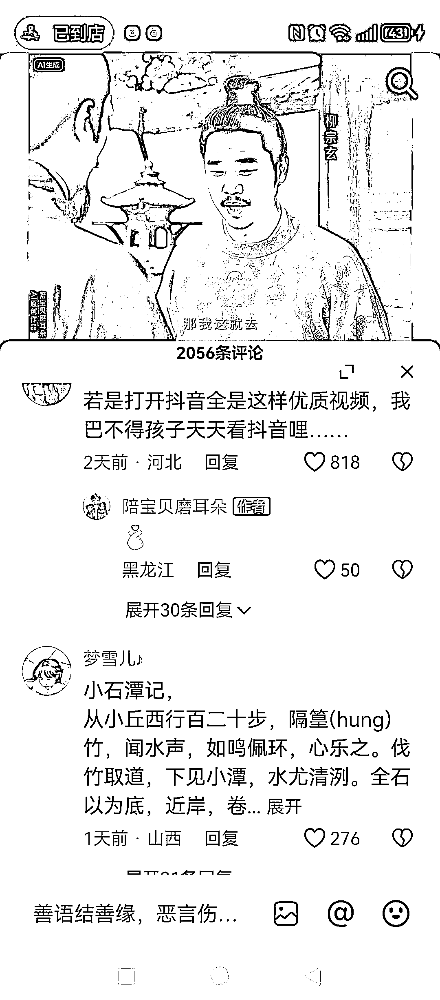
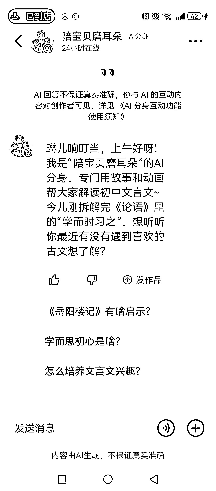

# AI 古文学习赛道：高赞精准获客后，可拓展 K12 全科动画内容打包售卖

> 原文：[`www.yuque.com/for_lazy/wind/crf4v3rkhgac1y3f`](https://www.yuque.com/for_lazy/wind/crf4v3rkhgac1y3f)

作者： 金琳

日期：2025-09-29

点赞数：**30**

* * *

正文：

用 ai 学古文，点赞和粉丝量都大，而且客户精准，后期也可以把小学、初中、高中的都弄个合集打包售卖 9.9 元之类，我估计很多家长都会买来给小孩看，能力强的伙伴同样可以把义务教育阶段的各科都用 ai 来实现比如用 ai 把英语课文给做成动画、用 ai 来把初中地理知识做成动画或互动都是相通的。

* * *

评论区：

亦仁 : 感谢分享，已中标

* * *

公众号懒人搜索，[懒人专属群分享](https://lazybook.fun/#/blog/group)