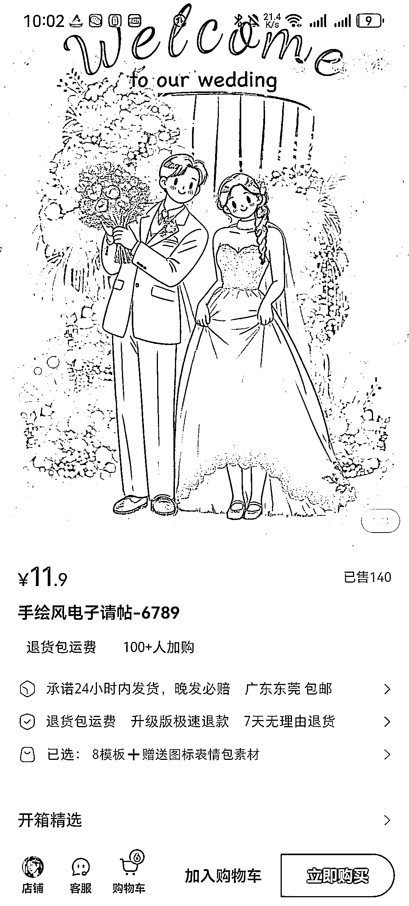
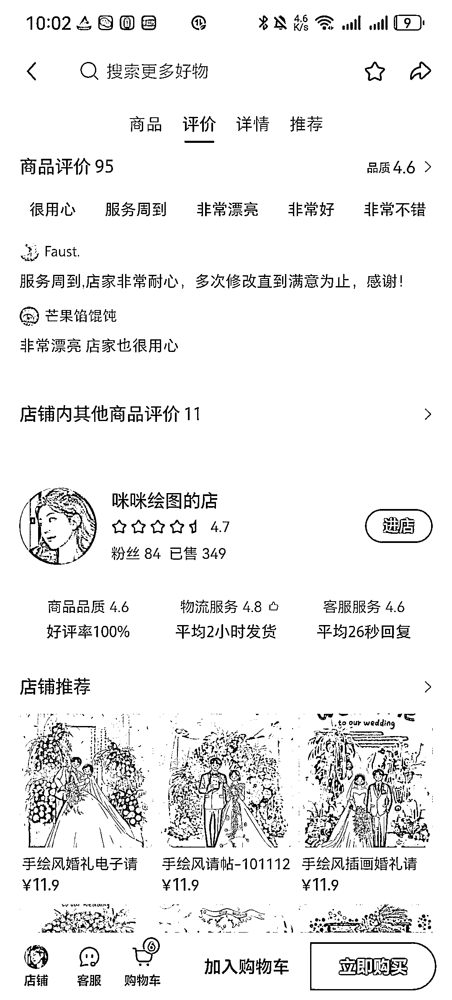
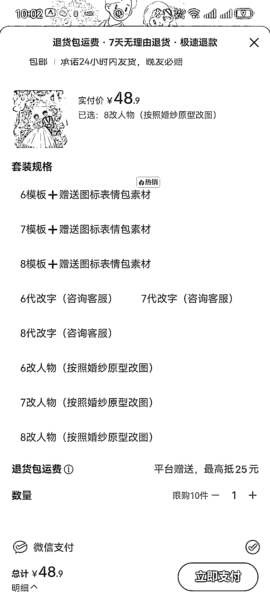

# 小红书 AI 手绘婚礼邀请函 50 天营业收入 4000+

> 原文：[`www.yuque.com/for_lazy/wind/xacbefwc1iv60o0y`](https://www.yuque.com/for_lazy/wind/xacbefwc1iv60o0y)

作者： 阿龙很勇敢

日期：2025-10-01

点赞数：**27**

* * *

正文：

小红书虚拟赛道分享: 【Ai 手绘风格婚礼邀请函】 开店 50+天，营业收入保守估计 4000+
用固定的 Ai 提示词，生成模板，顾客下单可以选择替换文字，或者换自己的婚纱照生成类似的图。 一张图片几分钟就完成 需要的技能:
Ai 文生图+图生图、P 图改字（美图、醒图等）

* * *

评论区：

南熹 : 请问这个是用 gpt 4o 吗

阿龙很勇敢 : 即梦，豆包就可以

南熹 : 试过了，不知道这种风格关键词是什么，生成的不精致

阿龙很勇敢 : 不会写可以把图片截下来发给 AI，让 AI 帮你写提示词

南熹 : 也试了，不得要领，我再试试，谢谢你

亦仁 : 感谢分享，已中标

* * *

公众号懒人搜索，[懒人专属群分享](https://lazybook.fun/#/blog/group)