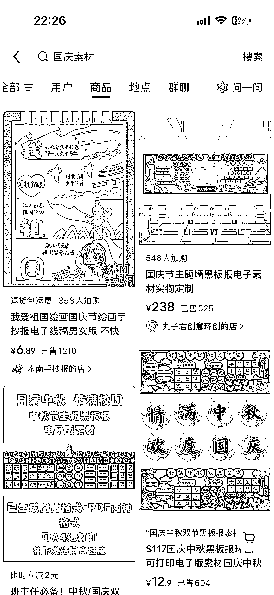
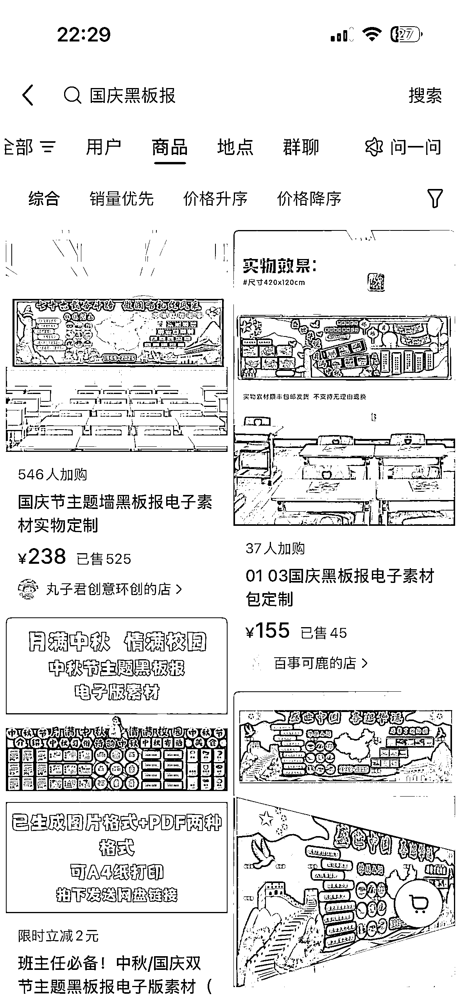

# 小红书国庆流量赛道：AI 助力虚拟产品销量递增

> 原文：[`www.yuque.com/for_lazy/wind/luibg9o3d7v82e9q`](https://www.yuque.com/for_lazy/wind/luibg9o3d7v82e9q)

作者： 馆主

日期：2025-09-29

点赞数：**26**

* * *

正文：

用户热门搜索词｜异常值 由于国庆节的到来，这个是一个社会热点 作为一名搞钱的人，肯定会抓住这一波大流量搞点小钱 小红书是普通人入场的低门槛商业平台
我们在搜索框输入：国庆 就可以看到有各种各样的用户需求词，而一些聪明的商家早于布局好了 seo 吃这一波流量
比如说：国庆头像（之前没有 AI 普通人不会设计搞不了，但是现在有了 AI 的辅助这不是问题） 国庆素材、国庆黑板报等….
都有对应的商品，而且销量还不错，一直在递增

* * *

评论区：

亦仁 : 感谢分享，已中标

* * *

公众号懒人搜索，[懒人专属群分享](https://lazybook.fun/#/blog/group)