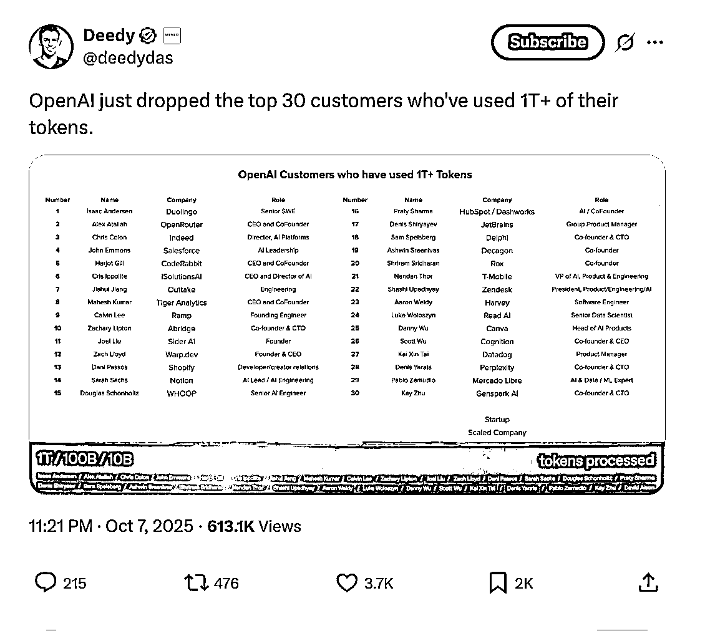
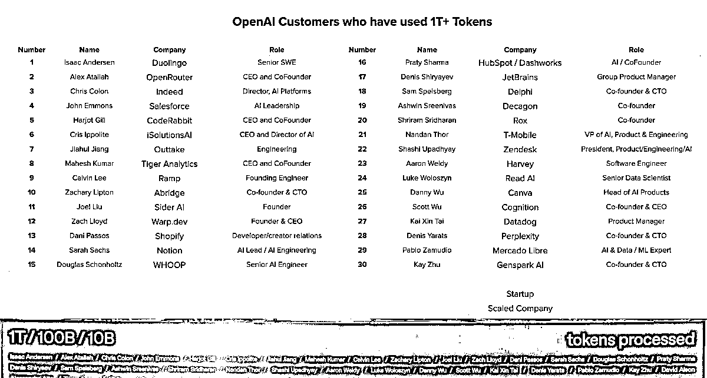

# AI 大客户超万亿 Token 用量名单公布：关注行业头部信息源价值解析

> 原文：[`www.yuque.com/for_lazy/wind/gn7ro594m24mh6cw`](https://www.yuque.com/for_lazy/wind/gn7ro594m24mh6cw)

作者： 阿牛

日期：2025-10-08

点赞数：**27**

* * *

正文：

OpenAI 最近公布了超过 1 万亿 Token 的 OpenAI 大客户名单 序号, 姓名, 公司, 职位 1, Isaac Andersen, Duolingo,
高级软件工程师 2, Alex Atallah, OpenRouter, CEO 及联合创始人 3, Chris Colon, Indeed, AI 平台总监
4, John Emmons, Salesforce, AI 领导团队 5, Harjot Gill, CodeRabbit, CEO 及联合创始人 6,
Cris Ippolite, iSolutionsAI, CEO 及 AI 总监 7, Jiahui Jiang, Outtake, 工程师 8, Mahesh
Kumar, Uber, CEO 及联合创始人（更正） 9, Calvin Lee, Ramp, 创始工程师 10, Zachary Lipton,
Abridge, 联合创始人及 CTO 11, Joel Liu, Sider AI, 创始人 12, Zach Lloyd, Warp\.dev,
CEO 及创始人 13, Dani Passos, Shopify, 开发者关系 14, Sarah Sachs, Notion, AI 负责人 /
AI 工程主管 15, Douglas Schonholtz, WHOOP, 高级 AI 工程师 16, Praty Sharma, HubSpot /
Dashworks, AI 负责人 / 联合创始人 17, Denis Shiryaev, JetBrains, 集团产品经理 18, Sam
Spelsberg, Delphi, 联合创始人及 CTO 19, Ashwin Sreenivas, Decagon, 联合创始人 20, Shriram
Sridharan, Rox, 联合创始人 21, Nandan Thor, T-Mobile, AI、产品及工程副总裁 22, Shashi
Upadhyay, Zendesk, 产品、工程及 AI 总裁 23, Aaron Weldy, Harvey, 软件工程师 24, Luke
Woloszyn, Read AI, 高级数据科学家 25, Danny Wu, Canva, 产品总负责人 26, Scott Wu,
Cognition, 联合创始人及 CEO 27, Kai Xin Tai, Datadog, 产品经理 28, Denis Yarats,
Perplexity, 联合创始人及 CTO 29, Pablo Zamudio, Mercado Libre, AI 与数据/机器学习专家 30, Kay
Zhu, Genspark AI, 联合创始人及 CTO 看到 X 上有个老哥做了个网站：
关注这些大佬，是不是优质的信息源！[`geyser-80.faces.site/tokens`](https://geyser-80.faces.site/tokens)

* * *

评论区：

亦仁 : 感谢分享，已中标

* * *

公众号懒人搜索，[懒人专属群分享](https://lazybook.fun/#/blog/group)