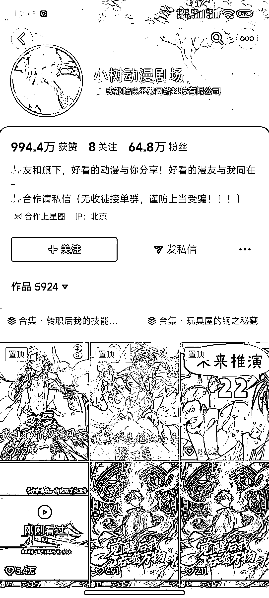
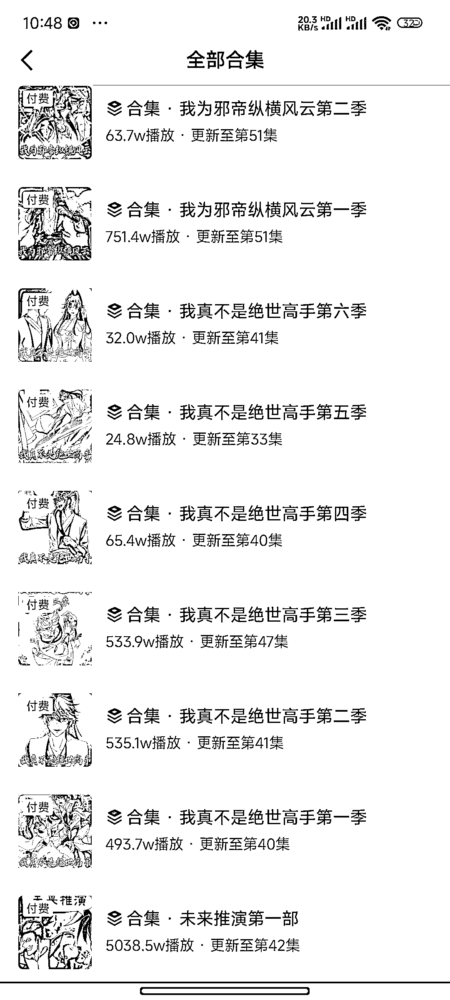
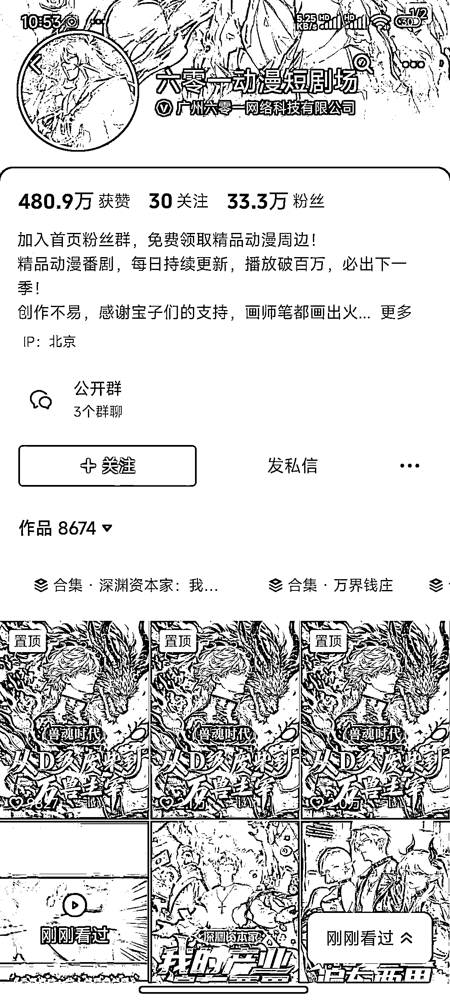
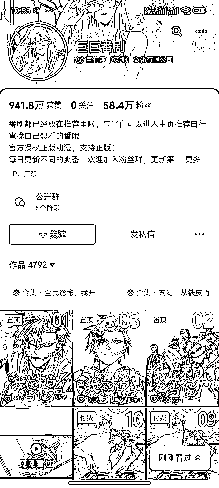
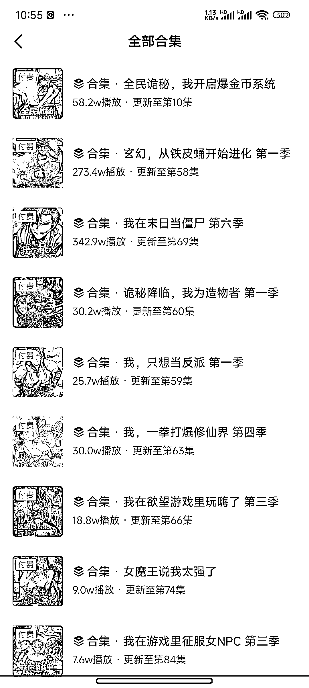

# AI 动漫短剧赛道：多风格内容高频发布与付费变现模式解析

> 原文：[`www.yuque.com/for_lazy/wind/hq8g2xrs03qfn81m`](https://www.yuque.com/for_lazy/wind/hq8g2xrs03qfn81m)

作者： 浮生若梦

日期：2025-10-07

点赞数：**26**

* * *

正文：

我发现这些做 Ai 动漫短剧粉丝量高的账号，每天都发布非常多的 Ai 动漫短剧视频，可以看出来的是每个短剧的视频风格都不太一样，估计是整个公司的员工共同运营账号，而且他们每个短剧的前几个视频流量非常高，估计是有在投流的，这 AI 短剧里面必定有非常大的赚钱机会，就像当时的短剧一样越看越上头，p2、p4、p6 就是这 3 个账号的付费短剧的合集，他们这种 Ai 漫剧账号的变现就是通过用户付费进行赚钱

* * *

评论区：

亦仁 : 感谢分享，已中标

* * *

公众号懒人搜索，[懒人专属群分享](https://lazybook.fun/#/blog/group)