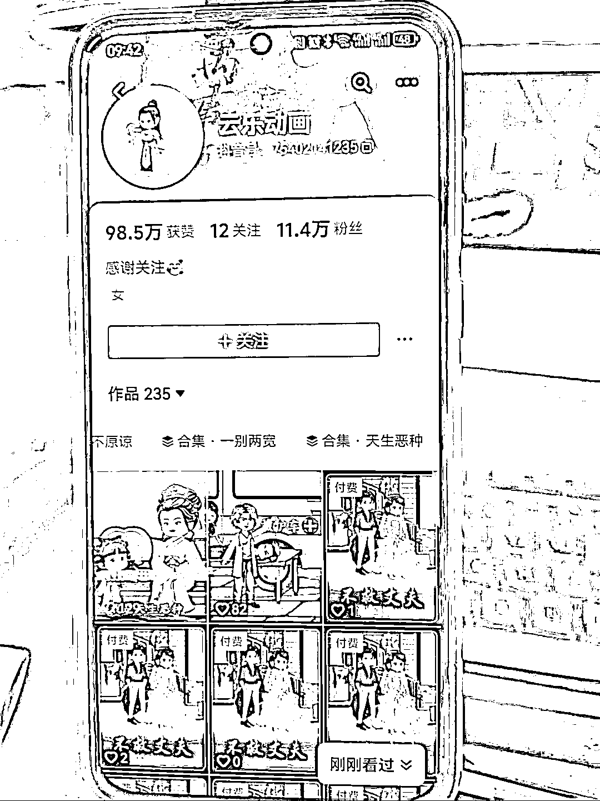
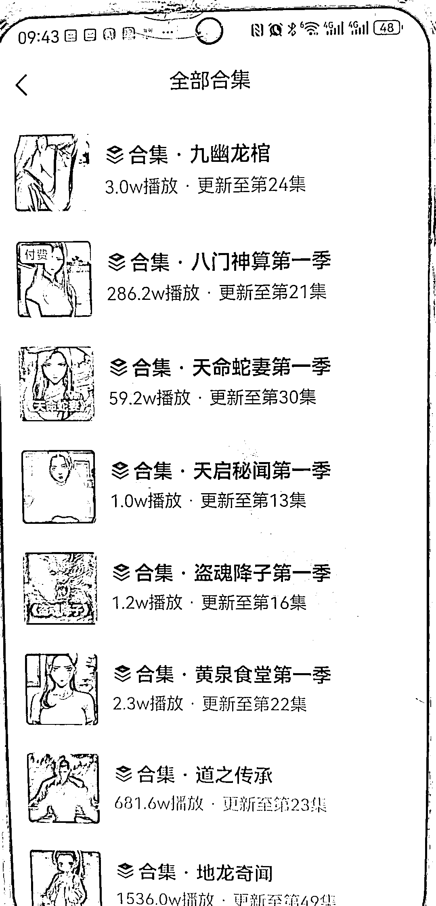
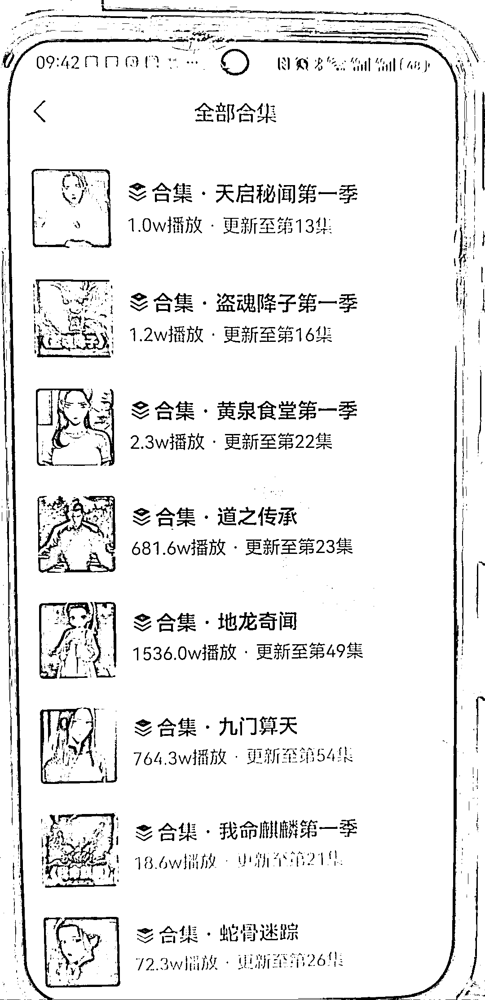
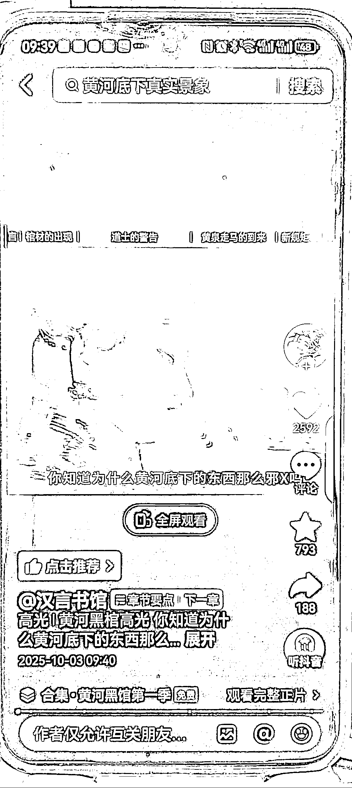
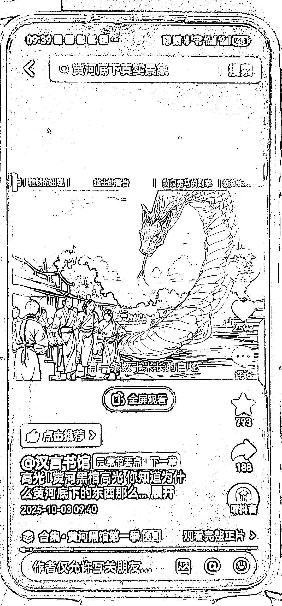
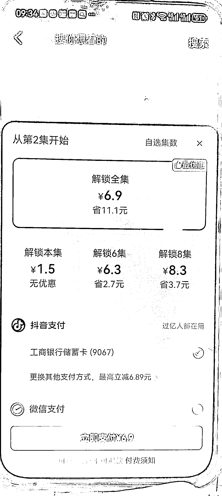
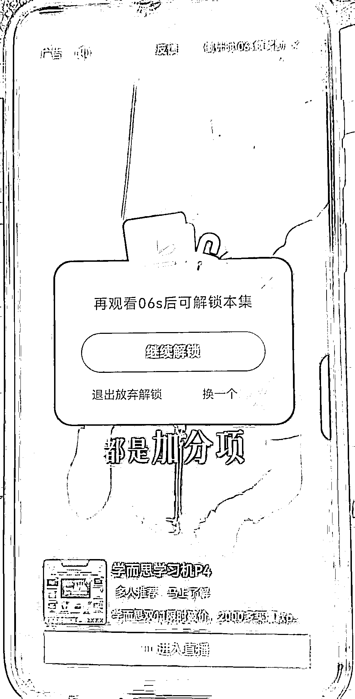

# AI 动漫网剧：流量变现新方式解析（一鱼多吃模式）

> 原文：[`www.yuque.com/for_lazy/wind/uwmn6yzp7y4h01c9`](https://www.yuque.com/for_lazy/wind/uwmn6yzp7y4h01c9)

作者： 全息身心调养思齐

日期：2025-10-10

点赞数：**26**

* * *

正文：

发现两个个简单做 AI 动漫网剧的账号，流量好，变现方式新颖，可一鱼多吃 刷抖音发现两个账号。第 1 个是汉言书馆。第 2 个是可乐动画。
做的都是动漫网剧。变现方式主要有两种。第一是纯付费。只有解锁才能够观看。第 2 种是观看 10 秒钟的广告。才能解锁看其余的部分。赚广告钱。
汉颜书馆做的都是玄幻，悬疑，这种能够强烈勾起人好奇心的内容，看了第 1 集就很想看第 2 集，然后接下来都看完。他的方式也很聪明，在第 1 集开播部分投放广告，免费看，流量很高。等人吸引进来之后，想看下一集就要看广告或者是付费了。
这种动漫剧制作很简单。一般在第 1 集有半分钟混剪带着真实、神秘感的视频素材，强烈勾起人的好奇心，之后的几分钟都是简单纯粹图片再加上旁白解说。只要找好剧本，可以批量制作。一天播几集。
这种视频可以易于多吃，多个平台播放，包括去 youtube
第 2 个账号可乐动画主要是言情类的。变现方式和接收方式和这个相同。只是这个账号可以截屏。前一个账号设置了隐私，不能够随意截屏。 ai 视频 动漫

* * *

评论区：

亦仁 : 感谢分享，已中标

诗雅呀 : 这两个账号，在抖音都搜不到

才 : 第 2 个可以搜索到

* * *

公众号懒人搜索，[懒人专属群分享](https://lazybook.fun/#/blog/group)