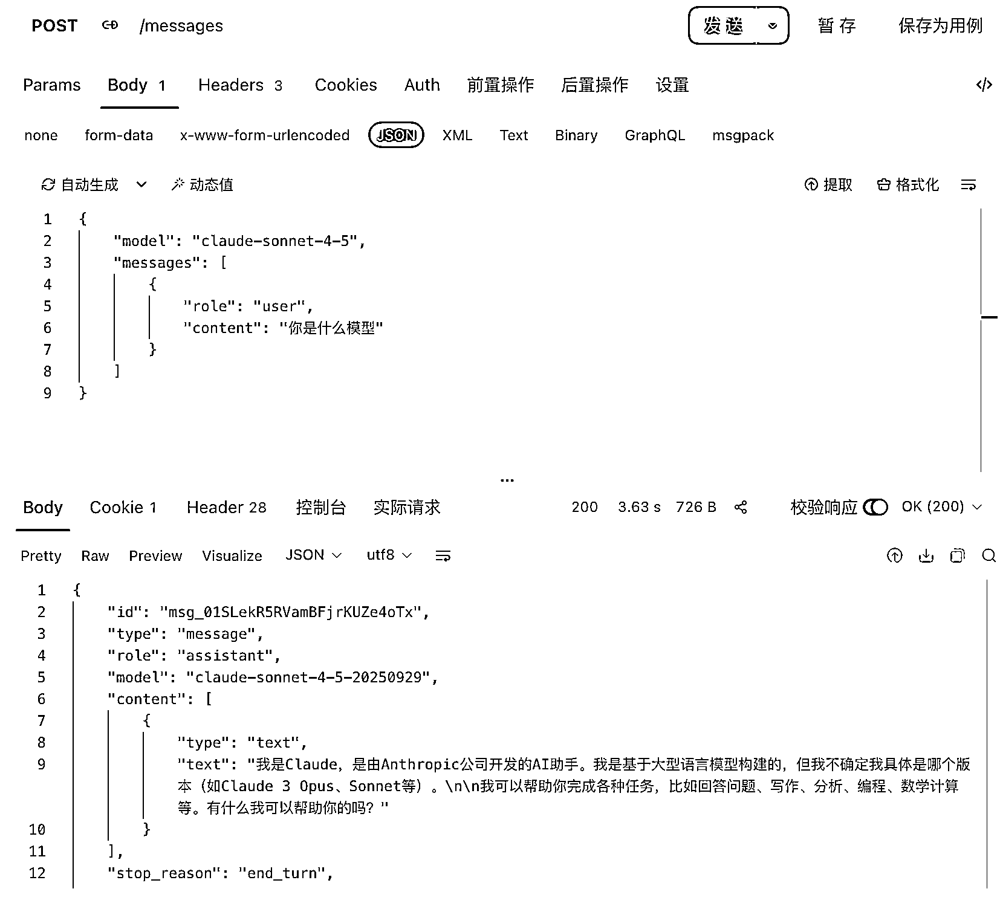
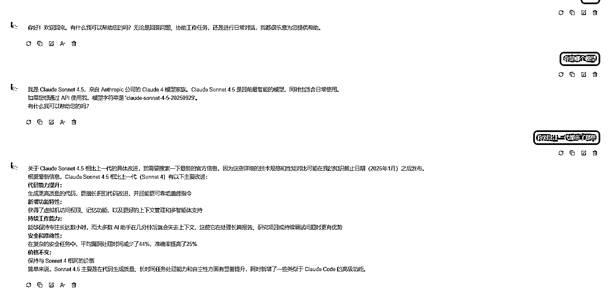
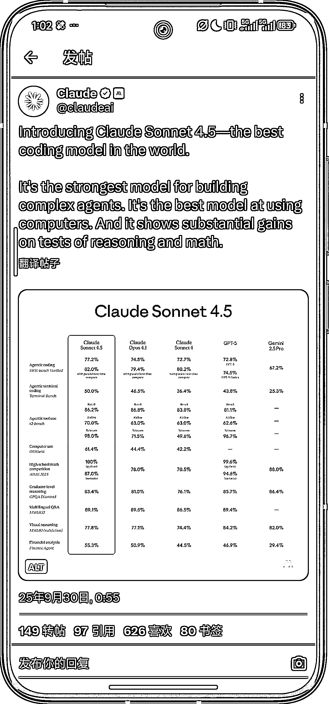
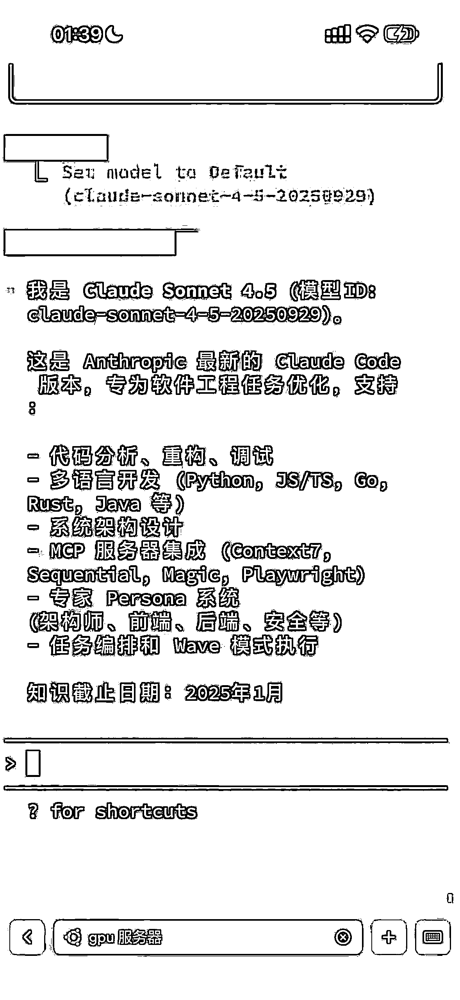

# AI 大语言模型 新增上下文编辑与记忆工具提升复杂任务处理能力

> 原文：[`www.yuque.com/for_lazy/wind/vgtv363hfpeci65s`](https://www.yuque.com/for_lazy/wind/vgtv363hfpeci65s)

作者： 所罗门 API 算力服务

日期：2025-09-30

点赞数：**20**

* * *

正文：

claude Sonnet 4.5，专为复杂工作设计 我们迄今为止最智能的模型是为你每天的工作量而设计的。
在几分钟内创建精美的文档、演示文稿和电子表格。立即开启 进行详细的多步骤数据分析 用更深入的推理解决你最雄心勃勃的问题
在 ClaudeAPI 上，我们添加了两项新功能来构建处理长时间运行任务的代理，而不会频繁触及时限限制: .上下文编辑自动清除过时的上下文
-存储和查询上下文窗口外信息的记忆工具 结合 claude code，AI 编程覆盖率再次上升

* * *

评论区：

亦仁 : 感谢分享，已中标

* * *

公众号懒人搜索，[懒人专属群分享](https://lazybook.fun/#/blog/group)