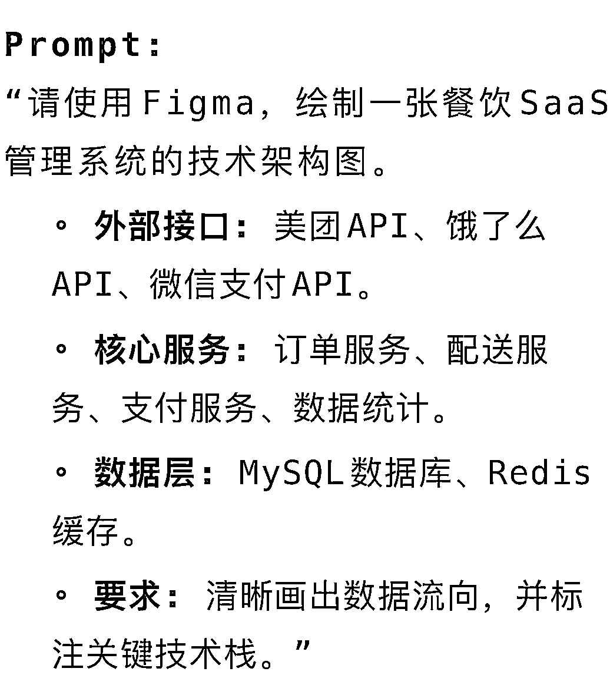
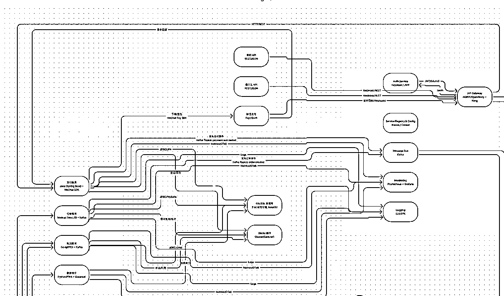
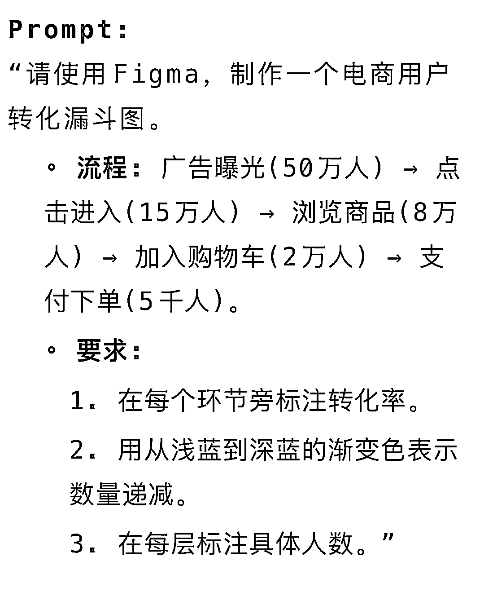
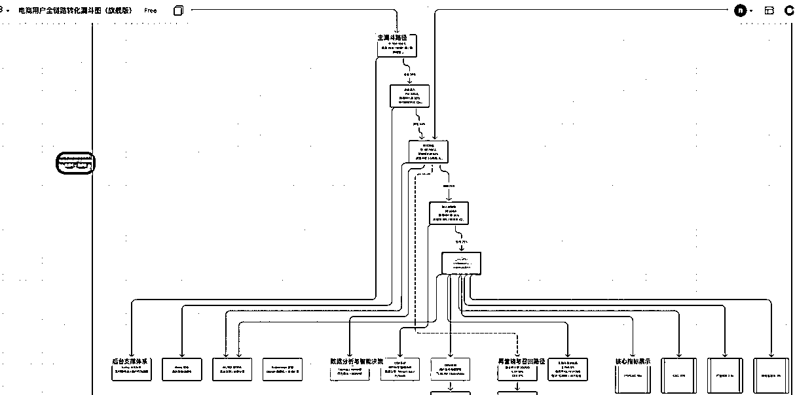
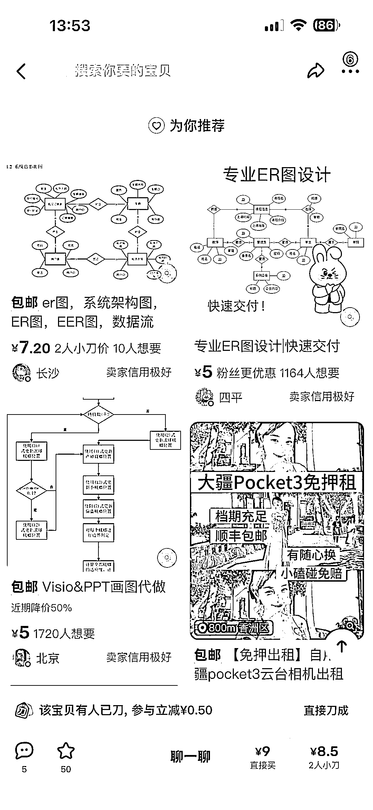
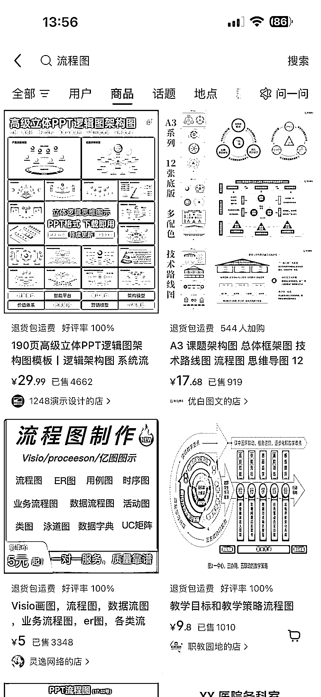
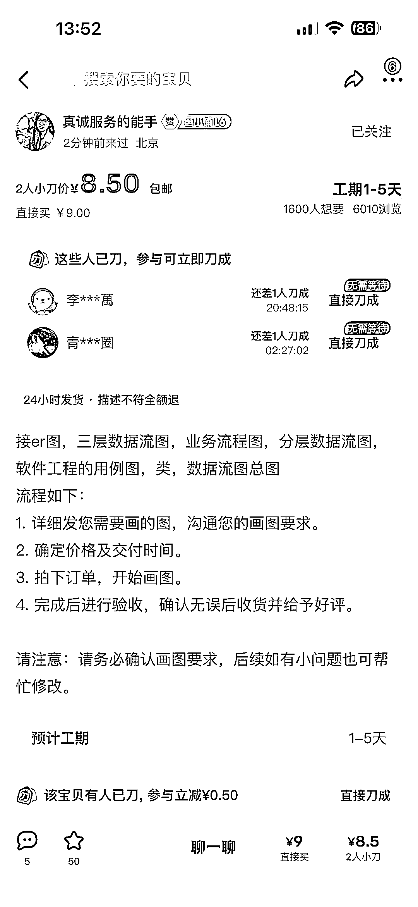
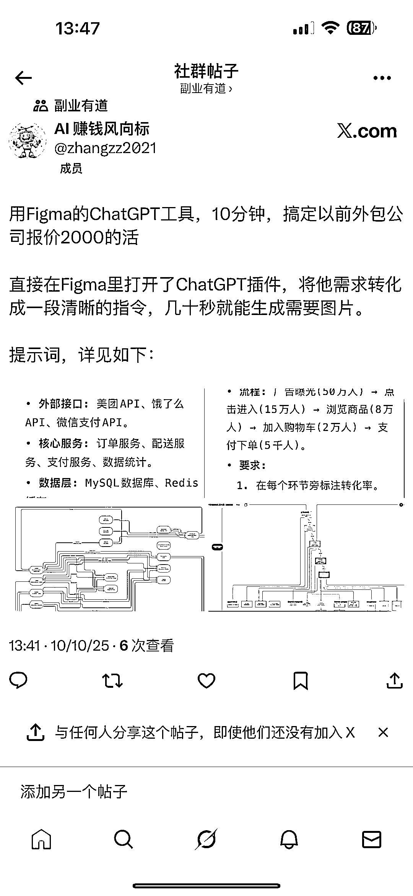

# AI 图表生成工具 10 分钟完成逻辑关系图表制作 相关服务平台数据表现良好

> 原文：[`www.yuque.com/for_lazy/wind/naw7gyq70h1zovai`](https://www.yuque.com/for_lazy/wind/naw7gyq70h1zovai)

作者： Miles

日期：2025-10-10

点赞数：**23**

* * *

正文：

用 Figma 的 ChatGPT 工具，10 分钟可能搞定以前外包公司报价 2000 的活
直接在 Figma 里打开了 ChatGPT 插件，将他需求转化成一段清晰的指令，几十秒就能生成需要图片。例如，使用 Figma，绘制一张餐饮 SaaS 管理系统的技术架构图。或者制作一个电商用户转化漏斗图。
它极其擅长绘制一切与“逻辑关系”相关的图表。它能做的（逻辑之王）： • 产品/技术架构图 (系统结构、数据流)• 业务流程图 (UML 活动图、泳道图)•
数据漏斗图 (转化率、增长分析)• 组织架构图 (团队结构、汇报关系)• 时间线/路线图 (项目排期、发展历程) 它不擅长的（颜值短板）： •
带复杂视觉设计的海报• 精美的 PPT 封面或模板• 社交媒体营销配图• 高保真 UI 界面原型
这些擅长图有可能做成特定需求的产品和服务。咸鱼小红书上有大量类似的链接，数据都还挺不错。

* * *

评论区：

亦仁 : 感谢分享，已中标

* * *

公众号懒人搜索，[懒人专属群分享](https://lazybook.fun/#/blog/group)