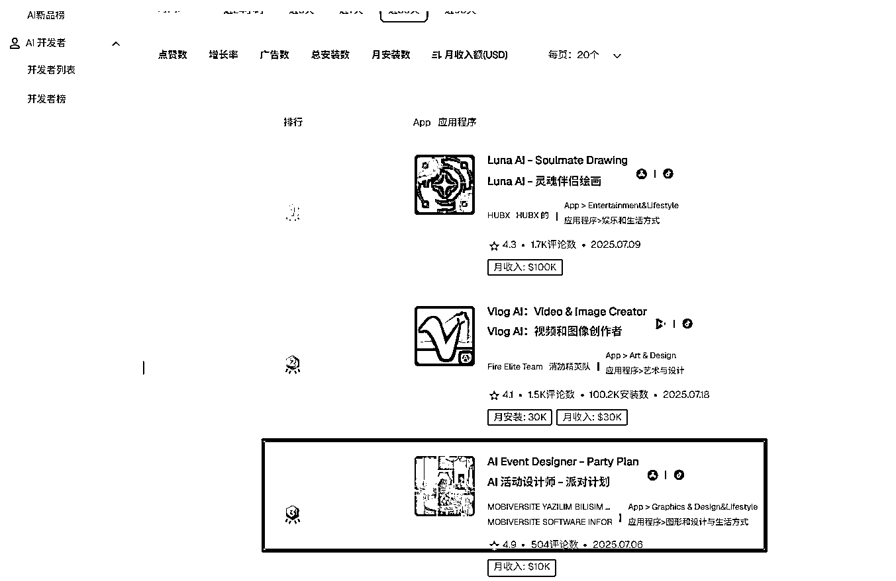
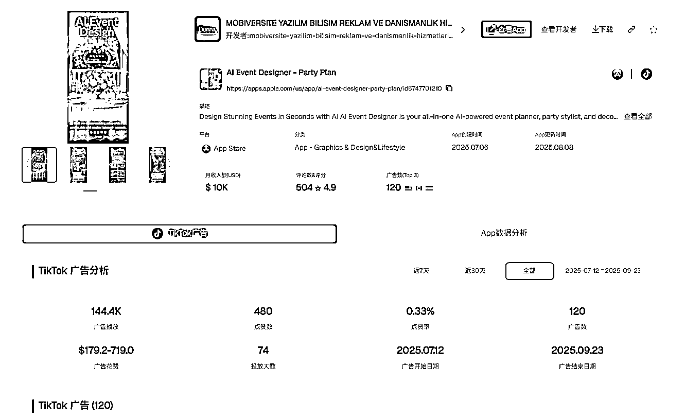
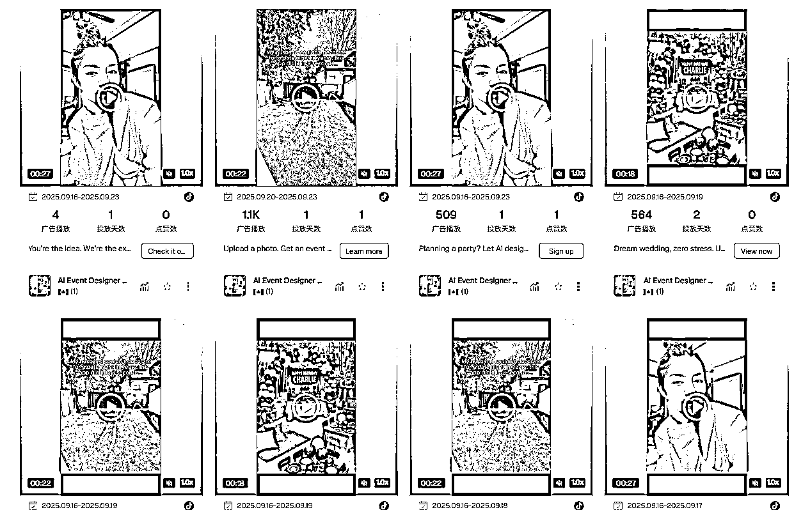
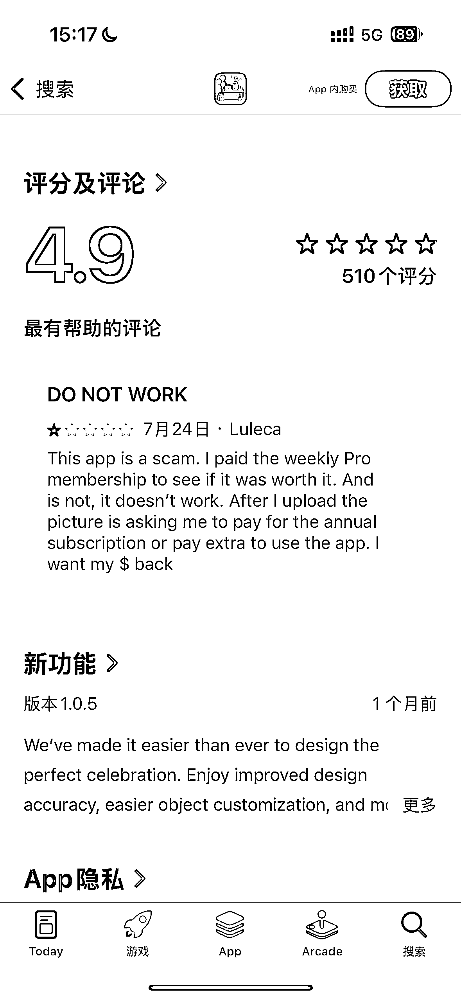
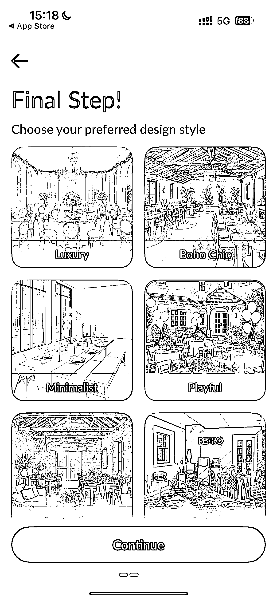
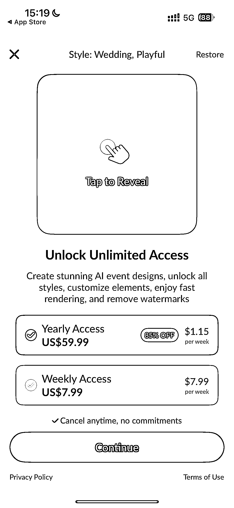
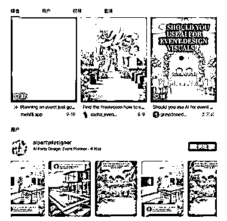

# AI 派对活动设计应用拆解：上线 3 个月营收 1 万美金的快速起量与增长瓶颈分析

> 原文：[`www.yuque.com/for_lazy/wind/sxhu835lg46nr7oi`](https://www.yuque.com/for_lazy/wind/sxhu835lg46nr7oi)

作者： 梁小伟

日期：2025-10-01

点赞数：**19**

* * *

正文：

派对设计师 AI 小应用 Pipiads APP 新品榜 Top3，上线两个月营收一万美金 今天深度拆解一下「AI Event Designer」，一个在
Pipiads AI 新品榜冲到第三名的 AI 应用。它上线 3 个月左右，月收入已达 10K 美金，是一个不错的案例 Part 1：快速成功的“三板斧”
它是如何快速起量的？ 抢占先机： 技术门槛不高，但它切入了“派对活动”这个细分场景，占据了先手，快速吸引了第一波用户。 定价心理学：
设置 7.99/周和 59.99/年两个极端选项，用高昂的周费作“锚点”，强烈刺激用户选择年度订阅，一步到位锁定长期收入。 评论管理：
4.9 星的总体高分。通过在 App 内积极引导满意用户去打五星，成功维持了高分门面，确保了广告转化率。 Part 2：隐藏的增长瓶颈
光鲜数据背后，它的短板和风险也非常突出： 社媒推广短板： 没有自己的内容团队，营销严重依赖外部达人建联获取素材投放广告，模式单一且天花板低。 素材放量困难：
依赖达人导致广告素材的生产和迭代速度极慢，无法支撑大规模的投放，增长很快会摸到天花板。 最终结论： 这是一个教科书级别的 “AI”
项目，完美符合几个核心特点： 好做 : 技术壁垒低，可以快速复制和开发。 容易推广 : 视觉冲击力强，效果直观，非常适合在 TikTok 这类平台传播。
快速拿现金流: 激进的定价策略，就是为了在最短时间内回笼资金和锁定用户价值。
它靠着市场时机和精明运营快速起量，但由于产品壁垒和内容能力的缺失，长期增长面临巨大挑战。非常适合快速拿结果，小而美，跑通最小的 SOP 的团队.

* * *

评论区：

亦仁 : 感谢分享，已中标

* * *

公众号懒人搜索，[懒人专属群分享](https://lazybook.fun/#/blog/group)