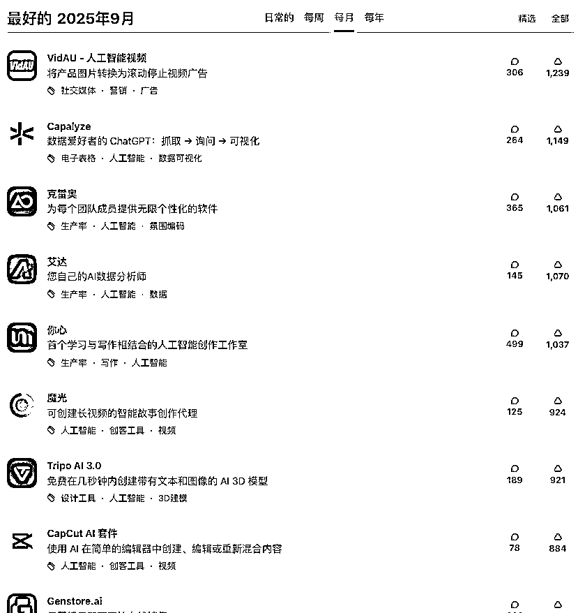
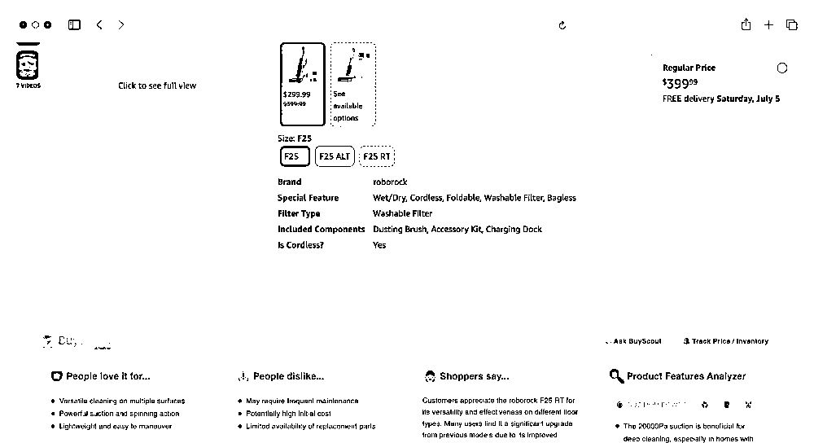
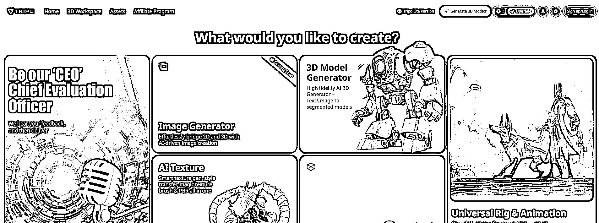

# 9 月 AI 发展趋势：横向普及廉价与纵向专业深入并存

> 原文：[`www.yuque.com/for_lazy/wind/nq25fcab1locr332`](https://www.yuque.com/for_lazy/wind/nq25fcab1locr332)

作者： Miles

日期：2025-10-09

点赞数：**14**

* * *

正文：

9 月的 Product Hunt 榜单分析：AI 正在“横向”上变得更普及和廉价（如 3D 生成免费），同时在“纵向”上变得更专业和深入（如垂直领域代理）
发现以下新动向： 1.从“创造应用”到“创造创造者”（Meta-Agent）：8 月的 Floot、Anything 等让用户能构建应用，而 9 月的
Latitude 2.0 则允许用户构建“能构建应用的 Agent”。这代表 AI 开发工具正在经历一层重要的“抽象化”升级，能力更底层，潜力也更大。
2.3D 生成成为新焦点：7 月的焦点是 2D 视频（Clueso），9 月 Tripo AI 3.0 的高调免费推出，标志着生成式 AI 的战场正快速蔓延至
3D 领域。这意味着数字内容的创造维度正在拓宽。 3.垂直代理深入“深水区”：AI 代理不再局限于通用任务。9 月出现了非常垂直的 Envelope（活动策划）
和成熟的 BuyScout（购物），说明 AI 正在攻克那些流程复杂、依赖专业知识的行业，价值更具象。 4.“免费”或“极低成本”成为重要卖点：Tripo AI
3.0 强调“免费”，Mando
AI（7 月产品）曾标榜“15 美元”。在技术扩散后，极致的成本控制成为后来者抢占市场的利器，也预示着某些 AI 服务可能很快会成为基础免费设施。

* * *

评论区：

亦仁 : 感谢分享，已中标

* * *

公众号懒人搜索，[懒人专属群分享](https://lazybook.fun/#/blog/group)