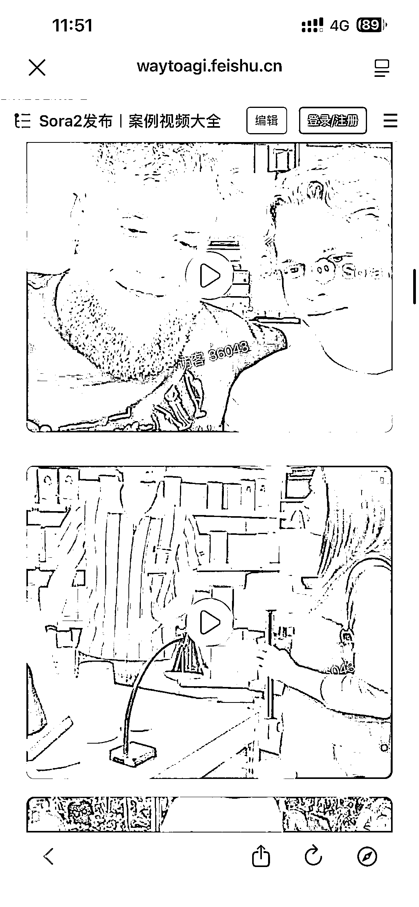

# AI 视频生成模型案例视频大全：音画同步技术提升物理交互与叙事能力

> 原文：[`www.yuque.com/for_lazy/wind/qhtgxsuk9l4g24lv`](https://www.yuque.com/for_lazy/wind/qhtgxsuk9l4g24lv)

作者： 折腾 boy 程泽

日期：2025-10-01

点赞数：**18**

* * *

正文：

Sora2 案例视频大全 通往 AGI 之路出品 [`waytoagi.feishu.cn/wiki/OCcrwM2QiihqlTkIU2FctoQFnBd`](https://waytoagi.feishu.cn/wiki/OCcrwM2QiihqlTkIU2FctoQFnBd)

* * *

评论区：

亦仁 : 感谢分享，已中标

* * *

公众号懒人搜索，[懒人专属群分享](https://lazybook.fun/#/blog/group)