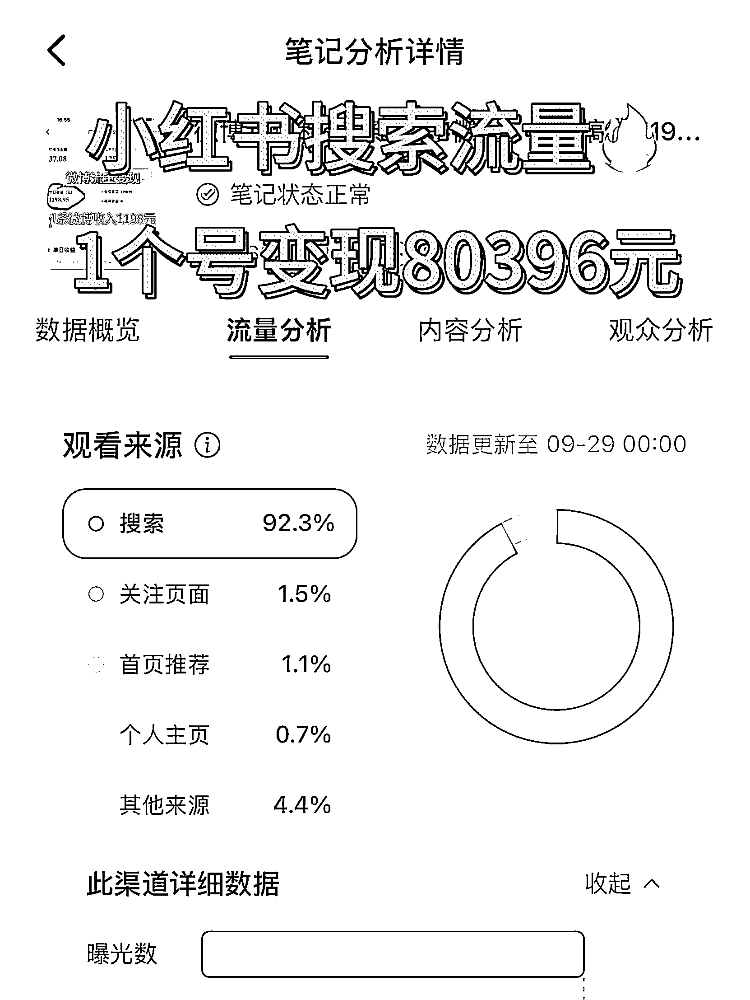
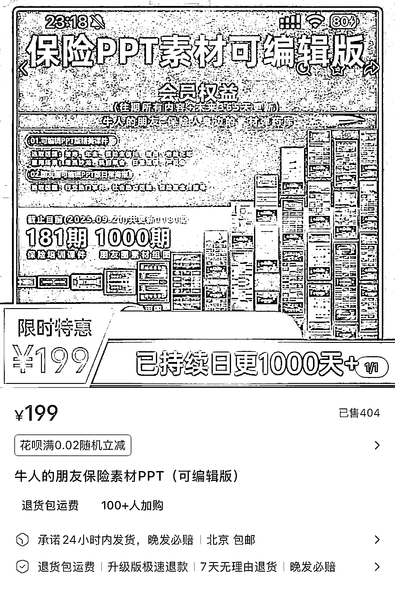

# 小红书保险行业搜索流量变现 80396 元实操方法

> 原文：[`www.yuque.com/for_lazy/wind/aruv0ul0y578hpk9`](https://www.yuque.com/for_lazy/wind/aruv0ul0y578hpk9)

作者： 哈默

日期：2025-09-29

点赞数：**45**

* * *

正文：

小红书的机会是搜索流量，1 个号卖课变现 80396 元，亲测有效！ 90%搞小红书的人，还在追逐推荐流量，却忽视了搜索这座金矿
我们自己一个保险账号，只做搜索流量，单个账号卖课变现 80396 元，图 2 以下以保险行业举例，但这套玩法适合所有做小红书高客单的人 1️⃣推荐流量 VS
搜索流量 推荐流量： 算法推送，用户漫无目的，转化随机 搜索流量： 用户主动查询，带明确需求，精准度最高
对类似保险这种高客单、长决策的行业，抓住搜索就是抓住成交命脉 2️⃣为什么搜索流量是保险人的黄金矿？ 1. 商业转化率高：搜索"30 岁女性重疾险怎么买"的用户，比刷到科普内容的人更接近下单 2. 用户意图强：用户搜索时是"解决问题"的心态，愿意深度阅读，易建立信任 3. 生命周期长： 推荐笔记活 3-7 天，搜索笔记能持续 1-2 年带来流量 3️⃣三层搜索成交模型 1. 关键词布局 不要用保险术语，要用客户口头禅 找词方法： 1）核心词：重疾险、医疗险、年金险
2）需求词：保额高、保费低、理赔快 3）场景词：30 岁女性、有社保、预算 5000 标题公式： 场景词 + 核心词 + 需求词 案例：
《3 口之家年收入 20 万，如何配置全家保险？》 2. 满足用户意图 客户搜索"重疾险怎么买"，真实意图是： ✅需要多少保额？ ✅保费多少钱？ ✅产品有什么区别？ ✅我的身体状况能买吗？ ✅理赔会不会麻烦？ 你的笔记必须预判并解答所有疑问 3. 建立信任 笔记必须包含 2-3 个信任组件： ✅亮身份：
"6 年独立保险经纪人" ✅摆事实： "去年服务 200+家庭，协助 18 例理赔" ✅秀过程： "从收入、负债、健康三维度分析" ✅给凭证：
客户反馈、理赔案例、配置对比图 核心思维 从"推销产品"转向"解答问题" 从"追求爆款"转向"标准答案" 从"刷存在"转向"建信任"
你的目标：让每篇笔记成为某个问题的"标准答案" 当你做到了，精准客户会主动找你。 项目实操

* * *

评论区：

亦仁 : 感谢分享，已中标

Mackie : 想试试但不知道怎么入手

* * *

公众号懒人搜索，[懒人专属群分享](https://lazybook.fun/#/blog/group)