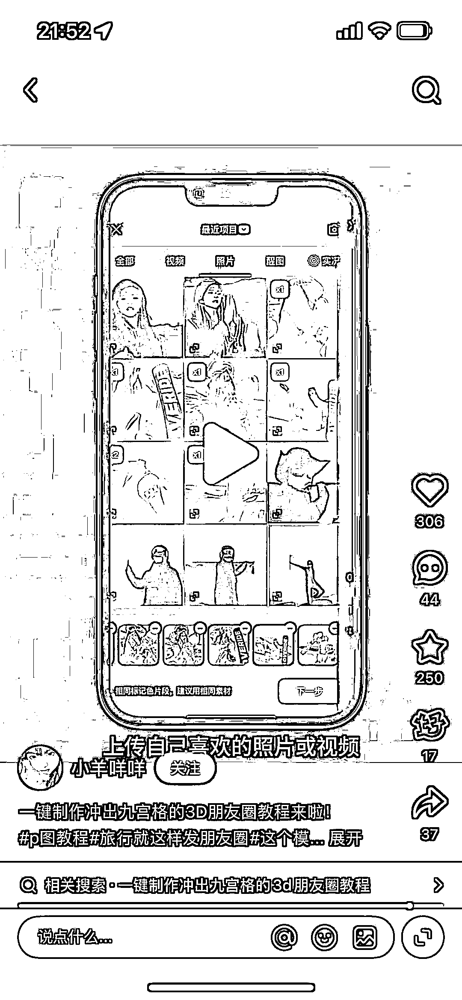
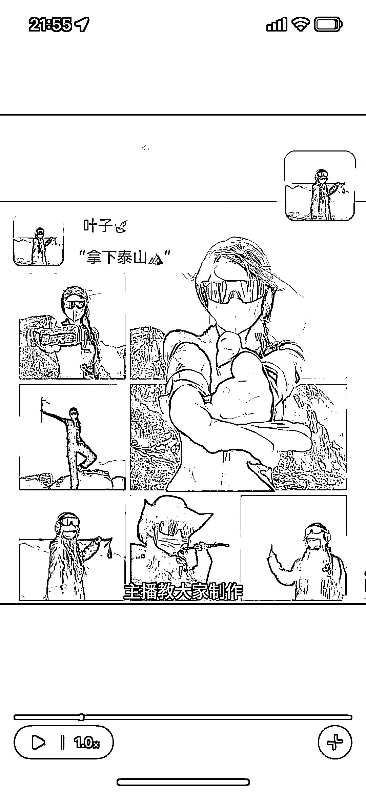
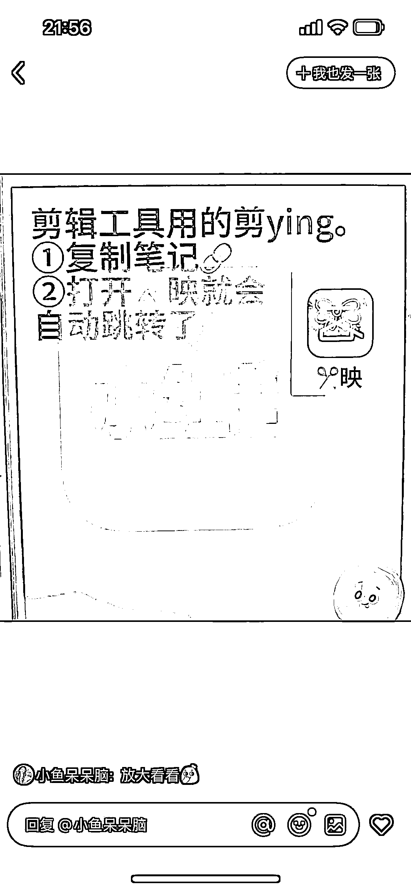
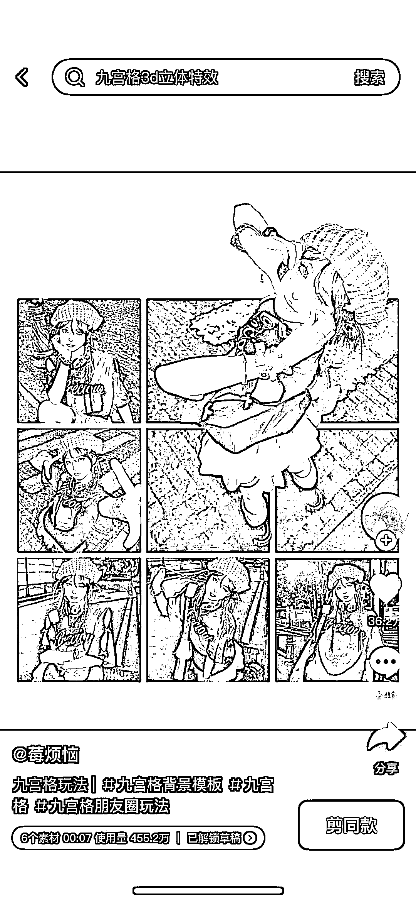

# 小红书虚拟产品：剪映模板使用量 455.2 万

> 原文：[`www.yuque.com/for_lazy/wind/qhw4m7e7i0f8ho9u`](https://www.yuque.com/for_lazy/wind/qhw4m7e7i0f8ho9u)

作者： 阿宝

日期：2025-10-10

点赞数：**34**

* * *

正文：

居然还可以这样玩 刷小红书发现一篇【九宫格 3D 朋友圈】教程笔记 比较好奇 然后按照博主评论区所说的试了一下，居然是卖剪映模板的[捂脸]
这个剪映模板使用量高达 455.2 万，花钱解锁草稿的应该也不在少数 真是长见识了

* * *

评论区：

亦仁 : 感谢分享，已中标

* * *

公众号懒人搜索，[懒人专属群分享](https://lazybook.fun/#/blog/group)