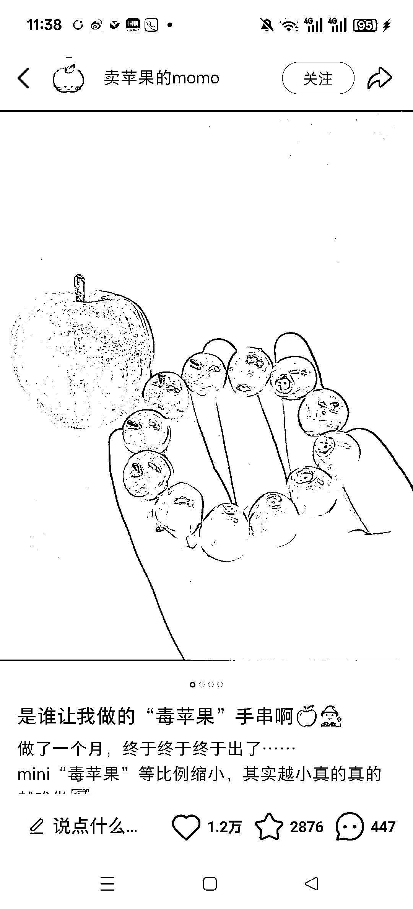
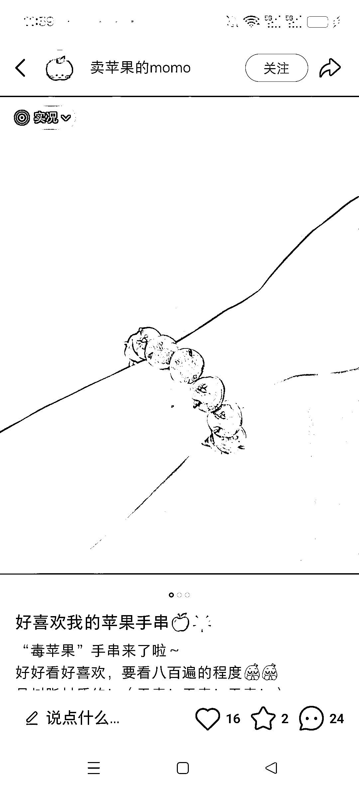
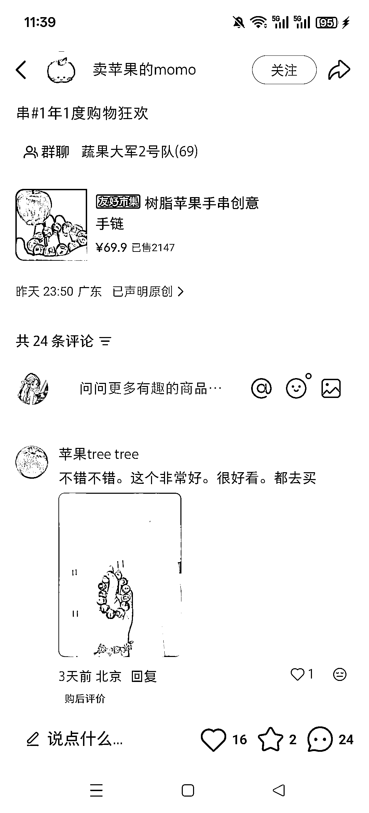
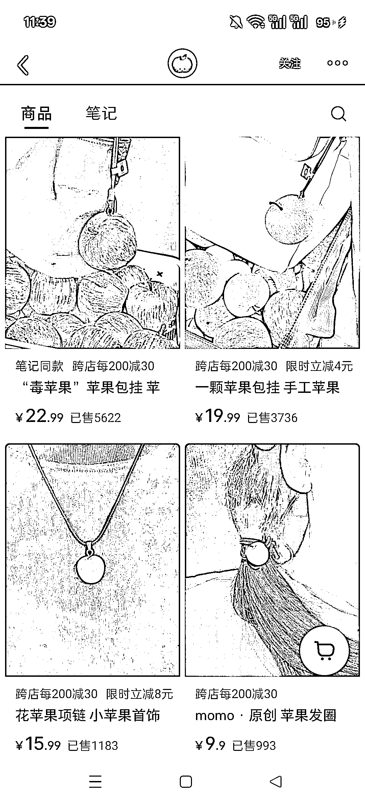
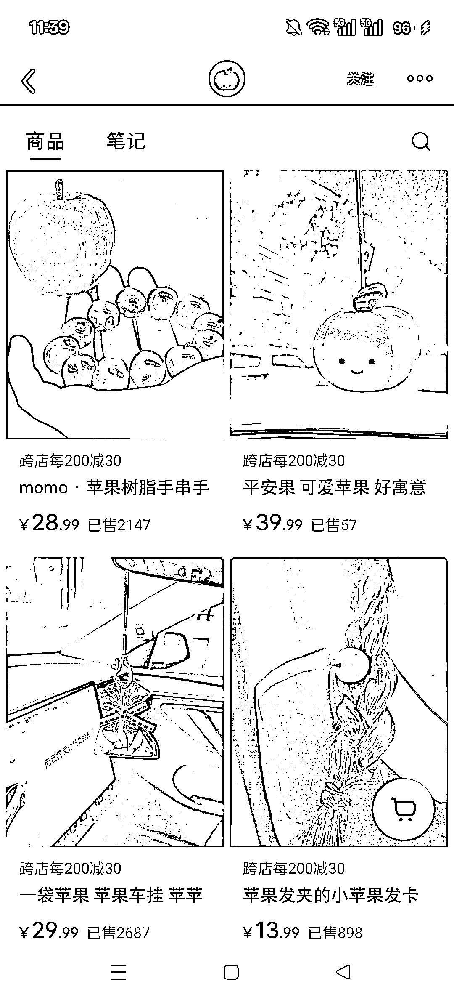
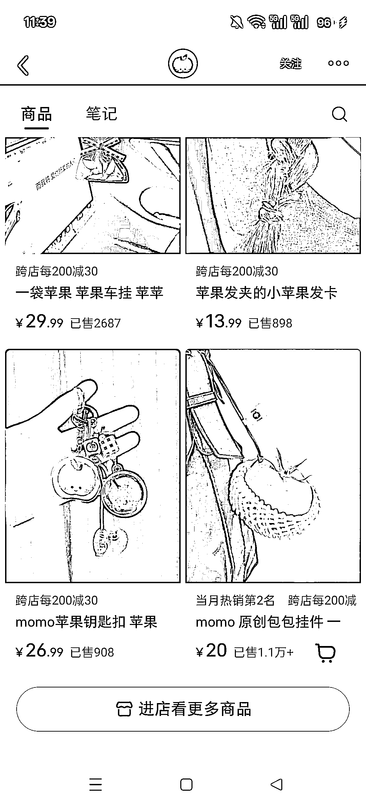
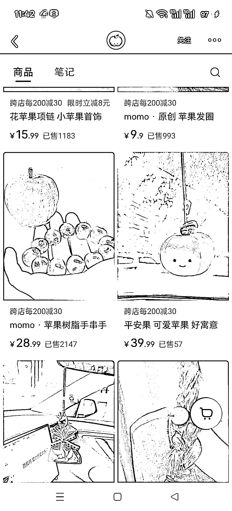

# 小红书创意饰品赛道 苹果手串销量 2147 份 GMV6 万+

> 原文：[`www.yuque.com/for_lazy/wind/iatlf6ohz3k3qsvn`](https://www.yuque.com/for_lazy/wind/iatlf6ohz3k3qsvn)

作者： 源源（急事语音）

日期：2025-10-04

点赞数：**36**

* * *

正文：

这个小红书赛道虚拟也是相当有创意了 苹果手串，苹果挂件，南瓜挂件，苹果发圈！！ 不仅好看还有新意！
这个手串也是在小红书卖了 2147 份了，光这个手串卖了 6 万多！

* * *

评论区：

远鹏 : 石榴手串肯定好看

源源（急事语音） : 感觉难度会有点大

亦仁 : 感谢分享，已中标

* * *

公众号懒人搜索，[懒人专属群分享](https://lazybook.fun/#/blog/group)