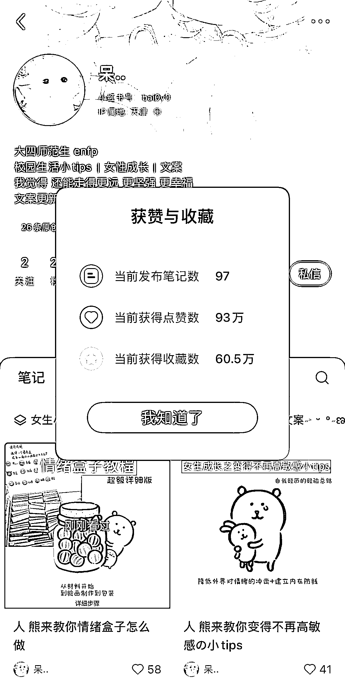
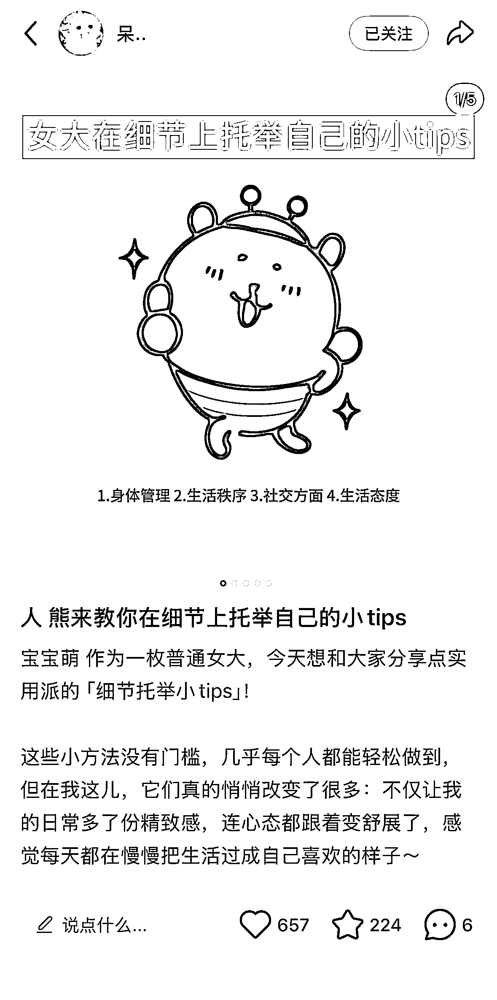
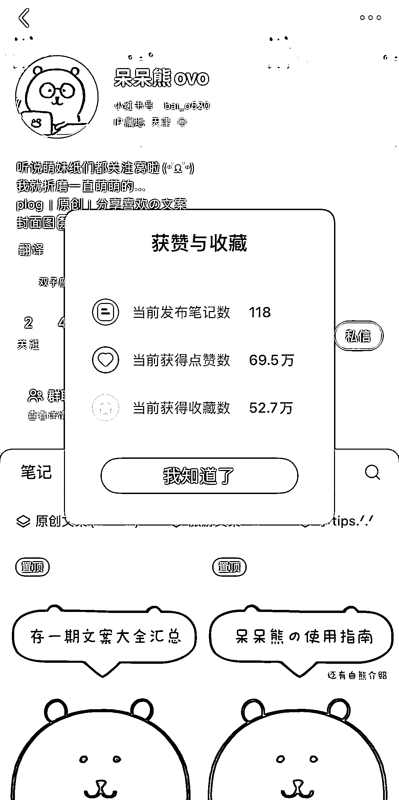
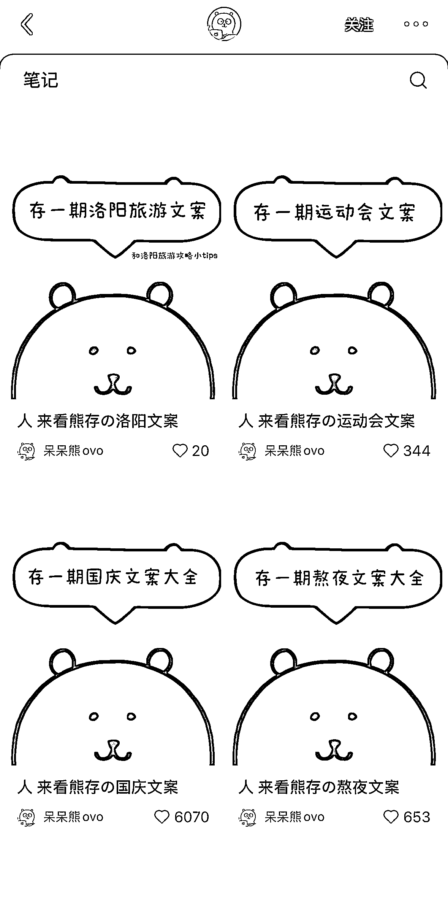
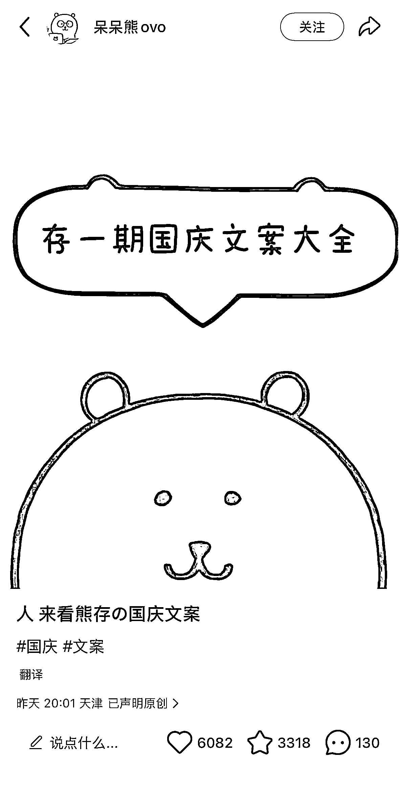
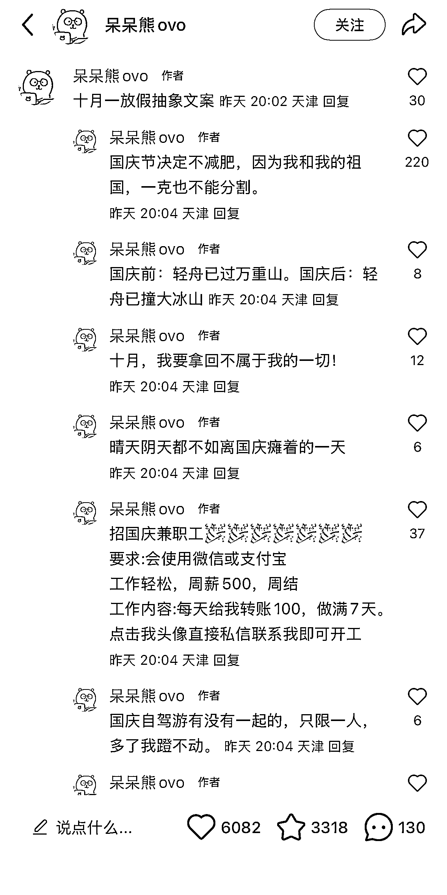
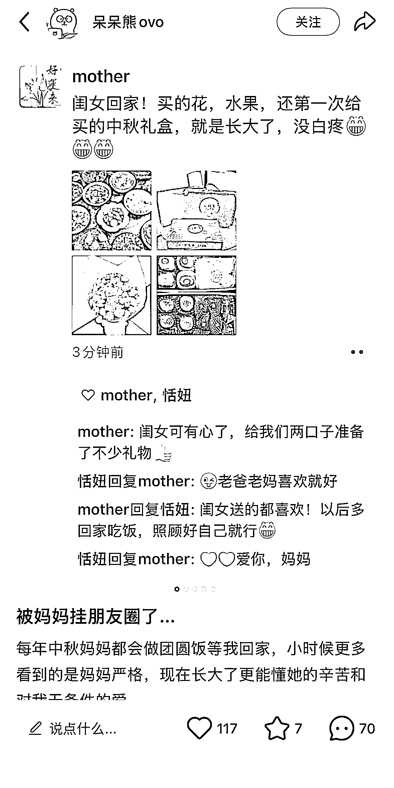
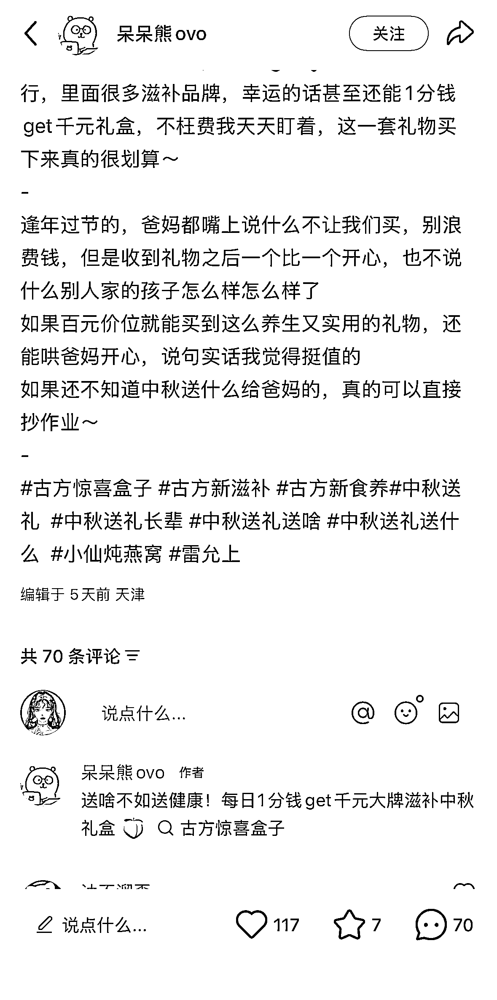

# 小红书文案赛道：2 万粉丝账号笔记点赞收藏近 160 万

> 原文：[`www.yuque.com/for_lazy/wind/bxox2dqr5ud1e4l6`](https://www.yuque.com/for_lazy/wind/bxox2dqr5ud1e4l6)

作者： 馆主

日期：2025-09-29

点赞数：**26**

* * *

正文：

流量｜异常值 在小红书挖掘到一个专注做文案赛道的博主，笔记数据惊人的异常值 1/账号定位：文案分享 2/赛道人群：在校大学生/女性成长
3/笔记风格：使用统一抽象的表情包+文字 4/变现方式：接商单 这两个账号都是同一个博主的：
账号一数据分析：2w 粉丝，97 篇笔记，点赞收藏接近 160w，笔记内容基本都是女大学生的小 tips（文案在图片内容里面）
账号二数据分析：4w 粉丝，118 篇笔记，点赞收藏 130w，笔记内容是生活文案（国庆文案、熬夜文案、运动会文案…）这个更简单，就一直图片一个表情包+黑白字，文案主要在评论区发布
最后两张图我们可以看到是商单笔记，这个赛道非常的适合小白入手，因为制作过程非常的简单（AI 辅助）

* * *

评论区：

MYX(爆单路上) : 收益咋样啊，后台能看到吗？

馆主 : 可以根据两个公式来判断：粉丝数量+点赞数据来报价，第二个是看她接的商单笔记数量，就可以大概判断最少赚了多少钱

L!N/林林/小林 : 感谢分享，恭喜中标。🎉🎉🎉

亦仁 : 感谢分享，已中标

* * *

公众号懒人搜索，[懒人专属群分享](https://lazybook.fun/#/blog/group)