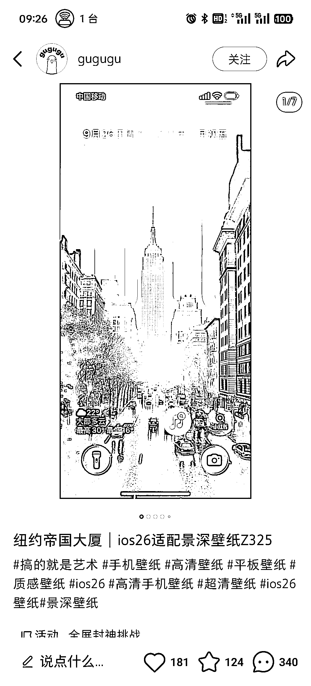
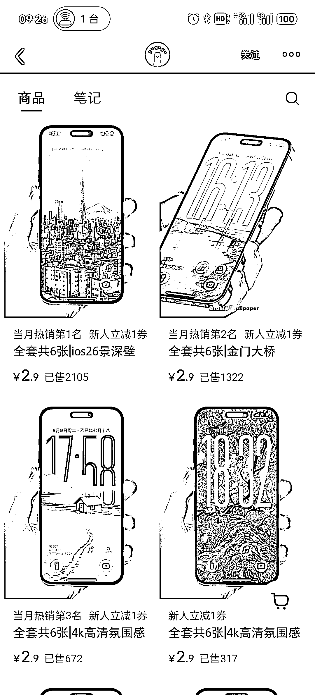

# 小红书壁纸赛道：简单笔记+AI 生图，月入超 5 位数

> 原文：[`www.yuque.com/for_lazy/wind/mtxdu1cia75swipi`](https://www.yuque.com/for_lazy/wind/mtxdu1cia75swipi)

作者： 花生结果

日期：2025-10-07

点赞数：**29**

* * *

正文：

小红书壁纸赛道，账号很简单，但收入超 5 位数。 笔记简单，只需要屏幕截图 产品简单，随便找一个生图 ai
发出的笔记还是有很多人喜欢，壁纸产品还是有很多人买，

* * *

评论区：

Jokul : 这都行

花生结果 : 赚钱路子千千万[偷笑]

风益 : 我的商业认知又提高了不少[呲牙]

驼铃 : 感觉背景时钟很酷啊，不知道是怎么设置的

花生结果 : 哈哈，问下 ai

亦仁 : 感谢分享，已中标

偶尔的时光 : 牛掰啊

* * *

公众号懒人搜索，[懒人专属群分享](https://lazybook.fun/#/blog/group)