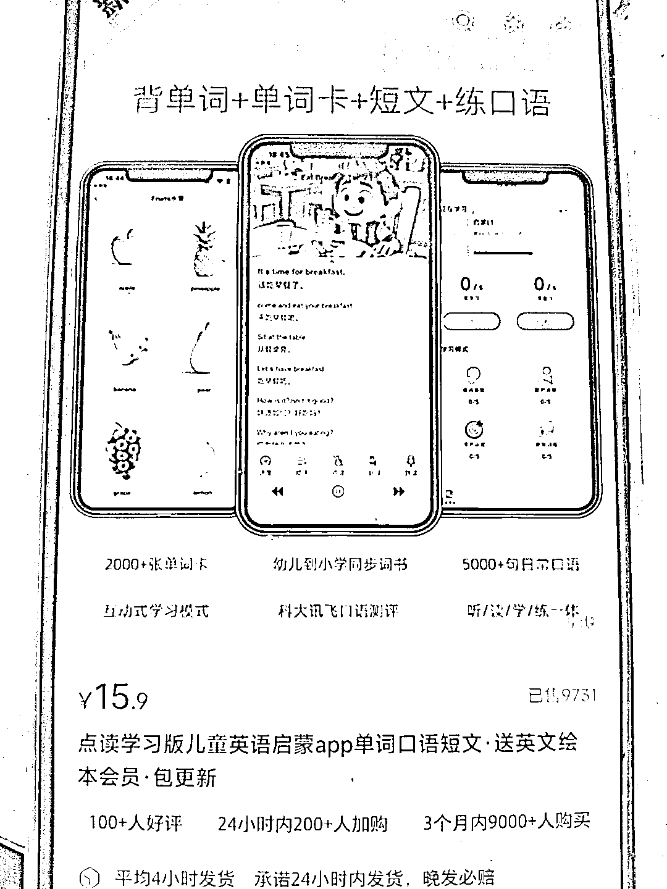
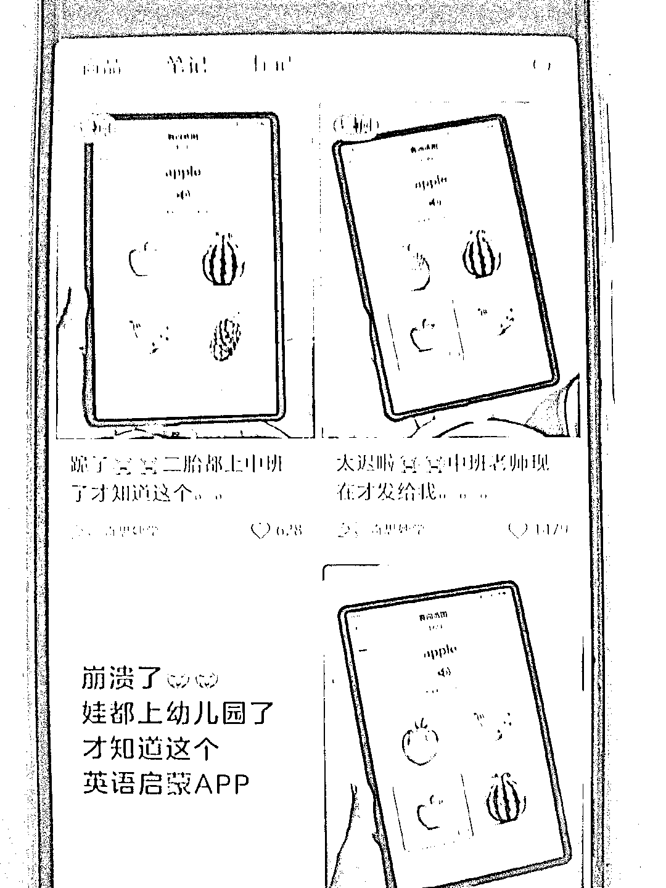
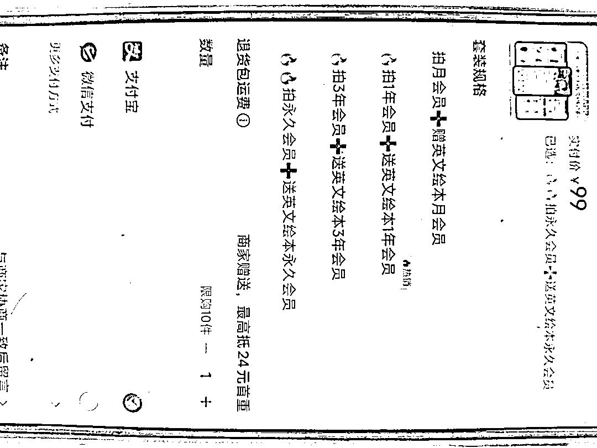

# 儿童英语启蒙背单词 APP 三个月销量数十万：以图形化设计切入低龄儿童早期教育赛道

> 原文：[`www.yuque.com/for_lazy/wind/wwrknudnr1kk3bcz`](https://www.yuque.com/for_lazy/wind/wwrknudnr1kk3bcz)

作者： 嗯

日期：2025-09-29

点赞数：**26**

* * *

正文：

小红书虚拟这个 APP 产品很火，整体的开发应该是比较简单的，然后三个月内卖了几十万。它就是针对这个人，人都要学的英语背单词，启蒙的 APP 做了一个差异化，在之前的 APP 背单词大都是针对大学生或者成人的，它这个等于是把那个图形化什么的做的好，然后整体针对儿童了，特别是这个没上过学的儿童进行早期教育。做出一定的差异化，然后拿走一部分市场。

* * *

评论区：

亦仁 : 感谢分享，已中标

* * *

公众号懒人搜索，[懒人专属群分享](https://lazybook.fun/#/blog/group)