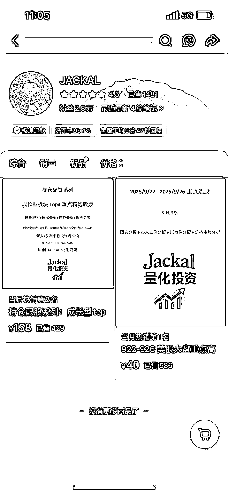
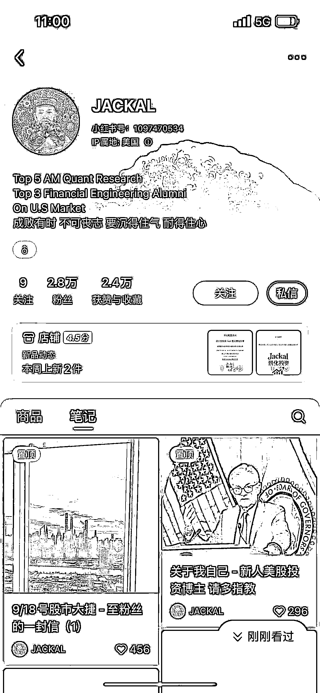
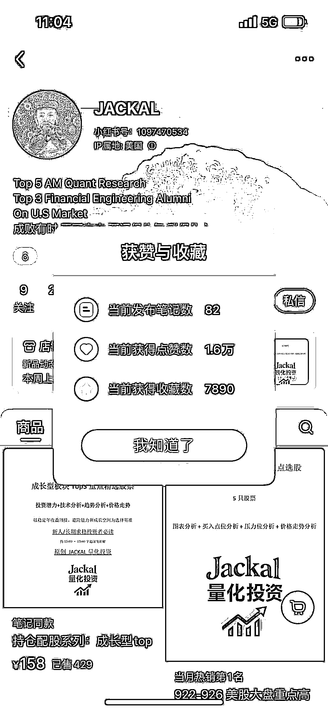
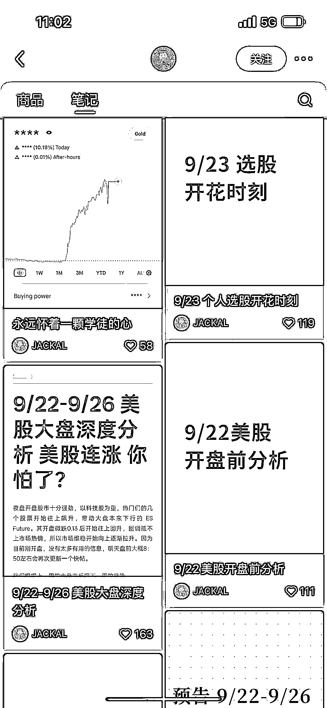
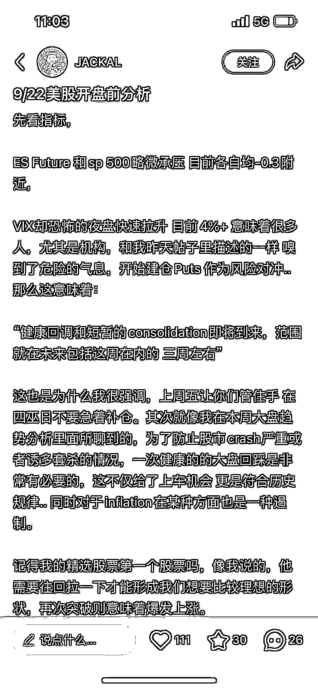

# 小红书美股分析虚拟内容 高客单轻运营变现模式解析

> 原文：[`www.yuque.com/for_lazy/wind/ee2g1u5mivan5rp5`](https://www.yuque.com/for_lazy/wind/ee2g1u5mivan5rp5)

作者： 刘土豆

日期：2025-09-29

点赞数：**24**

* * *

正文：

小红书虚拟，做美股分析的博主，笔记都是几百字的分析，卖几天的美股推荐，客单不低，事少钱多

* * *

评论区：

MYX(爆单路上) : 可能还是 AI 写的。。

亦仁 : 感谢分享，已中标

* * *

公众号懒人搜索，[懒人专属群分享](https://lazybook.fun/#/blog/group)