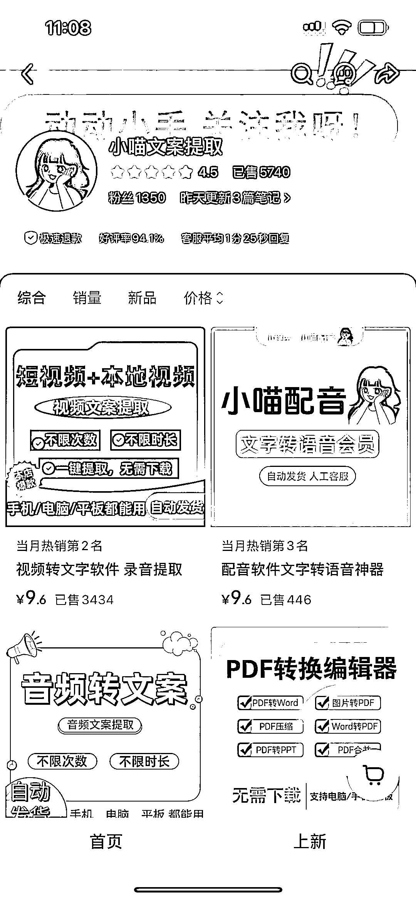

# 小红书虚拟电商-视频文案提取工具销量 3000+：信息差带来的市场机会

> 原文：[`www.yuque.com/for_lazy/wind/wifu74o4ru0lf08k`](https://www.yuque.com/for_lazy/wind/wifu74o4ru0lf08k)

作者： 大瑞

日期：2025-09-28

点赞数：**30**

* * *

正文：

小红书虚拟电商-视频文案提取工具 一个自己做的小程序文案提取工具，卖了 3000 多份，这就是信息差。
其实这种提取工具在微信一搜出来一大堆，都是免费的，但正是很多时候我们觉得习以为常的东西，还有很多人不知道。

* * *

评论区：

亦仁 : 感谢分享，已中标

* * *

公众号懒人搜索，[懒人专属群分享](https://lazybook.fun/#/blog/group)